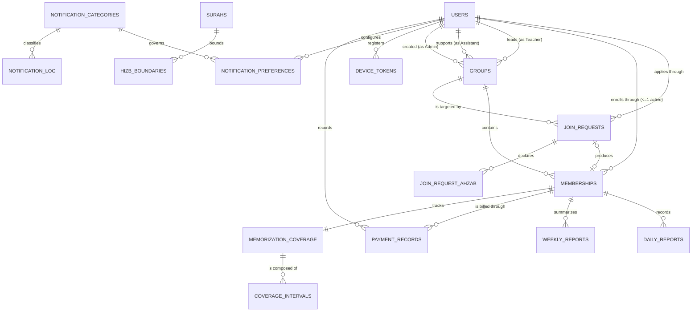

# Irtaki — Database Design Specification

---

## 1. Document Information

| Field | Value |
|---|---|
| Document | Irtaki — Database Design Specification (DDS) |
| Version | 1.0 |
| Status | Draft — pending Product Owner review |
| Source documents | Irtaki SRS v1.0 (Baselined) · Irtaki SAS v1.0 (Baselined) · Irtaki DMS v1.0 (Draft) |
| Prepared by | Senior Database Architect / Data Modeler |
| Audience | Backend Lead, DBA, Mobile Lead, QA Lead, Product Owner |
| Scope | MVP |
| Target platform | PostgreSQL |
| Identifier scheme | `DBT-*` Table · `DB-FK-*` Foreign key · `DB-UQ-*` Unique constraint · `DB-CHK-*` Check constraint · `DB-IDX-*` Index · `DBQ-*` Database-design decision (this document, resolved in the Batch 1 review) — all other prefixes (`BR-*`, `FR-*`, `VR-*`, `E-*`, `ST-*`, `INV-*`, `ADR-*`, `DEC-*`, `ISS-*`, `T-*`) are inherited verbatim from the SAS/DMS |

---

## 2. Database Design Objectives

Persist the Irtaki domain model (DMS) in PostgreSQL such that:

1. Every domain invariant that *can* safely be enforced by the database *is* — as a constraint, not a comment (Rule 4).
2. Every entity's historical requirement (DMS §18.1) is honored: nothing DMS marks "Full" history is ever hard-deleted.
3. The five race-condition-prone uniqueness rules SAS §26.4 identifies are database constraints, not application checks (AR-03).
4. The schema stays a clean, normalized MVP model — no caching tables, materialized views, or partitioning are introduced without a stated requirement (Rule 3).
5. The result is directly implementable: every table, column, type, constraint, and index is specified, not left to the implementer's judgment.

This document does **not** produce SQL migrations (a separate, later phase) — it produces the logical model those migrations will implement.

---

## 3. Database Design Principles

| Principle | Confirmed / Recommended / Technical Decision | Basis |
|---|---|---|
| Referential integrity via foreign keys everywhere a relationship exists | Confirmed | SAS §24.6: "all foreign keys `ON DELETE RESTRICT`" |
| Nothing is ever hard-deleted except `device_tokens` | Confirmed | SAS §20.1, ADR-007 |
| Immutability enforced at the storage layer, not application code alone | Confirmed | ADR-010 |
| One consistent primary-key strategy across all business entities | Confirmed — UUIDv7 | DBQ-08 |
| Normalize to 3NF; the one deliberate exception (`ahzab_completed`) is documented, not silent | Recommended | Rule 6 methodology; DMS §7.1 calls it "a cached derivation" |
| No PostgreSQL-native `ENUM` types; enumerations are `TEXT` + `CHECK`, with one exception | Technical Decision | §18 below |
| No caching tables, materialized views, partitioning, or read replicas for MVP | Confirmed | Rule 3; SAS §26.3 (AR-19/20 explicitly deferred) |
| Every index traces to a named read path in SAS §18 or §24.6 | Confirmed | SAS §24.6, §25.4 (NFR-11/12 with no sizing target — "correct by construction") |
| All timestamps stored in UTC; only dates are timezone-derived | Confirmed | SAS T-04, NFR-16 |
| Soft-delete filtering is a default query-layer scope, not a per-table application decision | Confirmed (architecture, not schema) | SAS §20.2 recommendation, AR-07 |

---

## 4. Domain-to-Database Mapping

| Domain Concept (DMS) | Database Representation | Reason |
|---|---|---|
| User (E-01) | `users` | Persistent entity, independent identity |
| Group (E-02) | `groups` | Persistent entity |
| Membership (E-03) | `memberships` | Associative entity with its own lifecycle — not a junction table |
| JoinRequest (E-04) | `join_requests` + `join_request_ahzab` | Entity + normalized child set (ApplicantProfile's `memorized_ahzab` set) |
| DailyReport (E-05) | `daily_reports` | Entity, deliberately flat — embedded VOs (`AyahRange`, `TimeWindow`) become nullable, type-conditional columns, not child tables (DMS §21.1) |
| WeeklyReport (E-06) | `weekly_reports` | Hybrid entity — see §14 |
| PaymentRecord (E-07) | `payment_records` | Sparse event table — see §16 |
| MemorizationCoverage (E-08) | `memorization_coverage` + `coverage_intervals` | Entity (projection) + child interval table — a fold over history, not a report-normalization |
| Surah, HizbBoundary (external reference) | `surahs`, `hizb_boundaries` | Read-only reference data, never entities (DMD-01) |
| — (new, DBQ-06) | `reference_data_version` | Detectability for a future Quran dataset correction (ADR-005) — not a domain concept, a deployment-integrity safeguard |
| DeviceToken, NotificationPreference, NotificationLog (E-09/10/11) | `device_tokens`, `notification_preferences`, `notification_log` | Supporting subdomain — lighter rigor throughout |
| AuditEntry (E-12) | `audit_entries` | Write-once log, no aggregate root needed |
| CommitmentScore, AtRiskFlag, PaymentStatus, PaymentCycle, RevisionPeriod | **Not persisted anywhere** | All are read-time derivations per DMS §22; storing any of them would violate DEC-A06/A10/A04 |
| Role (enum), Gender (enum), etc. | Columns on their owning table, `TEXT` + `CHECK` | See §18 |
| NotificationCategory | `notification_categories` (lookup table) | The one enum exception — see §18 |

No domain entity maps to more than one table except the two explicitly normalized cases above (JoinRequest's ahzab set, Coverage's interval set) — both because the "value" in question is itself a *set*, which a single row cannot represent in 1NF.

---

## 5. Table Catalogue

17 tables. Each is detailed fully in §31; this is the navigation summary.

| ID | Table | Domain Entity | PK | Lifecycle | History |
|---|---|---|---|---|---|
| DBT-01 | `users` | User (E-01) | UUIDv7 | Registration → role transitions, never deleted | Current state only (role history deliberately absent, INV-25) |
| DBT-02 | `groups` | Group (E-02) | UUIDv7 | Active/Archived × Open/Closed | Full — never deleted once used |
| DBT-03 | `memberships` | Membership (E-03) | UUIDv7 | Active → Terminated (terminal) | Full — this table *is* the enrollment history |
| DBT-04 | `join_requests` | JoinRequest (E-04) | UUIDv7 | Pending → Accepted/Rejected (terminal) | Full, soft-deleted on cascade |
| DBT-05 | `join_request_ahzab` | (VO-08 member set) | Composite | Insert-only with parent | Full, cascades with parent |
| DBT-06 | `daily_reports` | DailyReport (E-05) | UUIDv7 | Submitted, immutable | Full, append-only |
| DBT-07 | `weekly_reports` | WeeklyReport (E-06) | UUIDv7 | Open → Finalised (terminal) | Full, append-only |
| DBT-08 | `payment_records` | PaymentRecord (E-07) | UUIDv7 | Created once, immutable | Full, append-only, no correction path (ISS-02) |
| DBT-09 | `memorization_coverage` | MemorizationCoverage (E-08) | UUIDv7 | Seeded with Membership, updated in place | Current state only (ISS-16) |
| DBT-10 | `coverage_intervals` | (VO-07 CoverageSet member) | UUIDv7 | Insert/merge with parent | Current state only, mirrors parent |
| DBT-11 | `surahs` | Surah (external reference) | Natural (`number`) | Deployment-loaded, read-only | N/A — static |
| DBT-12 | `hizb_boundaries` | HizbBoundary (external reference) | Natural (`hizb_number`) | Deployment-loaded, read-only | N/A — static |
| DBT-13 | `reference_data_version` | — (new, DBQ-06) | Singleton | Updated on dataset reload | N/A |
| DBT-14 | `device_tokens` | DeviceToken (E-09) | UUIDv7 | Registered → invalidated | None needed — physical delete permitted |
| DBT-15 | `notification_categories` | NotificationCategory (enum, promoted) | Natural (`code`) | Deployment-loaded | N/A — static |
| DBT-16 | `notification_preferences` | NotificationPreference (E-10) | UUIDv7 | Created → mutable at will | None needed |
| DBT-17 | `notification_log` | NotificationLog (E-11) | UUIDv7 | Write-once | Bounded, no retention policy defined (ISS-08) |
| DBT-18 | `audit_entries` | AuditEntry (E-12) | UUIDv7 | Write-once | Full, never deleted |

---

## 6. User & Role Model

**Model chosen: A** — `users` with a `role` column, no per-role sub-tables (Student/Teacher/Assistant profiles).

This directly carries forward DMS §25.2's decision (Option A over Option B), which was already made at the domain-modeling layer and re-confirmed here rather than re-litigated: none of the four roles has a single attribute or lifecycle event the base `User` type lacks in this MVP. A `role TEXT CHECK (role IN ('Admin','User','Student','Teacher','Assistant'))` column, with `INV-01` ("exactly one role at any time") trivially true because it's a single column, is both the simplest and the domain-correct model.

`full_name` and `gender` are nullable — they are populated only at first enrollment acceptance (DS-01), not at registration. `email` carries the sole business-meaningful uniqueness constraint on identity (`DB-UQ-01`). `INV-02` ("exactly one Admin account exists system-wide") is **not** database-enforceable as a simple constraint (a partial unique index on `role = 'Admin'` *would* work here, since it's a single-column condition) — see `DB-UQ-08`.

Role history is deliberately not modeled (INV-25, DMD-06) — no `user_role_history` table exists. Revisit this table only if that decision is reopened.

---

## 7. Group Model

`groups` carries `teacher_id` and `assistant_id` as **mandatory, single, mutable** foreign keys to `users` — no join table, since the cardinality is strictly 1 Group → 1 Teacher and 1 Group → 1 Assistant (INV-04), and a Teacher/Assistant may lead many Groups (the reverse direction is 1→N, requiring no structure on the `users` side at all).

**Per DBQ-03 (confirmed):** no `group_staff_assignments` history table is introduced. Reassignment (`groups.teacher_id`/`assistant_id` UPDATE) is a plain mutation with no historical trace — a reassigned Teacher's visibility scope changes immediately and completely. ISS-04 remains logged as an Open Question (§34) rather than silently resolved.

`recitation_day` is `SMALLINT CHECK (recitation_day BETWEEN 1 AND 7)` (ISO-8601 day-of-week, 1 = Monday) and is protected as immutable-after-creation by `DB-CHK-06` (a targeted trigger — see §22), per INV-05. No group-capacity column exists — BR-09 confirms no maximum, so none is modeled.

`enrollment_status` (`Open`/`Closed`) and `lifecycle_state` (`Active`/`Archived`) are two **independent** columns, not one combined status enum, mirroring DMS §20.1's explicit reasoning: conflating them would make "temporarily not accepting applications" indistinguishable from "permanently retired" in the data itself.

---

## 8. Membership Model

`memberships` is the associative entity DMS §25.1 confirms as the single most consequential domain decision. Columns: `id`, `user_id`, `group_id`, `join_request_id` (nullable — a Membership always traces to exactly one JoinRequest per R-05, but the FK is nullable-in-principle only for defensive schema flexibility; **in practice it is always populated**, since DS-01 is the only creation path), `state`, `started_at`, `ended_at`, `ended_by`.

**A student can have only one active group** (INV-03, BR-39) — enforced by `DB-UQ-02`, a **partial unique index**: `UNIQUE (user_id) WHERE state = 'Active'`. This is the safest of the three options Phase 10 lists (partial unique index vs. application transaction vs. a plain unique constraint), because a plain unique constraint on `user_id` would forbid a legitimate rejoin (a second, `Terminated`, historical row for the same user), and an application-only transaction check is exactly the kind of concurrency hazard SAS §26.4 names as needing a database constraint.

`started_at`/`ended_at` are `DATE`, not `TIMESTAMPTZ` — every downstream calculation (`EffectiveWindow`, `ExpectedDays`, prorating) operates on calendar dates in the member's local timezone, never on instants (DMS §18.3, SAS §19.3). A separate `created_at TIMESTAMPTZ` captures the technical audit moment.

---

## 9. Join Request Model

`join_requests` holds the full `ApplicantProfile` (VO-08) as flat columns, plus `score`, `status`, and the JoinRequest's own lifecycle fields. **One active Join Request per user** (INV-08, BR-01) is enforced by `DB-UQ-03`, the same partial-unique-index pattern as Membership: `UNIQUE (user_id) WHERE status = 'Pending'`.

This resolves cleanly against Phase 11's question of "one request ever vs. one active request": the SRS/SAS rule is unambiguously the latter — a user may submit, be rejected, and apply again (SAS §24.1: "unlimited rejected requests per user"), so historical `Rejected`/`Accepted` rows never block a new `Pending` one.

`memorized_ahzab` (a *set* of hizb numbers, VO-08) is normalized into the child table `join_request_ahzab(join_request_id, hizb_number)` rather than stored as an array column — this keeps "which applicants know hizb 30" queryable with a plain join rather than an array-containment scan, and keeps the parent row in 1NF. `memorized_hizb_count` is persisted redundantly on the parent (SAS §24.3 explicitly calls this "New... derived = set cardinality; persisted for score reproducibility") — this is the one place besides `ahzab_completed` where a derived value is deliberately stored, and for the identical reason: BR-38 requires the historical score to remain reproducible even if the scoring formula changes later, which requires freezing the *inputs* to that formula, not just the output.

`resolution_source` distinguishes an Assistant's manual decision from Group-archival auto-rejection (DE-04) — nullable, populated only on `Rejected`.

---

## 10. Quran Data Model

Per DMD-01, `surahs` and `hizb_boundaries` are **reference tables, not domain entities** — deployment-loaded, read-only at runtime, never written by any application code path.

Every ayah position in the system (`AyahPosition`, VO-01) is stored as a precomputed **integer ordinal**, not a `(surah, ayah)` pair, following SAS §24.5's design note: range containment, overlap, and hizb-completion all reduce to integer comparisons this way, and the surah/ayah pair is reconstructed for display via a join to `surahs`. `surahs.ordinal_offset` is what makes that reconstruction possible.

Per **DBQ-06 (confirmed)**, `reference_data_version` is added as a one-row metadata table so that a future correction to the Quran dataset (VER-01's risk) is detectable against every ordinal already stored in `daily_reports` and `coverage_intervals` — not a domain concept, a data-integrity safeguard for exactly the failure mode ADR-005 names.

No `Juz`, `Page`, or generic `QuranReference` wrapper table exists (§19.1's explicit exclusions carried forward unchanged).

---

## 11. Daily Report Model

`daily_reports` is deliberately flat — memorization and revision data are nullable, type-conditional columns on the same row, not child tables, per DMS §21.1's explicit test (both fail the identity/lifecycle/cardinality test for entity-hood, and splitting them would add a join to the system's single hottest read path).

`type` (`Normal`/`Absent`/`Revision`) governs which of the following column groups is populated:

| `type` | Populated columns | Null columns |
|---|---|---|
| `Normal` | `no_memorization_today`, optionally `memo_*`, `completed_50_repetitions`, `repetitions_in_single_session`, `no_revision_today`, optionally `rev_*`, `read_tafsir` | `absence_reason` |
| `Absent` | `absence_reason` | everything else |
| `Revision` | `no_revision_today`, optionally `rev_*`, `read_tafsir` | `memo_*`, `completed_50_repetitions`, `repetitions_in_single_session`, `absence_reason` |

This is not a normal-form violation — it's a standard single-table-with-type-discriminant pattern, justified here specifically because DMS confirms neither memorization nor revision data has independent identity, lifecycle, or unbounded cardinality per report (§21.1).

**Uniqueness (Phase 13):** `(membership_id, report_date) WHERE deleted_at IS NULL` — `DB-UQ-04`. Cross-referencing SAS §24.6 against the business rules: a student cannot submit twice (BR-19/INV-11), a report cannot be edited or resubmitted (BR-22 — nobody, ever, including the submitting Student), and there is no assistant/teacher edit path anywhere in the ownership table (§12 of the DMS explicitly lists "Nobody" as the modifier). Nothing here is undefined.

`report_date` is `DATE` (the student's local calendar date at submission, per T-04); `submitted_at` is `TIMESTAMPTZ`; `submitted_timezone` is `TEXT` (IANA identifier), snapshotted per-row so a report remains explicable if the user later relocates (T-05).

---

## 12. Memorization Model

Memorization data lives as embedded columns on `daily_reports` (see §11) — `memo_from_ordinal`, `memo_to_ordinal` (an `AyahRange`, VO-02), `memo_time_from`/`memo_time_to` (a `TimeWindow`, VO-03, both `TIME` with no date component), `completed_50_repetitions`, `repetitions_in_single_session`.

The persisted **projection** of all memorization history is `memorization_coverage` (one row per Membership, `DB-UQ-07`) plus its child `coverage_intervals` (the `CoverageSet`, VO-07 — a set of disjoint, non-adjacent, ordinal ranges). This is a genuinely separate table from `daily_reports`, not a normalization of it: it's a fold over unbounded history with its own update semantics (merge-on-insert, never-shrinks per INV-18), which is exactly what DMS §7.1 (E-08) and ADR-008 justify as earning its own entity even though the source reports don't get split.

`ahzab_completed` on `memorization_coverage` is a stored **cached derivation** from `coverage_intervals`, recomputed transactionally by `DS-05` (MemorizationProgressEngine) on every accepted submission that carries a memorization range — never independently editable, never drifting out of sync outside of the one write path that touches it. `last_memorized_position` (`last_memorized_ordinal`) is a separate, weaker, non-monotonic field — explicitly *not* "progress" per DMS §19.3.

---

## 13. Revision Model

Revision data — `no_revision_today`, `rev_from_ordinal`/`rev_to_ordinal`, `rev_time_from`/`rev_time_to` — lives as embedded columns on `daily_reports`, identical treatment and identical justification to memorization (§21.1's test applies equally to both).

**Revision Period is not modeled anywhere as stored data** (INV-22, `RevisionPeriod` in DMS §5 marked *not an entity*) — it is purely `daily_reports.type = 'Revision'` evaluated at read time. No `revision_periods` table, no boolean flag elsewhere, no derived column. This is the cleanest possible resolution of Phase 16's question: any additional structure here would duplicate a fact the `type` column already carries.

---

## 14. Weekly Report Model

**This is the highest-scrutiny section, per Phase 19 of the design brief and per DBQ-01's resolution.**

`weekly_reports` is a genuine hybrid — not purely stored, not purely calculated (Option D-ish, but resolved with a specific, non-ambiguous timing rule rather than left as "a combination"):

- **No row exists** for a given `(membership_id, week)` while that week's 6 memorization days are still in progress. Dashboards for the current, in-progress week are computed **live** from `daily_reports`, with nothing written to `weekly_reports`.
- A row is **created exactly once**, on entering the recitation day (or lazily, on first read that day) — DMS §7.1 (E-06). By this moment, every day the week's metrics depend on is already in the past, and `daily_reports` is immutable and non-backdatable (BR-21/BR-22). That means the five `missed_*` metrics have nothing left to change: they are computed once, at row-creation time, and stored as `NOT NULL` — resolving the apparent §18.7-vs-§24.1 tension identified in Batch 1 (finding #1) without inventing new nullability.
- The only genuinely mutable window is between row-creation (start of the recitation day) and finalisation (student confirmation, or the midnight scheduler default): during that window, `attended_recitation_call` can move from its `false` default to `true` exactly once, and `state` moves `Open → Finalised`.
- Once `Finalised`, the row is fully immutable (INV-14) — protected by a trigger (`DB-CHK-08`, see §22), exempting only `deleted_at` (the Membership-termination soft-delete cascade).

**Uniqueness:** `(membership_id, week_start) WHERE deleted_at IS NULL` — `DB-UQ-05`, matching VR-22/INV-13.

`finalised_by` is nullable `UUID REFERENCES users(id)`: populated with the Student's `user_id` when they confirm; left `NULL` when the scheduler defaults `attended = false` — this single nullable column, rather than a separate boolean, is sufficient to distinguish DE-07's two trigger paths.

**No foreign key exists from `daily_reports` to `weekly_reports`** (R-16) — the association is resolved at query/read time by `(membership_id, date range)`, exactly as DMS's note requires, because a foreign-key-based link cannot represent "this WeeklyReport summarizes zero DailyReports," which is a real, common case (a student who submitted nothing that week still gets a `Finalised` row showing all misses).

---

## 15. Performance Model

Per DMS §22's single governing rule ("derive on read when the input set is bounded and small; materialize when the input set grows without bound"), **no table exists for any of the following** — they are pure read-time computations, never written anywhere:

| Metric | Storage |
|---|---|
| Commitment Score (VO-06) | Never stored — period is caller-supplied |
| At-risk flag | Never stored — depends on "today" |
| Payment status / arrears | Never stored — time-dependent by definition |
| Weekly metrics, current (`Open`) week | Never stored — see §14 |

The one exception, already covered in §12, is `memorization_coverage.ahzab_completed` — a bounded-growth (0–60) materialized fold, not a performance metric in this sense.

`DB-IDX-*` entries in §23 are what makes these read-time computations viable without a sizing target (DEC-C11): every one of them is a bounded range scan over an indexed `(membership_id, date)` pair, never a full table scan.

---

## 16. Payment Model

`payment_records` — one row per **paid** cycle, per ADR-006's confirmed decision. There is no `payment_cycles` table, no scheduled row-generation job, and no stored `Unpaid` state anywhere: "unpaid" is the absence of a row for a cycle index that arithmetic (`DS-06`) says should exist by now.

**Per DBQ-02 (confirmed):** the schema stays exactly as SAS §24.5 proposes — `id`, `membership_id`, `cycle_index`, `amount`, `paid_at`, `recorded_by`. No `reversed_at`/`reversal_of_payment_id` columns are added pre-emptively. ISS-02 (no correction path) is logged in §34 as an accepted MVP limitation, not designed around.

**Uniqueness:** `(membership_id, cycle_index) WHERE deleted_at IS NULL` — `DB-UQ-06`, matching VR-26/INV-16, protecting against the concurrency hazard of two Assistants recording the same cycle simultaneously.

`amount NUMERIC(10,2) CHECK (amount = 30)` — fixed for MVP (BR-31...35), stored per-row rather than hardcoded in application code specifically so a future price change never invalidates historical records (the same reproducibility principle as `join_requests.score` and `memorized_hizb_count`).

---

## 17. Schedule Model

There is no separate `group_schedules` table. The "6 memorization days + 1 recitation day" structure is **entirely derived** from the single `groups.recitation_day` column — SAS §18.1's `ReportingWeek` formula (`week_end = recitation day; week_start = week_end − 6`) needs nothing else. Since `recitation_day` is write-once/immutable (INV-05) and every Group has exactly one, no group-level "schedule variant" concept exists to store, and no historical schedule-change tracking is needed because the schedule never changes after creation.

---

## 18. Enumerations

**Technical Decision: `TEXT` + `CHECK` constraint for every enumeration except `NotificationCategory`, which becomes a lookup table.**

Reasoning, since this wasn't dictated by any source document: PostgreSQL's native `ENUM` type is difficult to evolve safely (values can be added but not easily removed or reordered without a full type rebuild), and none of these enumerations carry additional metadata that would justify a full lookup table with its extra join — except one. `TEXT` + `CHECK` gives the same validation guarantee as a native `ENUM` with none of the migration friction, at a storage cost (a few bytes per row) that's irrelevant at this data volume.

| Enumeration | Table.Column | Mechanism | Values |
|---|---|---|---|
| Role | `users.role` | `TEXT` + `CHECK` | Admin, User, Student, Teacher, Assistant |
| Gender | `users.gender`, `groups.gender`, `join_requests.gender` | `TEXT` + `CHECK` | Male, Female |
| GroupEnrollmentStatus | `groups.enrollment_status` | `TEXT` + `CHECK` | Open, Closed |
| GroupLifecycleState | `groups.lifecycle_state` | `TEXT` + `CHECK` | Active, Archived |
| MembershipState | `memberships.state` | `TEXT` + `CHECK` | Active, Terminated |
| JoinRequestStatus | `join_requests.status` | `TEXT` + `CHECK` | Pending, Accepted, Rejected |
| DailyReportType | `daily_reports.type` | `TEXT` + `CHECK` | Normal, Absent, Revision |
| AbsenceReason | `daily_reports.absence_reason` | `TEXT` + `CHECK` | Sick, Studying, Other |
| TajweedLevel | `join_requests.tajweed_level` | `TEXT` + `CHECK` | Beginner, Intermediate, Advanced |
| ProgramGoal | `join_requests.program_goal` | `TEXT` + `CHECK` | Memorization (only value accepted) |
| WeeklyReportState | `weekly_reports.state` | `TEXT` + `CHECK` | Open, Finalised |
| AuditAction | `audit_entries.action` | `TEXT` + `CHECK` | ENROLLMENT_TOGGLED, GROUP_CREATED, LOGIN |
| **NotificationCategory** | `notification_preferences.category`, `notification_log.category` | **Lookup table `notification_categories(code PK, description, is_mutable)`** | Per SAS §22.2's N-01…N-08 catalogue |

**Why NotificationCategory is the exception.** BR-61 ("account-critical categories cannot be muted") is a per-value business attribute, not just a valid-value list — `is_mutable BOOLEAN` on a real row is what lets `DB-CHK-09` (a trigger on `notification_preferences`) enforce that rule at the storage layer by joining against it, which a `CHECK` constraint on a `TEXT` column structurally cannot do (Postgres `CHECK` constraints cannot reference another table). Every other enumeration above is a flat, attribute-free value list, so the added join for those would buy nothing.

`PaymentStatus` and `DayClassification` are **not** database enumerations at all — both are pure read-time derived values (DMS §9) with no column anywhere to constrain.

---

## 19. Relationships

All 16 domain relationships from DMS §10 map to a foreign key, except R-16 (deliberately no FK — see §14).

| DMS ID | Relationship | FK location | Cardinality enforcement |
|---|---|---|---|
| R-01 | User → JoinRequest | `join_requests.user_id` | App + `DB-UQ-03` (≤1 Pending) |
| R-02 | Group → JoinRequest | `join_requests.group_id` | FK only |
| R-03 | User → Membership | `memberships.user_id` | App + `DB-UQ-02` (≤1 Active) |
| R-04 | Group → Membership | `memberships.group_id` | FK only, uncapped |
| R-05 | JoinRequest → Membership | `memberships.join_request_id` | `DB-UQ-09` (each JoinRequest produces ≤1 Membership) |
| R-06 | Group → Teacher (User) | `groups.teacher_id` | FK, mandatory (`NOT NULL`) |
| R-07 | Group → Assistant (User) | `groups.assistant_id` | FK, mandatory (`NOT NULL`) |
| R-08 | Group → Admin (User) | `groups.created_by` | FK, mandatory |
| R-09 | Membership → DailyReport | `daily_reports.membership_id` | FK + `DB-UQ-04` |
| R-10 | Membership → WeeklyReport | `weekly_reports.membership_id` | FK + `DB-UQ-05` |
| R-11 | Membership → PaymentRecord | `payment_records.membership_id` | FK + `DB-UQ-06` |
| R-12 | Membership → MemorizationCoverage | `memorization_coverage.membership_id` | FK + `DB-UQ-07` (strict 1:1) |
| R-13 | PaymentRecord → User (Assistant) | `payment_records.recorded_by` | FK, mandatory |
| R-14 | User → DeviceToken | `device_tokens.user_id` | FK only |
| R-15 | User → NotificationPreference | `notification_preferences.user_id` | FK + `DB-UQ-10` (one row per user/category) |
| R-16 | DailyReport → WeeklyReport | *(none)* | Resolved at query time by date range |

---

## 20. Primary Keys

**Confirmed strategy (DBQ-08): UUIDv7 for every business-entity table.** One exception category, justified below:

| Table | PK strategy | Justification |
|---|---|---|
| All 12 business-entity tables (`users` … `audit_entries`) | UUIDv7 | Time-ordered generation avoids B-tree fragmentation on the highest-write tables (`daily_reports` at 6 rows/student/week — SAS §24.4); no offline client-side ID generation exists (NFR-02) so server-side sequential generation carries no downside |
| `join_request_ahzab` | Composite `(join_request_id, hizb_number)` | Pure associative table representing set membership — a surrogate key would add nothing queryable |
| `surahs` | Natural (`number`, 1–114) | Fixed, small, externally-defined reference data — the natural key *is* the stable identifier, and a surrogate UUID would only add an unnecessary join for every ordinal lookup |
| `hizb_boundaries` | Natural (`hizb_number`, 1–60) | Same reasoning as `surahs` |
| `notification_categories` | Natural (`code`) | Same reasoning — a small, stable, deployment-loaded set |
| `reference_data_version` | Singleton (`id BOOLEAN DEFAULT true CHECK (id)`) | Enforces exactly one row via the PK itself — a standard Postgres singleton-table pattern, cheaper than a separate `CHECK (SELECT count(*) ...)` |

This is not a mixed strategy in the sense Phase 4 warns against — every table that represents a *business entity with its own identity* uses UUIDv7, consistently. The exceptions are all reference/lookup/associative data, a category the phase brief itself anticipates ("Natural Key" and "Composite Key" are listed as legitimate options).

---

## 21. Foreign Keys

Full foreign-key catalogue (selected — see §31 for every column-level FK):

| DB-FK ID | Child | Column | Parent | Required | Delete behavior | Reason |
|---|---|---|---|---|---|---|
| DB-FK-01 | `groups` | `teacher_id` | `users` | Yes | RESTRICT | INV-07 blocks removing a staffed Teacher anyway; RESTRICT is the DB-level backstop |
| DB-FK-02 | `groups` | `assistant_id` | `users` | Yes | RESTRICT | Same as above |
| DB-FK-03 | `memberships` | `user_id` | `users` | Yes | RESTRICT | Users are never deleted (§6), so this never fires in practice — RESTRICT is defensive |
| DB-FK-04 | `memberships` | `group_id` | `groups` | Yes | RESTRICT | INV-06 — a Group with a Membership can never be deleted |
| DB-FK-05 | `daily_reports` | `membership_id` | `memberships` | Yes | RESTRICT | Memberships are never deleted (only terminated) |
| DB-FK-06 | `weekly_reports` | `membership_id` | `memberships` | Yes | RESTRICT | Same |
| DB-FK-07 | `payment_records` | `membership_id` | `memberships` | Yes | RESTRICT | Same |
| DB-FK-08 | `memorization_coverage` | `membership_id` | `memberships` | Yes | RESTRICT | Same |
| DB-FK-09 | `coverage_intervals` | `coverage_id` | `memorization_coverage` | Yes | CASCADE | The only cascade in the schema — an interval has zero independent meaning without its parent coverage row, and coverage rows are themselves never deleted, so this cascade is inert in production and exists purely for correctness in test/dev teardown |
| DB-FK-10 | `join_request_ahzab` | `join_request_id` | `join_requests` | Yes | CASCADE | Same reasoning as DB-FK-09 — a pure set-membership row |

**Confirming SAS §24.6's blanket rule** ("all foreign keys `ON DELETE RESTRICT`... a cascade would silently defeat DEC-B10"): this DDS narrows that to *all foreign keys pointing at soft-deletable business entities are RESTRICT*, and explicitly carves out the two genuinely-dependent child tables (`coverage_intervals`, `join_request_ahzab`) as CASCADE, since those two rows have no existence or meaning independent of their parent and are never the target of a soft-delete themselves — RESTRICT there would just force the application to manually delete children before parents for no integrity benefit.

---

## 22. Constraints

### 22.1 Unique constraints

| ID | Constraint | Enforces |
|---|---|---|
| DB-UQ-01 | `users(email)` | VR-01 |
| DB-UQ-02 | `memberships(user_id) WHERE state = 'Active'` (partial) | INV-03, BR-39 |
| DB-UQ-03 | `join_requests(user_id) WHERE status = 'Pending'` (partial) | INV-08, BR-01 |
| DB-UQ-04 | `daily_reports(membership_id, report_date) WHERE deleted_at IS NULL` (partial) | INV-11, BR-19 |
| DB-UQ-05 | `weekly_reports(membership_id, week_start) WHERE deleted_at IS NULL` (partial) | INV-13, VR-22 |
| DB-UQ-06 | `payment_records(membership_id, cycle_index) WHERE deleted_at IS NULL` (partial) | INV-16, VR-26 |
| DB-UQ-07 | `memorization_coverage(membership_id)` | R-12, strict 1:1 |
| DB-UQ-08 | `users(role) WHERE role = 'Admin'` (partial) | INV-02 |
| DB-UQ-09 | `memberships(join_request_id)` | R-05 — each JoinRequest produces at most one Membership |
| DB-UQ-10 | `notification_preferences(user_id, category)` | One preference row per user per category |
| DB-UQ-11 (Recommended, not Confirmed) | `groups(name)` | SAS §24.1 flags this as recommended, not SRS-stated — carried forward as Recommended, not Confirmed |

### 22.2 Check constraints

| ID | Rule | Mechanism |
|---|---|---|
| DB-CHK-01 | `memberships.ended_at >= started_at` | CHECK |
| DB-CHK-02 | `daily_reports.memo_to_ordinal >= memo_from_ordinal` (when both non-null) | CHECK |
| DB-CHK-03 | `daily_reports.rev_to_ordinal >= rev_from_ordinal` (when both non-null) | CHECK |
| DB-CHK-04 | `coverage_intervals.end_ordinal >= start_ordinal` | CHECK |
| DB-CHK-05 | `weekly_reports.expected_days BETWEEN 0 AND 6` | CHECK |
| DB-CHK-06 | `groups.recitation_day` immutable after creation | Trigger (`BEFORE UPDATE`, rejects if `NEW.recitation_day <> OLD.recitation_day`) — INV-05 |
| DB-CHK-07 | `daily_reports` fully immutable except `deleted_at` | Trigger — BR-22, ADR-010 |
| DB-CHK-08 | `weekly_reports` immutable except `attended_recitation_call`, `state`, `finalised_at`, `finalised_by`, `deleted_at` **while `state = 'Open'`**; fully immutable except `deleted_at` once `Finalised` | Trigger — INV-14 |
| DB-CHK-09 | `notification_preferences`: `muted = true` rejected if the referenced `notification_categories.is_mutable = false` | Trigger (cross-table check) — BR-61 |
| DB-CHK-10 | `join_requests` immutable except `status`, `reviewed_at`, `reviewed_by`, `resolution_source`, `deleted_at` | Trigger — INV-09 (`score` immutable) |
| DB-CHK-11 | `payment_records` fully immutable except `deleted_at` | Trigger — ownership table (§12 DMS): "Nobody" modifies; DBQ-02 confirms no reversal mechanism |
| DB-CHK-12 | `join_requests.gender` must equal the target `groups.gender` at insert | Trigger (cross-table check) — INV-10 |
| DB-CHK-13 | `join_requests.fee_agreement = true` | CHECK |
| DB-CHK-14 | `join_requests.program_goal = 'Memorization'` | CHECK |
| DB-CHK-15 | `join_requests.memorized_hizb_count BETWEEN 5 AND 60` | CHECK |
| DB-CHK-16 | `join_requests.score BETWEEN 9.17 AND 100` | CHECK — corrected range per SAS CON-09 |
| DB-CHK-17 | `payment_records.amount = 30` | CHECK — fixed MVP fee |
| DB-CHK-18 | `payment_records.cycle_index >= 0` | CHECK |
| DB-CHK-19 | `memorization_coverage.ahzab_completed BETWEEN 0 AND 60` | CHECK |
| DB-CHK-20 | `groups.recitation_day BETWEEN 1 AND 7` | CHECK |

**Rule 4 classification** — every constraint above the line is genuinely database-enforceable in isolation (single-row `CHECK`) or via a trigger with a bounded, well-defined lookup (cross-table). Two rules deliberately stay **application-level only**, because they require broader context a trigger shouldn't own:

| Rule | Why application-level |
|---|---|
| `recorded_by` (PaymentRecord) must be the *currently assigned* Assistant of the Membership's Group | Requires resolving "currently assigned" through two joins at write time — reasonable as an application-layer authorization check (already required anyway, since it's an authorization rule, not just a data-shape rule), not a storage-layer invariant |
| INV-07 (a staffed Teacher/Assistant cannot be demoted or removed from a non-Archived Group) | This is a *cross-entity write-time business rule* spanning `users.role` and `groups.teacher_id/assistant_id` simultaneously — exactly the kind of rule DS-08 (GroupStaffReassignmentService) exists to own, per DMS §16 |

---

## 23. Indexes

All eight from SAS §24.6 are retained; three are added for query paths this DDS's own schema (notification_categories join, `reference_data_version`, admin-recovery access) introduces.

| DB-IDX ID | Index | Serves |
|---|---|---|
| DB-IDX-01 | `daily_reports(membership_id, report_date)` | Every weekly/dashboard computation (§18 SAS) |
| DB-IDX-02 | `weekly_reports(membership_id, week_start)` | AttendanceRate, weekly history |
| DB-IDX-03 | `memberships(group_id, state)` | Group roster and dashboards |
| DB-IDX-04 | `memberships(group_id, started_at, ended_at)` | Period-aware historical aggregation (FR-PERF-09) |
| DB-IDX-05 | `join_requests(group_id, status, score DESC, created_at ASC)` | Assistant review queue, sorted (FR-REQ-02/02a) |
| DB-IDX-06 | `groups(gender, enrollment_status, lifecycle_state)` | Open-group discovery (FR-JOIN-03/03a) |
| DB-IDX-07 | `coverage_intervals(coverage_id, start_ordinal)` | Interval merge-on-insert |
| DB-IDX-08 | `payment_records(membership_id, cycle_index)` | Ledger derivation (DS-06) |
| DB-IDX-09 | `notification_preferences(user_id, category)` | Preference lookup at dispatch time |
| DB-IDX-10 | `memberships(user_id) WHERE state = 'Active'` | Doubles as `DB-UQ-02`'s enforcing index — "current group" lookup for a User |
| DB-IDX-11 | `daily_reports(membership_id, report_date) WHERE deleted_at IS NOT NULL` | Admin recovery view (UC-16) — the *only* place soft-deleted rows are queried by design, so it earns its own partial index rather than scanning the primary one |

No index exists for a column not named in a specific read path above — consistent with Phase 24's "avoid indexing every column" instruction and with DEC-C11's "correct by construction, not fast by luck" principle from SAS §25.4.

---

## 24. Audit Fields

| Category | Fields | Where |
|---|---|---|
| Technical timestamps (every table) | `created_at TIMESTAMPTZ NOT NULL DEFAULT now()` | Every table except reference data (`surahs`, `hizb_boundaries`, `notification_categories`) and `weekly_reports`/`coverage_intervals` where the row's own domain timestamp (`submitted_at`, etc.) already serves this purpose |
| Business timestamps | `submitted_at` (DailyReport), `paid_at` (PaymentRecord), `finalised_at` (WeeklyReport), `reviewed_at` (JoinRequest), `archived_at` (Group) | Distinct in kind from `created_at` — these mark a business event, not row insertion, even where they coincide in practice |
| Attribution | `recorded_by`, `reviewed_by`, `finalised_by`, `created_by`, `ended_by`, `actor_id` | Wherever a specific person's action is a business fact (never added just "for audit" — each traces to a named requirement) |

`updated_at` is **deliberately absent** from every table except `memorization_coverage` (which is genuinely, repeatedly mutated by the system) and `users`/`groups`/`memberships` (which have narrow, named mutable fields). Every other table is insert-only or has its one mutation already captured by a more specific business timestamp (`finalised_at`, `reviewed_at`) — a generic `updated_at` on an append-only table would be actively misleading.

---

## 25. Deletion & Retention Strategy

| Entity | Hard delete | Soft delete | Archive | Reason |
|---|---|---|---|---|
| User | Never | — | — | Never deleted; role reverts to `User` on removal |
| Group | Only if no Membership ever existed (BR-43) | — | Yes (`lifecycle_state = 'Archived'`) | INV-06 |
| Membership | Never | — | Terminated (`state = 'Terminated'`) | BR-05a |
| JoinRequest | Never | Yes, cascades with Membership termination | — | Full history required for score reproducibility |
| DailyReport | Never | Yes, cascades with Membership termination | — | This *is* the product's core value |
| WeeklyReport | Never | Yes, cascades with Membership termination | — | Same |
| PaymentRecord | Never | Yes, cascades with Membership termination | — | Same |
| MemorizationCoverage | Never | Cascades with Membership termination (row stays, hidden) | — | Current-state projection, still historically meaningful |
| DeviceToken | **Yes, physical delete permitted** | — | — | The one confirmed exception (SAS §20.1) — no business value in retaining an invalidated push token |
| NotificationLog | Never (no retention policy defined — ISS-08) | — | — | Logged as Open Question, not designed around |
| AuditEntry | Never | — | — | Write-once, permanent by definition |

**Soft-delete mechanism:** every soft-deletable table carries `deleted_at TIMESTAMPTZ NULL`. Per SAS §20.2's recommendation (adopted here as Confirmed, since it directly implements AR-07): filtering is a **default query-layer scope**, not a `WHERE deleted_at IS NULL` repeated per query — this is an application/data-access-layer decision, not a schema one, but it's recorded here because it determines that `DB-IDX-11` (the one deliberately-inverted index) is necessary rather than redundant.

**Per DBQ-04 (confirmed):** Admin recovery is **read/export only**. No un-delete write path, no `restored_at` column, no mechanism anywhere that clears a `deleted_at` value once set. `DEC-C02` (a Membership is never revived) makes this the only coherent reading — "restoring" visibility without reviving the Membership's `Active` state would be a contradiction in terms.

**Per DBQ-05 (confirmed):** no retention/purge mechanism exists for `notification_log`, invalidated `device_tokens`, or soft-deleted rows generally. Storage is unbounded for MVP. ISS-08 is logged in §34.

---

## 26. Temporal & Timezone Strategy

| Rule | Implementation |
|---|---|
| All timestamps in UTC (T-04, NFR-16) | Every `TIMESTAMPTZ` column — PostgreSQL stores these internally as UTC regardless of session timezone, satisfying this by construction |
| Only dates are timezone-derived | `report_date`, `week_start`, `week_end`, `started_at`, `ended_at`, `archived_at` (date-only business meaning) are `DATE`, not `TIMESTAMPTZ` |
| `User.timezone` is the single authority (INV-27, T-01) | `users.timezone TEXT NOT NULL` — an IANA identifier string; validity is checked at the application layer (Postgres has no native IANA tz validation function), not by a `CHECK` constraint, since the valid-value set is the entire IANA database and changes over time |
| Per-row timezone snapshot (T-05) | `daily_reports.submitted_timezone TEXT NOT NULL` |
| Client timezone not trusted for validation (T-03) | Not a schema concern — an application/API-layer rule, noted here for completeness only |

No `TIMESTAMP` (without time zone) columns exist anywhere in the schema — every instant is `TIMESTAMPTZ`, every business-meaningful day is `DATE`. This single rule eliminates an entire category of timezone bugs at the type level rather than relying on application discipline.

---

## 27. Transaction & Concurrency Considerations

| Operation | Race condition | DB protection | App protection |
|---|---|---|---|
| Two Assistants accepting/rejecting the same JoinRequest simultaneously | Double-processing, or a Membership created from an already-decided request | `join_requests.status` transition wrapped in a single `UPDATE ... WHERE status = 'Pending'` (0 rows affected = already decided, safe no-op) inside the same transaction as the Membership insert | `DS-01` (EnrollmentService) runs the whole join-acceptance sequence as one transaction (AR-04) |
| Student submitting two DailyReports for the same date simultaneously (double-tap, retry) | Duplicate report | `DB-UQ-04` — the second `INSERT` fails at the constraint, full stop | None needed beyond surfacing the constraint violation as a clean error |
| Student submitting two JoinRequests, or joining two Groups, simultaneously | Two `Pending` requests, or two `Active` Memberships | `DB-UQ-03` / `DB-UQ-02` — identical pattern | None needed |
| Two Assistants recording the same payment cycle simultaneously | Duplicate `PaymentRecord` for one cycle | `DB-UQ-06` | None needed |
| Assistant accepting a JoinRequest while an Admin archives its Group | A Membership created into an Archived Group | `DS-07` (GroupArchivalService) auto-rejects every `Pending` JoinRequest as part of the archival transaction (AR-04) — by the time an Assistant's accept transaction runs, the request is no longer `Pending`, so the `WHERE status = 'Pending'` guard above catches this too | Archival and acceptance both run inside `SERIALIZABLE` or `REPEATABLE READ` isolation to avoid a TOCTOU window |

**General principle:** every one of Irtaki's five documented concurrency hazards (SAS §26.4) resolves to a **partial unique index**, not row-locking or `SERIALIZABLE` isolation for the common case — because each hazard is "at most one X in state Y," which is exactly what a partial unique index guarantees under concurrent `INSERT`s without any explicit locking code. `AR-04`'s multi-entity transactions (join acceptance, student removal) still need ordinary transactional atomicity, but not elevated isolation levels beyond Postgres's default `READ COMMITTED`, since no operation here reads-then-writes based on a value another concurrent transaction could change out from under it in a way a unique constraint doesn't already catch.

---

## 28. Security Considerations

| Concern | Table / column | Treatment |
|---|---|---|
| Password credentials | `users.password_hash` | Never returned by any query used for an API response; hashing algorithm is an application/ADR-011 concern, not a schema one (NFR-06, ISS-05 — open) |
| Personal data restricted to reviewing Assistant + Admin | `join_requests.phone_number`, `.age`, `.occupation`, `.city` | Not encrypted at rest (no requirement states this) — restriction is enforced at the API/authorization layer (NFR-09, NFR-10), not the schema; the schema's role is simply to *not* duplicate these fields anywhere a broader audience is queried from |
| Applicant email visibility to Assistant | Not a separate column — `join_requests.user_id` joins to `users.email` | ISS-11 (open) — recommended default is to permit, since Assistants contact applicants offline; no schema change either way |
| Scoped data access (Teacher/Assistant limited to assigned Groups) | Every query touching `memberships`, `daily_reports`, `weekly_reports`, `payment_records` | Application/data-access-layer scoping (AR-02, NFR-09), not a schema mechanism — no row-level security policies are introduced for MVP, consistent with Rule 3 |
| Assistant must never see report/performance content (DEC-B09) | `daily_reports`, `weekly_reports`, `memorization_coverage` | Authorization-layer concern only; no schema-level partition between "Assistant-visible" and "Teacher-visible" columns exists because the restriction is per-table, not per-column |

No column-level encryption is introduced — nothing in the SRS/SAS states a compliance requirement that would justify it, and inventing one would violate the "do not invent compliance requirements" instruction.

---

## 29. Query & Reporting Requirements

| Query | Tables | Filters | Supporting index |
|---|---|---|---|
| Get student's current group | `memberships` | `user_id`, `state = 'Active'` | DB-IDX-10 |
| Get student's daily reports (a period) | `daily_reports` | `membership_id`, `report_date` range | DB-IDX-01 |
| Get group roster | `memberships` | `group_id`, `state` | DB-IDX-03 |
| Get group's historical roster (period-aware, DEC-C04) | `memberships` | `group_id`, `started_at`/`ended_at` overlapping a period | DB-IDX-04 |
| Get pending join requests, sorted by score | `join_requests` | `group_id`, `status = 'Pending'`, `ORDER BY score DESC, created_at ASC` | DB-IDX-05 |
| Get open groups matching gender | `groups` | `gender`, `enrollment_status`, `lifecycle_state` | DB-IDX-06 |
| Get group weekly performance | `weekly_reports`, `memberships` | `membership_id IN (group roster)`, `week_start` | DB-IDX-02, DB-IDX-03 |
| Get student payment status/arrears | `payment_records` | `membership_id` | DB-IDX-08 |
| Generate weekly report (current week, live) | `daily_reports` | `membership_id`, date range = current reporting week | DB-IDX-01 |
| Admin recovery view of a removed student | `daily_reports`/`weekly_reports`/`payment_records` WHERE `deleted_at IS NOT NULL` | `membership_id` | DB-IDX-11 |
| Dispatch a notification, checking mute state | `notification_preferences`, `notification_categories` | `user_id`, `category` | DB-IDX-09 |

Every query above resolves to an indexed lookup or bounded range scan — none requires a full table scan at any data volume, which is the specific answer this schema gives to DEC-C11's "no sizing target" constraint (§25.4 SAS: "the architecture must therefore be correct by construction").

---

## 30. ERD

`daily_reports` ↔ `weekly_reports` (R-16) is intentionally absent from this diagram — no foreign key exists, per §14.

---

## 31. Logical Database Schema

### `users` (DBT-01)

| Column | Type | Nullable | Default | Description |
|---|---|---|---|---|
| `id` | UUID | No | `uuidv7()` | PK |
| `email` | TEXT | No | — | Unique login identity |
| `password_hash` | TEXT | No | — | Never returned by API |
| `role` | TEXT | No | `'User'` | CHECK IN (Admin, User, Student, Teacher, Assistant) |
| `full_name` | TEXT | Yes | NULL | Set at first enrollment acceptance |
| `gender` | TEXT | Yes | NULL | CHECK IN (Male, Female); set at first enrollment |
| `timezone` | TEXT | No | — | IANA identifier |
| `created_at` | TIMESTAMPTZ | No | `now()` | |

PK: `id`. Unique: `DB-UQ-01` (`email`), `DB-UQ-08` (partial, `role = 'Admin'`).

---

### `groups` (DBT-02)

| Column | Type | Nullable | Default | Description |
|---|---|---|---|---|
| `id` | UUID | No | `uuidv7()` | PK |
| `name` | TEXT | No | — | Recommended unique (DB-UQ-11) |
| `gender` | TEXT | No | — | CHECK IN (Male, Female) |
| `recitation_day` | SMALLINT | No | — | CHECK BETWEEN 1 AND 7 (ISO day-of-week); immutable (DB-CHK-06) |
| `enrollment_status` | TEXT | No | `'Open'` | CHECK IN (Open, Closed) |
| `lifecycle_state` | TEXT | No | `'Active'` | CHECK IN (Active, Archived) |
| `archived_at` | TIMESTAMPTZ | Yes | NULL | |
| `teacher_id` | UUID | No | — | FK → users, DB-FK-01 |
| `assistant_id` | UUID | No | — | FK → users, DB-FK-02 |
| `created_by` | UUID | No | — | FK → users (Admin) |
| `created_at` | TIMESTAMPTZ | No | `now()` | |

PK: `id`. Deletion: allowed only if never had a Membership (application-enforced, per BR-43 — not practically expressible as a static constraint since it depends on historical existence, not current state).

---

### `memberships` (DBT-03)

| Column | Type | Nullable | Default | Description |
|---|---|---|---|---|
| `id` | UUID | No | `uuidv7()` | PK |
| `user_id` | UUID | No | — | FK → users, DB-FK-03 |
| `group_id` | UUID | No | — | FK → groups, DB-FK-04 |
| `join_request_id` | UUID | Yes | NULL | FK → join_requests, DB-UQ-09 |
| `state` | TEXT | No | `'Active'` | CHECK IN (Active, Terminated) |
| `started_at` | DATE | No | — | |
| `ended_at` | DATE | Yes | NULL | CHECK >= started_at (DB-CHK-01) |
| `ended_by` | UUID | Yes | NULL | FK → users (Admin) |
| `created_at` | TIMESTAMPTZ | No | `now()` | |

PK: `id`. Unique: `DB-UQ-02` (partial, `state = 'Active'`), `DB-UQ-09`.

---

### `join_requests` (DBT-04)

| Column | Type | Nullable | Default | Description |
|---|---|---|---|---|
| `id` | UUID | No | `uuidv7()` | PK |
| `user_id` | UUID | No | — | FK → users |
| `group_id` | UUID | No | — | FK → groups |
| `full_name` | TEXT | No | — | 3–80 chars (app-validated) |
| `gender` | TEXT | No | — | CHECK IN (Male, Female); DB-CHK-12 vs. target group |
| `age` | INTEGER | No | — | CHECK > 0 |
| `phone_number` | TEXT | No | — | |
| `occupation` | TEXT | No | — | |
| `city` | TEXT | No | — | |
| `memorized_hizb_count` | SMALLINT | No | — | CHECK BETWEEN 5 AND 60 (DB-CHK-15) |
| `tajweed_level` | TEXT | No | — | CHECK IN (Beginner, Intermediate, Advanced) |
| `studied_tajweed_theory` | BOOLEAN | No | — | |
| `studied_qalun` | BOOLEAN | No | — | |
| `fee_agreement` | BOOLEAN | No | — | CHECK = true (DB-CHK-13) |
| `program_goal` | TEXT | No | — | CHECK = 'Memorization' (DB-CHK-14) |
| `score` | NUMERIC(5,2) | No | — | CHECK BETWEEN 9.17 AND 100 (DB-CHK-16); immutable |
| `status` | TEXT | No | `'Pending'` | CHECK IN (Pending, Accepted, Rejected) |
| `resolution_source` | TEXT | Yes | NULL | e.g. 'assistant_decision', 'group_archived' |
| `created_at` | TIMESTAMPTZ | No | `now()` | |
| `reviewed_at` | TIMESTAMPTZ | Yes | NULL | |
| `reviewed_by` | UUID | Yes | NULL | FK → users |
| `deleted_at` | TIMESTAMPTZ | Yes | NULL | Soft delete, cascades from Membership termination |

PK: `id`. Unique: `DB-UQ-03` (partial, `status = 'Pending'`). Immutability: `DB-CHK-10`.

---

### `join_request_ahzab` (DBT-05)

| Column | Type | Nullable | Description |
|---|---|---|---|
| `join_request_id` | UUID | No | FK → join_requests, DB-FK-10 (CASCADE) |
| `hizb_number` | SMALLINT | No | CHECK BETWEEN 1 AND 60 |

PK: `(join_request_id, hizb_number)`.

---

### `daily_reports` (DBT-06)

| Column | Type | Nullable | Default | Description |
|---|---|---|---|---|
| `id` | UUID | No | `uuidv7()` | PK |
| `membership_id` | UUID | No | — | FK → memberships |
| `report_date` | DATE | No | — | Submitter's local date |
| `type` | TEXT | No | — | CHECK IN (Normal, Absent, Revision) |
| `submitted_at` | TIMESTAMPTZ | No | `now()` | |
| `submitted_timezone` | TEXT | No | — | IANA identifier, snapshotted |
| `no_memorization_today` | BOOLEAN | Yes | NULL | `Normal` only |
| `memo_from_ordinal` | INTEGER | Yes | NULL | `Normal` only |
| `memo_to_ordinal` | INTEGER | Yes | NULL | CHECK >= memo_from_ordinal (DB-CHK-02) |
| `memo_time_from` | TIME | Yes | NULL | |
| `memo_time_to` | TIME | Yes | NULL | |
| `completed_50_repetitions` | BOOLEAN | Yes | NULL | `Normal` only |
| `repetitions_in_single_session` | BOOLEAN | Yes | NULL | `Normal` only |
| `no_revision_today` | BOOLEAN | Yes | NULL | `Normal`/`Revision` |
| `rev_from_ordinal` | INTEGER | Yes | NULL | |
| `rev_to_ordinal` | INTEGER | Yes | NULL | CHECK >= rev_from_ordinal (DB-CHK-03) |
| `rev_time_from` | TIME | Yes | NULL | |
| `rev_time_to` | TIME | Yes | NULL | |
| `read_tafsir` | BOOLEAN | Yes | NULL | Informational (ISS-12) |
| `absence_reason` | TEXT | Yes | NULL | CHECK IN (Sick, Studying, Other); `Absent` only |
| `deleted_at` | TIMESTAMPTZ | Yes | NULL | Soft delete cascade |

PK: `id`. Unique: `DB-UQ-04` (partial). Immutability: `DB-CHK-07`.

---

### `weekly_reports` (DBT-07)

| Column | Type | Nullable | Default | Description |
|---|---|---|---|---|
| `id` | UUID | No | `uuidv7()` | PK |
| `membership_id` | UUID | No | — | FK → memberships |
| `week_start` | DATE | No | — | |
| `week_end` | DATE | No | — | The recitation day's date |
| `expected_days` | SMALLINT | No | — | CHECK BETWEEN 0 AND 6 (DB-CHK-05) |
| `missed_daily_reports` | SMALLINT | No | — | Computed once at row creation |
| `missed_daily_memorization` | SMALLINT | No | — | Same |
| `missed_daily_revision` | SMALLINT | No | — | Same |
| `missed_50_repetitions` | SMALLINT | No | — | Same |
| `missed_single_session` | SMALLINT | No | — | Same |
| `attended_recitation_call` | BOOLEAN | No | `false` | Student-set once |
| `state` | TEXT | No | `'Open'` | CHECK IN (Open, Finalised) |
| `finalised_at` | TIMESTAMPTZ | Yes | NULL | |
| `finalised_by` | UUID | Yes | NULL | FK → users; NULL = scheduler default |
| `deleted_at` | TIMESTAMPTZ | Yes | NULL | Soft delete cascade |

PK: `id`. Unique: `DB-UQ-05` (partial). Immutability: `DB-CHK-08`. Row creation timing: see §14 (DBQ-01).

---

### `payment_records` (DBT-08)

| Column | Type | Nullable | Default | Description |
|---|---|---|---|---|
| `id` | UUID | No | `uuidv7()` | PK |
| `membership_id` | UUID | No | — | FK → memberships |
| `cycle_index` | SMALLINT | No | — | CHECK >= 0 (DB-CHK-18) |
| `amount` | NUMERIC(10,2) | No | — | CHECK = 30 (DB-CHK-17) |
| `paid_at` | TIMESTAMPTZ | No | `now()` | |
| `recorded_by` | UUID | No | — | FK → users (Assistant) |
| `deleted_at` | TIMESTAMPTZ | Yes | NULL | Soft delete cascade |

PK: `id`. Unique: `DB-UQ-06` (partial). Immutability: `DB-CHK-11`. No correction path (ISS-02, DBQ-02).

---

### `memorization_coverage` (DBT-09)

| Column | Type | Nullable | Default | Description |
|---|---|---|---|---|
| `id` | UUID | No | `uuidv7()` | PK |
| `membership_id` | UUID | No | — | FK → memberships |
| `ahzab_completed` | SMALLINT | No | `0` | CHECK BETWEEN 0 AND 60 (DB-CHK-19); cached derivation |
| `last_memorized_ordinal` | INTEGER | Yes | NULL | Non-monotonic, not "progress" |
| `updated_at` | TIMESTAMPTZ | No | `now()` | |

PK: `id`. Unique: `DB-UQ-07`.

---

### `coverage_intervals` (DBT-10)

| Column | Type | Nullable | Description |
|---|---|---|---|
| `id` | UUID | No | PK, `uuidv7()` |
| `coverage_id` | UUID | No | FK → memorization_coverage, DB-FK-09 (CASCADE) |
| `start_ordinal` | INTEGER | No | |
| `end_ordinal` | INTEGER | No | CHECK >= start_ordinal (DB-CHK-04) |

---

### `surahs` (DBT-11)

| Column | Type | Nullable | Description |
|---|---|---|---|
| `number` | SMALLINT | No | PK, CHECK BETWEEN 1 AND 114 |
| `name_ar` | TEXT | No | |
| `ayah_count` | SMALLINT | No | |
| `ordinal_offset` | INTEGER | No | For (surah, ayah) ↔ ordinal reconstruction |

---

### `hizb_boundaries` (DBT-12)

| Column | Type | Nullable | Description |
|---|---|---|---|
| `hizb_number` | SMALLINT | No | PK, CHECK BETWEEN 1 AND 60 |
| `start_ordinal` | INTEGER | No | |
| `end_ordinal` | INTEGER | No | |
| `start_surah` | SMALLINT | No | FK → surahs |
| `start_ayah` | SMALLINT | No | |
| `end_surah` | SMALLINT | No | FK → surahs |
| `end_ayah` | SMALLINT | No | |

---

### `reference_data_version` (DBT-13) — new, DBQ-06

| Column | Type | Nullable | Default | Description |
|---|---|---|---|---|
| `id` | BOOLEAN | No | `true` | PK, CHECK (id) — enforces singleton |
| `dataset_version` | TEXT | No | — | |
| `loaded_at` | TIMESTAMPTZ | No | `now()` | |

---

### `device_tokens` (DBT-14)

| Column | Type | Nullable | Default | Description |
|---|---|---|---|---|
| `id` | UUID | No | `uuidv7()` | PK |
| `user_id` | UUID | No | — | FK → users |
| `token` | TEXT | No | — | Unique |
| `platform` | TEXT | No | — | CHECK IN (iOS, Android) |
| `registered_at` | TIMESTAMPTZ | No | `now()` | |
| `last_seen_at` | TIMESTAMPTZ | No | `now()` | |
| `invalidated_at` | TIMESTAMPTZ | Yes | NULL | Logical invalidation, distinct from physical delete |

Physical delete permitted — the sole exception to "never hard-delete" in this schema.

---

### `notification_categories` (DBT-15)

| Column | Type | Nullable | Description |
|---|---|---|---|
| `code` | TEXT | No | PK |
| `description` | TEXT | No | |
| `is_mutable` | BOOLEAN | No | BR-61 — false for account-critical categories |

---

### `notification_preferences` (DBT-16)

| Column | Type | Nullable | Default | Description |
|---|---|---|---|---|
| `id` | UUID | No | `uuidv7()` | PK |
| `user_id` | UUID | No | — | FK → users |
| `category` | TEXT | No | — | FK → notification_categories(code) |
| `muted` | BOOLEAN | No | `false` | DB-CHK-09 vs. `is_mutable` |

PK: `id`. Unique: `DB-UQ-10` (`user_id, category`).

---

### `notification_log` (DBT-17)

| Column | Type | Nullable | Default | Description |
|---|---|---|---|---|
| `id` | UUID | No | `uuidv7()` | PK |
| `user_id` | UUID | No | — | FK → users |
| `category` | TEXT | No | — | FK → notification_categories(code) |
| `dispatched_at` | TIMESTAMPTZ | No | `now()` | |
| `outcome` | TEXT | No | — | CHECK IN (Sent, Failed, Suppressed) |
| `transport_reference` | TEXT | Yes | NULL | Provider-specific message ID |

No retention policy (ISS-08, DBQ-05).

---

### `audit_entries` (DBT-18)

| Column | Type | Nullable | Default | Description |
|---|---|---|---|---|
| `id` | UUID | No | `uuidv7()` | PK |
| `actor_id` | UUID | No | — | FK → users |
| `action` | TEXT | No | — | CHECK IN (ENROLLMENT_TOGGLED, GROUP_CREATED, LOGIN) |
| `target_type` | TEXT | Yes | NULL | |
| `target_id` | UUID | Yes | NULL | |
| `previous_value` | JSONB | Yes | NULL | |
| `new_value` | JSONB | Yes | NULL | |
| `occurred_at` | TIMESTAMPTZ | No | `now()` | |

---

## 32. Traceability Matrix

| Business Rule | Domain Concept | Table | Mechanism |
|---|---|---|---|
| One active group per student (BR-39) | Membership | `memberships` | DB-UQ-02, partial unique index |
| One active join request (BR-01) | JoinRequest | `join_requests` | DB-UQ-03, partial unique index |
| Group belongs to exactly one Teacher and Assistant (BR-07) | Group | `groups` | DB-FK-01/02, `NOT NULL` |
| One report per (membership, date) (BR-19) | DailyReport | `daily_reports` | DB-UQ-04, partial unique index |
| One weekly report per (membership, week) (VR-22) | WeeklyReport | `weekly_reports` | DB-UQ-05, partial unique index |
| One payment per (membership, cycle) (VR-26) | PaymentRecord | `payment_records` | DB-UQ-06, partial unique index |
| Reports are immutable (BR-22) | DailyReport | `daily_reports` | DB-CHK-07, trigger |
| Finalised weekly reports are immutable (BR-45) | WeeklyReport | `weekly_reports` | DB-CHK-08, trigger |
| Recitation day is immutable (BR-12) | Group | `groups` | DB-CHK-06, trigger |
| JoinRequest gender must equal Group gender (VR-08) | JoinRequest | `join_requests` | DB-CHK-12, trigger |
| Account-critical notifications cannot be muted (BR-61) | NotificationPreference | `notification_preferences` | DB-CHK-09, trigger |
| Coverage never shrinks (INV-18) | MemorizationCoverage | `coverage_intervals` | Application-enforced (DS-05) — not a static constraint, since it depends on comparing new vs. prior state across a write |
| Score immutable once computed (INV-09) | JoinRequest | `join_requests` | DB-CHK-10, trigger |
| A Group with any Membership is never deleted (BR-43) | Group | `groups` | Application-enforced (historical-existence check) |
| Nothing is hard-deleted except DeviceToken (ADR-007) | All | Every soft-deletable table | `deleted_at` column, RESTRICT FKs |
| Payment amount fixed at 30 (BR-31) | PaymentRecord | `payment_records` | DB-CHK-17 |

---

## 33. Database Design Decisions

| ID | Decision | Status | Options | Recommendation | Impact |
|---|---|---|---|---|---|
| DBQ-01 | `weekly_reports` row created only on entering the recitation day; metrics `NOT NULL` from creation | **CONFIRMED** | Eager creation with live-updated metrics vs. row-only-at-finalisation vs. lazy-at-recitation-day (chosen) | Chosen | No row exists for an in-progress week; current-week dashboards are always computed, never read from this table |
| DBQ-02 | No payment reversal columns added for MVP | **CONFIRMED** | Add nullable reversal pair now vs. leave exactly as SAS proposes (chosen) | Chosen | ISS-02 stays an accepted MVP limitation |
| DBQ-03 | No `group_staff_assignments` history table | **CONFIRMED** | Add history table vs. keep mutable FK (chosen) | Chosen | ISS-04 stays an accepted MVP limitation; reassignment is total and immediate |
| DBQ-04 | Admin recovery is read/export only | **CONFIRMED** | Read/export only (chosen) vs. an actual restore mechanism | Chosen | No un-delete write path anywhere |
| DBQ-05 | No retention/purge mechanism for MVP | **CONFIRMED** | Bounded retention vs. unbounded (chosen) | Chosen | ISS-08 stays open; no partitioning designed |
| DBQ-06 | `reference_data_version` table added | **CONFIRMED** | Schema-level version marker (chosen) vs. deployment-tooling-only | Chosen | One new singleton table (DBT-13) |
| DBQ-07 | Immutability enforced via `BEFORE UPDATE` triggers | **CONFIRMED** | Trigger (chosen) vs. restricted DB role/grant | Chosen | DB-CHK-06/07/08/10/11 all trigger-based |
| DBQ-08 | UUIDv7 for all business-entity primary keys | **CONFIRMED** | UUIDv7 (chosen) vs. UUIDv4 vs. BIGINT | Chosen | One consistent strategy across 15 of 18 tables |
| DBQ-09 (Technical Decision, not asked) | `TEXT` + `CHECK` for all enumerations except NotificationCategory (lookup table) | **CONFIRMED** (Architect's own call, per Rule "do not automatically use ENUM everywhere") | Native ENUM vs. `TEXT`+`CHECK` (chosen) vs. lookup table for all | Chosen | Easier future evolution; one deliberate lookup-table exception for BR-61 |
| DBQ-10 (Technical Decision) | `join_request_ahzab`/`coverage_intervals` FKs are the only `CASCADE`s; everything else is `RESTRICT` | **CONFIRMED** | Blanket RESTRICT (SAS's stated default) vs. carve out genuinely-dependent child rows (chosen) | Chosen | Two narrow, justified exceptions to SAS §24.6's blanket rule |

---

## 34. Open Questions

Carried forward, unresolved by design (none block implementation):

| ID | Question | Affects | Status |
|---|---|---|---|
| ISS-02 | No payment correction path | `payment_records` | Accepted for MVP (DBQ-02) |
| ISS-04 | Staff reassignment grants immediate full historical visibility, no trace | `groups` | Accepted for MVP (DBQ-03) |
| ISS-08 | No retention policy for logs/soft-deleted rows | `notification_log`, all soft-deletable tables | Accepted for MVP (DBQ-05) |
| ISS-10 | "Restore" semantics | Admin recovery flow | Resolved as read/export only (DBQ-04) |
| ISS-16 | Coverage has no point-in-time snapshot | `memorization_coverage` | Accepted for MVP, unchanged from DMS |
| ISS-14 | End-of-month arithmetic for 3-month payment cycles | `payment_records.cycle_index` derivation | Application-layer concern (DS-06); recommend clamping, not a schema question |
| ISS-05 | Authentication provider unnamed | `users.password_hash` | Outside database-schema scope (ADR-011) |
| DB-UQ-11 | Whether `groups.name` uniqueness should be Confirmed rather than merely Recommended | `groups` | Awaiting explicit Product Owner confirmation |

---

## 35. Database Design Review

| Criterion | Assessment |
|---|---|
| **Integrity** | Every FK is `NOT NULL` where the domain relationship is mandatory (R-06/R-07/R-08/R-09 etc.); no invalid relationship can be inserted |
| **Cardinality** | Every relationship's cardinality from DMS §11 has a corresponding constraint — 1:1 (memorization_coverage), ≤1-conditional (memberships, join_requests, daily_reports, weekly_reports, payment_records), uncapped 1:N elsewhere |
| **Uniqueness** | All 5 concurrency-hazard uniqueness rules (SAS §26.4) are partial unique indexes; no duplicate business record can be created under concurrent writes |
| **Lifecycle** | Every entity with a meaningful lifecycle (Group, Membership, JoinRequest, DailyReport, WeeklyReport) has its transitions protected by a `CHECK`-constrained state column plus, where immutability applies, a trigger |
| **History** | Nothing DMS §18.1 marks "Full" is hard-deletable; the schema-level mechanism (`deleted_at` + RESTRICT FKs) matches ADR-007 exactly |
| **Normalization** | 3NF throughout; the two deliberate departures (`ahzab_completed`, `memorized_hizb_count`) are named, justified, and limited to values needed for historical reproducibility — not general-purpose caching |
| **Queryability** | Every query in §29 resolves to an index; none requires a full scan |
| **Security** | No sensitive field is exposed beyond what NFR-09/10 already scope; nothing invented beyond stated requirements |
| **Performance** | Every high-volume read path (daily reports, weekly aggregation, group rosters) is index-backed; no materialization exists beyond the two the domain model itself requires (coverage, finalised weekly metrics) |
| **Maintainability** | Every non-obvious decision (why a trigger, why a lookup table, why UUIDv7, why two CASCADEs) is documented with its reasoning inline, not just its outcome |

**Overall assessment:** this schema is a direct, traceable implementation of the DMS domain model and the SAS's own database proposal, with eight genuine open questions from the initial cross-check now resolved (DBQ-01…08) and two additional technical decisions made and documented (DBQ-09/10) without requiring stakeholder input, per the Rule 4 classification of database-enforceable vs. application-level concerns. No business rule was invented; every open item (§34) was already open in the SAS and remains explicitly logged, not silently resolved.

---

## 36. Future Considerations

Explicitly deferred, not designed against, consistent with Rule 3:

- **Payment reversal mechanism** (ISS-02) — if approved, adds `reversed_at`/`reversal_of_payment_id` to `payment_records` and a "can't reverse a reversal" check constraint.
- **Group staff-assignment history** (ISS-04) — if approved, adds `group_staff_assignments(group_id, role, user_id, started_at, ended_at)`, a genuinely new table not currently in the Entity Catalogue.
- **Retention policy** (ISS-08) — if defined, would introduce a scheduled purge job and possibly partition `notification_log` by month; no schema change needed to *start* logging a retention target, only to act on it.
- **Coverage point-in-time snapshots** (ISS-16) — if ever required, would need either periodic snapshotting of `coverage_intervals` or event-sourcing the memorization submissions themselves; explicitly out of scope now.
- **Read replicas / materialized dashboard aggregates** (AR-19/20) — SAS explicitly defers these pending an actual sizing target (DEC-C11); nothing here should be built preemptively.
- **Role sub-typing** (DMS §25.2, Option B) — revisit only if a role gains genuinely distinct attributes or lifecycle events of its own.

---

*End of document.*