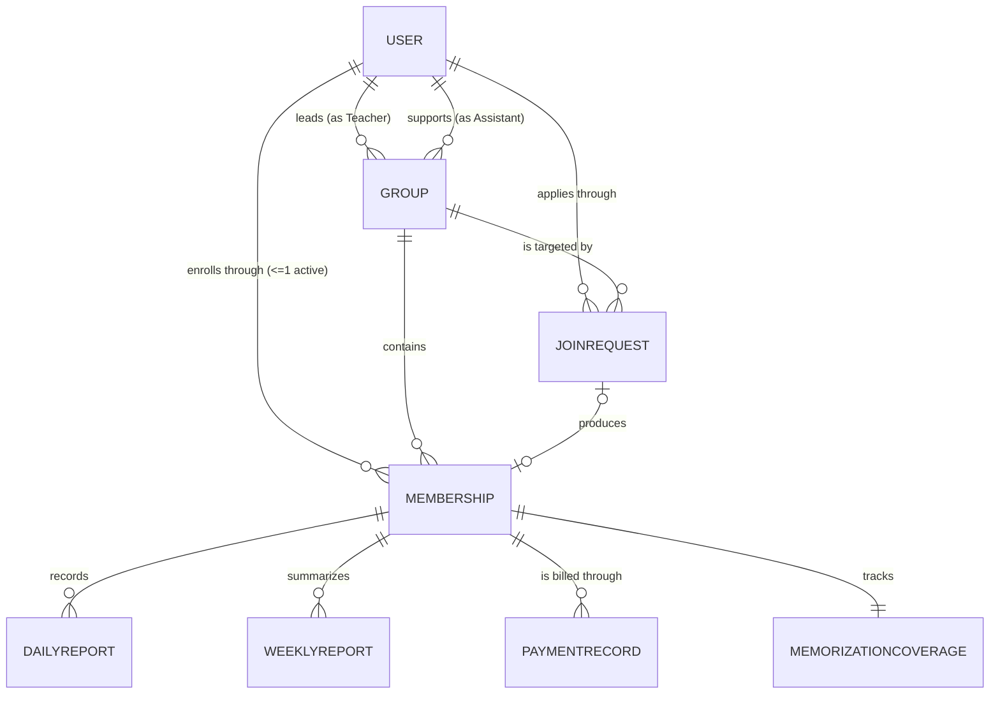

# Irtaki — Domain Model Specification

---

## 1. Document Information

| Field | Value |
|---|---|
| Document | Irtaki — Domain Model Specification (DMS) |
| Version | 1.0 |
| Status | Draft — pending Product Owner review |
| Source documents | Irtaki SRS v1.0 (Baselined) · Irtaki SAS v1.0 (Baselined) |
| Prepared by | Senior System Analyst / Domain Modeler |
| Audience | Software Architect, Backend Lead, Mobile Lead, DBA, QA Lead, Product Owner |
| Scope | MVP |
| Identifier scheme | `E-*` Entity · `VO-*` Value Object · `ST-*` State model · `R-*` Relationship · `DE-*` Domain Event · `DS-*` Domain Service · `INV-*` Invariant · `AGG-*` Aggregate · `DMD-*` Domain-modeling decision (this document) — all other prefixes (`BR-*`, `FR-*`, `VR-*`, `DEC-*`, `ADR-*`, `ISS-*`) are inherited verbatim from the SAS |

---

## 2. Purpose

The SRS states what the business wants. The SAS states what the system must therefore contain and do. This document states **what Irtaki fundamentally *is*** — independent of screens, endpoints, or tables — so that the same conceptual model can be recognized in the eventual database schema, the backend code, and the API, without any of those three disagreeing with each other about what a "Membership" or a "Weekly Report" means.

**Relationship to the SAS.** The SAS already performed substantial domain-modeling work (§7–§11: entity justification, value objects, aggregates, state models) to a rigor level this document treats as **authoritative and confirmed** (per DQ-01, agreed 2026-08-12). This document does not re-derive those conclusions; it:

1. **Formalizes** them into a dedicated domain-modeling structure (ubiquitous language, invariant classification, cardinality/optionality, aggregate boundaries, domain events, temporal model, alternatives-considered, quality review, decision register, traceability);
2. **Extends** into areas the SAS touched but did not fully formalize as domain artifacts (a complete domain event catalog beyond the notification subset; explicit documentation of rejected alternatives even for already-decided questions);
3. **Resolves** the domain-modeling-specific ambiguities raised and answered in Batch 1 (DQ-02…DQ-08), all approved by the Product Owner and recorded in §26.

No new business requirement is introduced anywhere in this document. Where information was genuinely absent, it is marked ⚠️ **OPEN DOMAIN QUESTION** rather than assumed.

---

## 3. Domain Overview

Irtaki is a **record-keeping and follow-up system** for a single Quran memorization center. It does not teach, examine, correct, or grade — recitation happens on WhatsApp, hizb verification happens between the student and a colleague, and money changes hands in cash. The system's entire value is in **recording what happened and computing indicators from those records.**

### 3.1 Core domain vs. supporting subdomains

Not every entity in the system carries equal conceptual weight. Separating them clarifies what this domain model is really *about*:

| Domain | Concepts | Why it belongs here |
|---|---|---|
| **Core domain** | User, Group, Membership, JoinRequest, DailyReport, WeeklyReport, PaymentRecord, MemorizationCoverage | This *is* Irtaki — enrollment, reporting, and follow-up. Every business rule in the SRS concerns these. |
| **Supporting subdomain** (per DQ-03) | DeviceToken, NotificationPreference, NotificationLog, AuditEntry | Cross-cutting infrastructure that *reacts to* the core domain (a notification fires because a `JoinRequest` was accepted) but carries none of the center's actual business rules. Documented in §20 with lighter rigor. |
| **External reference data** (per DQ-02) | Surah, HizbBoundary | Static facts about the Quran, not concepts Irtaki manages. Never created, modified, or owned by any domain behavior. Documented in §19 rather than the Entity Catalogue. |

### 3.2 Three functional pillars

1. **Enrollment** — a self-registered User applies to a gender-matching open Group through a scored multi-step form; an Assistant accepts or rejects; acceptance creates a Membership and starts a payment cycle.
2. **Reporting** — an enrolled Student submits one immutable Daily Report on each of six weekly memorization days, and confirms one auto-computed Weekly Report on the seventh (recitation) day.
3. **Follow-up** — derived indicators (Commitment Score, memorization coverage, at-risk detection, payment arrears) are surfaced to the Teacher, Assistant, and Student.

### 3.3 What makes this domain unusual

Two properties shape almost every modeling decision below:

- **Everything of value is derived, not entered.** A Student never enters a "commitment score" or "payment status" — the system computes both from raw, immutable Daily Reports. The domain model must therefore distinguish sharply between what is *recorded* (facts) and what is *derived* (projections), because conflating them is the single most common domain-modeling error available here (SAS's CON-01, CON-07).
- **A missed deadline is permanent.** Reports are immutable and non-backdatable. This makes the domain temporally strict in a way most CRUD systems are not — see §18.

---

## 4. Ubiquitous Language

The terminology below is used consistently by the business, the SRS, the SAS, and — from this document forward — the code. No significant synonym conflicts were found across the SRS and SAS (unlike a typical greenfield project, this domain's vocabulary was already disciplined before analysis began). Two terms are flagged below because they are easy to *conceptually* confuse even though the words themselves are unambiguous.

| Term | Definition | Business meaning | Related concepts | Modeling type |
|---|---|---|---|---|
| **User** | Any registered person, identified by email. | The identity anchor for every actor in the system. | Role, Student, Teacher, Assistant, Admin | Entity |
| **Role** | The single capacity a User currently holds. | Determines what a person can see and do. | User | Enumeration (not a sub-type — see §5) |
| **Student** | A User whose role is `Student`; bound to exactly one active Membership. | The person being followed up on. | Membership, DailyReport | Role value |
| **Teacher** | A User whose role is `Teacher`; pedagogical lead of one or more Groups. Read-only except the enrollment toggle. | Consumes follow-up data; never enters report content. | Group | Role value |
| **Assistant** | A User whose role is `Assistant`; handles applications and payments for assigned Groups. | Has zero visibility into report content or performance (DEC-B09). | JoinRequest, PaymentRecord | Role value |
| **Admin** | The single seeded account. | Owns Groups, staff assignment, and student removal. | Group | Role value |
| **Group** | An organizational unit with a fixed weekly recitation day and a gender restriction. | The container a Student is enrolled in. | Membership, Teacher, Assistant | Entity |
| **Membership** | One episode of a User's enrollment in a Group. | The thing that actually owns reports, payments, and progress — not the User. | User, Group, DailyReport | Entity (associative) |
| **JoinRequest** | A User's application to a specific Group. | Carries the applicant profile and score; outlives its own decision. | User, Group, Membership | Entity (associative) |
| **Applicant** | A User in the process of applying, before a decision is made. | Not a separate role — a User with a `Pending` JoinRequest. | User, JoinRequest | Named state, not an entity |
| **Daily Report** | One immutable record of a Student's activity on one date. | The system's primary data artefact. | Memorization, Daily Revision, Absence | Entity |
| **Memorization Day** | One of the 6 weekly days a Student memorizes new content and submits a Daily Report. | Defines when a Daily Report is expected. | Recitation Day, ReportingWeek | Derived (complement of Recitation Day) |
| **Recitation Day** | The single weekly day, fixed per Group, on which the group recites over WhatsApp (outside the app) and the Student confirms a Weekly Report. | Anchors the reporting week boundary. | Group, WeeklyReport | Attribute of Group |
| **Reporting Week** | The 7-day window from the day after one recitation day through the next, inclusive. | The period a Weekly Report summarizes. | WeeklyReport | Value Object (`VO-04`) |
| **Daily Revision** | A small consolidation quantity revised on **every** expected day, alongside memorization. | Mandatory, orthogonal to memorization. See the warning box below. | DailyReport | Attribute (embedded VO) |
| **Revision Period** | An implicit phase in which a Student's *focus* has shifted to consolidation rather than new memorization. | Signaled purely by report type; no declaration, no approval, no stored representation. | DailyReport.type | Derived predicate |
| **Weekly Report** | The auto-computed summary presented on the recitation day; the sole carrier of `attended_recitation_call`. | Bridges daily facts into a weekly, confirmable artefact. | DailyReport, Commitment Score | Entity |
| **Hizb** *(pl. ahzab)* | One of 60 fixed divisions of the Quran. | The unit of progress the center and the student both think in. | Surah, MemorizationCoverage | External reference concept |
| **Coverage** | The union of every ayah range a Student has ever memorized. | What "how much has this student memorized" actually means — order-independent. | MemorizationCoverage | Entity (persisted projection) |
| **Commitment Score** | A computed 0–100 indicator of a Student's consistency, or `null` if there isn't enough data. | The headline follow-up metric. | DailyReport, WeeklyReport | Derived Value Object |
| **At-Risk** | A Student with 3 consecutive expected days bearing no report. | The early-warning signal for pain point #2. | DailyReport | Derived predicate |
| **Payment Cycle** | A fixed 3-month billing period, derived arithmetically from `Membership.started_at`. | Never stored as a row — only *paid* cycles produce a record. | PaymentRecord | Value Object (`VO-05`) |
| **Arrears** | The count of past, unpaid cycles for a Membership. | Surfaced instead of a fourth payment-status value. | PaymentRecord | Derived value |
| **Applicant Score** | A computed 9.17–100 ranking value, snapshotted at submission. | Sorts (never gates) the Assistant's review queue. | JoinRequest | Attribute (computed once) |
| **Soft Delete** | Marking a record hidden-but-retained rather than physically removing it. | How student removal is implemented (superseding the SRS's original hard-delete rule). | Membership, DailyReport, WeeklyReport, PaymentRecord | Cross-cutting pattern |

> ⚠️ **Terminology warning — "Removal" vs. "Archival."** These sound similar but act on different entities with different effects. **Removal** ends a specific Student's *Membership* (they revert to `User`; their own records are hidden). **Archival** freezes an entire *Group* (all its Memberships stop accruing new activity, but every Student stays enrolled). Confusing the two in code or conversation would misroute a change that should affect one student into one that affects an entire group, or vice versa. Recommend keeping these as distinct, non-overloadable verbs (`removeStudent()` vs. `archiveGroup()`) everywhere downstream.

> ⚠️ **Terminology warning — "Revision" has two meanings.** SAS §17.2 calls this "the single most misreadable part of the domain," and it survives into this document unchanged: **Daily Revision** is a mandatory field filled in on *every* expected day. A **Revision Period** is an unrelated, implicit phase inferred from `DailyReport.type = Revision`. A `Normal`-type report with no revision entered is a miss, *even during what looks like a light week*; a `Revision`-type day satisfies daily revision automatically. Treat these as two unrelated terms that happen to share a root word.

---

## 5. Domain Concepts

Every concept named anywhere in the SRS or SAS, classified. This is the full candidate-concept sweep (Phase 2); §6–§9 give the confirmed catalogue in detail.

| Concept | Type | Reason | Source | Confidence |
|---|---|---|---|---|
| User | Entity | Independent identity (email), independent lifecycle | SRS §3, SAS E-01 | ✅ High |
| Role | Enumeration | One value at a time (BR-R01); no sub-type carries unique attributes or lifecycle | SRS §3.1, SAS §8.3 | ✅ High |
| Group | Entity | Independent identity, two-dimensional lifecycle | SRS §7.2, SAS E-02 | ✅ High |
| Membership | Entity (associative) | Resolves the User↔Group N:M-over-time relationship; owns all reporting/payment/progress data | SAS ADR-001, E-03 | ✅ High |
| JoinRequest | Entity (associative) | Carries a substantial, independently-lifecycled applicant profile | SRS §9.2, SAS E-04 | ✅ High |
| DailyReport | Entity | Independent identity, immutable lifecycle, unbounded cardinality | SRS §9.5, SAS E-05 | ✅ High |
| WeeklyReport | Entity | Distinct lifecycle from DailyReport (generated → presented → finalised); carries data (`attended`) that exists nowhere else | SRS §9.6, SAS E-06 | ✅ High |
| PaymentRecord | Entity | Records a discrete assertion event; cycles themselves are derived | SRS §9.7, SAS E-07, ADR-006 | ✅ High |
| MemorizationCoverage | Entity (projection) | A fold over unbounded history with its own update semantics | SAS §17.6, E-08, ADR-008 | ✅ High |
| MemorizationRecord | *(not an entity)* | Cardinality exactly 0..1 per report, no independent identity or lifecycle | SAS §8.3, §17.4 | ✅ High |
| RevisionRecord | *(not an entity)* | Identical argument to MemorizationRecord | SAS §8.3, §17.4 | ✅ High |
| RevisionPeriod | *(not an entity)* | Purely a derived predicate over report type; no stored representation exists or is wanted (DEC-A04) | SAS §8.3 | ✅ High |
| PaymentStatus | *(not an entity)* | Time-dependent; derived at read time (DEC-A06) | SAS §8.3, §18.5 | ✅ High |
| Attendance | Attribute | A single boolean on WeeklyReport | SRS §9.6 | ✅ High |
| AtRiskFlag | Derived predicate | Computed from the last 3 expected days | SAS §18.4, DEC-B05 | ✅ High |
| CommitmentScore | Derived Value Object | Recomputed per caller-supplied period; never stored | SRS §9.4.3, SAS VO-06 | ✅ High |
| AyahPosition / AyahRange / TimeWindow / ReportingWeek / PaymentCycle / CoverageSet / ApplicantProfile / DayClassification | Value Objects | No independent identity; defined by their attribute values | SAS §8.4 | ✅ High |
| DeviceToken / NotificationPreference / NotificationLog | Entity (supporting) | Independent identity and lifecycle, but no core business rule | SAS §8.2, DEC-C10 | ✅ High |
| AuditEntry | Entity (supporting) | Write-once record of 3 specific actions | SAS §8.2, DEC-D05 | ✅ High |
| Surah / HizbBoundary | External reference concept | Static, deployment-loaded, never created/updated by any domain behavior (per DQ-02) | SAS E-13/E-14, DEC-B01 | ✅ High |
| Tafsir | Attribute | A boolean on DailyReport, feeding no metric | SRS §1.3, SAS §17.5 | ✅ High (⚠️ ISS-12: possibly incomplete — see §27) |
| Role History | *(deliberately absent)* | No requirement or rule creates this concept; explicitly confirmed absent (per DQ-07) | BR-R04, DEC-D05, RISK-08 | ✅ High (documented absence) |
| Suspended (Membership state) | *(not modeled)* | No requirement asks for it; only a future idea (FI-21) | SAS §11, §32 | ✅ High (excluded per DQ-04) |

---

## 6. Entity Catalogue

| ID | Entity | Domain | Purpose in one line |
|---|---|---|---|
| E-01 | User | Core | Identity anchor: credentials, role, timezone |
| E-02 | Group | Core | The organizational unit; owns the recitation day |
| E-03 | Membership | Core | One episode of enrollment; owns all reporting/payment/progress data |
| E-04 | JoinRequest | Core | An application to join, carrying the scored applicant profile |
| E-05 | DailyReport | Core | One immutable record of one day's activity |
| E-06 | WeeklyReport | Core | The auto-computed, student-confirmed weekly summary |
| E-07 | PaymentRecord | Core | One assertion that a cycle was paid |
| E-08 | MemorizationCoverage | Core | The persisted interval-set projection of progress |
| E-09 | DeviceToken | Supporting | A push-notification destination |
| E-10 | NotificationPreference | Supporting | Per-category mute state |
| E-11 | NotificationLog | Supporting | Dispatch outcome record |
| E-12 | AuditEntry | Supporting | Write-once record of the 3 audited actions |

Full specifications for E-01…E-08 follow in §7.1; E-09…E-12 are covered together in §7.2 with lighter rigor, consistent with their Supporting-subdomain status (DQ-03).

---

## 7. Entity Specifications

### 7.1 Core domain entities

---

#### E-01 — User

| | |
|---|---|
| **Purpose** | The identity anchor for every actor in the system. |
| **Business definition** | Any person who has registered with Irtaki, identified by a unique email, holding exactly one role at a time. |
| **Identity** | `id` (UUID); externally recognizable by unique `email` |
| **Lifecycle** | Registration → role transitions (see ST-01). Never deleted. |
| **Ownership** | Business owner: the person themselves (own credentials, timezone, notification prefs). Role is Admin-owned. |
| **Key attributes** | email, password credential, role, full_name *(set only after first enrollment)*, gender *(set only after first enrollment)*, timezone |
| **Relationships** | 1 → 0..N JoinRequest · 1 → 0..N Membership (≤1 Active) · 1 → 0..N Group as Teacher · 1 → 0..N Group as Assistant |
| **Business rules** | BR-R01…R05 |
| **Invariants** | Exactly one role at any time · exactly one Admin exists system-wide · at most one Active Membership |
| **Creation conditions** | Self-registration (produces `User`); Admin seeded once at installation |
| **Modification conditions** | Self: credentials, timezone, notification prefs. Admin: role only, and only from `User` (BR-R03). |
| **Deletion / deactivation conditions** | Never deleted. Role transitions are the only lifecycle movement. |
| **Historical requirements** | None — role history is deliberately absent (§4, §27) |
| **Related use cases** | UC-01, UC-02, UC-17 |
| **Related requirements** | FR-AUTH-01…08 |

---

#### E-02 — Group

| | |
|---|---|
| **Purpose** | The organizational unit a Student is enrolled in; owns the recitation day that defines every member's reporting week. |
| **Business definition** | A gender-restricted memorization group with exactly one Teacher, exactly one Assistant, and a fixed weekly recitation day. |
| **Identity** | `id` (UUID); `name` is descriptive, not an identifier (no uniqueness stated) |
| **Lifecycle** | Two independent dimensions — see ST-02: `Active`/`Archived` (Admin-controlled) × `Open`/`Closed` (Teacher-controlled enrollment) |
| **Ownership** | Business owner: the Admin. Enrollment toggle owner: the assigned Teacher. |
| **Key attributes** | name, gender, recitation_day *(write-once)*, enrollment_status, lifecycle_state |
| **Relationships** | 1 → 0..N Membership · 1 → 0..N JoinRequest · N → 1 User (Teacher, mandatory) · N → 1 User (Assistant, mandatory) |
| **Business rules** | BR-07…13, BR-41…44 |
| **Invariants** | Exactly one Teacher and one Assistant, both correctly-roled · recitation day immutable after creation · no maximum capacity |
| **Creation conditions** | Admin only, with Teacher and Assistant assigned at creation (cannot be null) |
| **Modification conditions** | Admin: name, staff (reassignment), lifecycle. Teacher: enrollment toggle only, own group. |
| **Deletion / deactivation conditions** | Deletion: only if the Group has never had a Membership (BR-43). Deactivation: Archive, Admin-only, reversible. |
| **Historical requirements** | Full — a Group is never deleted once it has been used |
| **Related use cases** | UC-10, UC-11, UC-13, UC-14 |
| **Related requirements** | FR-GRP-01…12 |

---

#### E-03 — Membership

| | |
|---|---|
| **Purpose** | One episode of a User's enrollment in a Group. The most consequential domain decision in this model — see §25 for the alternative that was rejected and why. |
| **Business definition** | The record that a specific User was enrolled in a specific Group from a start date, optionally to an end date, and everything (reports, payments, progress) that happened during that episode. |
| **Identity** | `id` (UUID) — deliberately independent of both `user_id` and `group_id`, because the same (User, Group) pair can produce multiple Memberships over time (rejoin) |
| **Lifecycle** | `Active` → `Terminated`, terminal (see ST-03). Rejoining never revives a Membership — it creates a new one. |
| **Ownership** | Business owner: the enrolled Student (for their own data); created by the Assistant's acceptance action; terminated only by the Admin. |
| **Key attributes** | started_at, ended_at, state |
| **Relationships** | N → 1 User · N → 1 Group · 1 → 0..1 JoinRequest (the one that produced it) · 1 → 0..N DailyReport · 1 → 0..N WeeklyReport · 1 → 0..N PaymentRecord · 1 → 1 MemorizationCoverage |
| **Business rules** | BR-02, BR-04, BR-39, BR-40, BR-05a |
| **Invariants** | At most one `Active` Membership per User · a rejoin starts with zero coverage and zero history (no carry-forward) |
| **Creation conditions** | System, as the effect of an Assistant accepting a JoinRequest |
| **Modification conditions** | Admin: termination only. No other field is ever mutated after creation. |
| **Deletion / deactivation conditions** | Never deleted — terminated (soft) only, as the effect of Admin-initiated student removal |
| **Historical requirements** | Full — this is precisely the entity that makes historical retention possible in the first place |
| **Related use cases** | UC-04, UC-12, UC-16 |
| **Related requirements** | FR-REQ-05, FR-GRP-08/08a |

---

#### E-04 — JoinRequest

| | |
|---|---|
| **Purpose** | A User's application to a specific Group, carrying the full applicant profile and computed score. Survives its own decision. |
| **Business definition** | A scored, decided-once application that either produces a Membership or terminates without one. |
| **Identity** | `id` (UUID) |
| **Lifecycle** | `Pending` → `Accepted` / `Rejected`, all terminal, no reopening (see ST-04) |
| **Ownership** | Business owner: the applicant (read, status-only, while pending — DEC-C09). Decided by the Assistant of the target Group. |
| **Key attributes** | full_name, gender, memorized_ahzab (set of hizb numbers), tajweed_level, program_goal, fee_agreement, score *(computed once, immutable)*, status |
| **Relationships** | N → 1 User · N → 1 Group · 1 → 0..1 Membership (produced only if `Accepted`) |
| **Business rules** | BR-01, BR-06, BR-36…38, BR-57…59 |
| **Invariants** | At most one `Pending` request per User · score immutable after creation · gender must equal the target Group's gender |
| **Creation conditions** | The User, when not enrolled and holding no other `Pending` request |
| **Modification conditions** | Assistant: status only (`Pending` → `Accepted`/`Rejected`). System: auto-rejection on Group archival. |
| **Deletion / deactivation conditions** | Never deleted directly — soft-deleted only as a cascade of the applicant's later removal as a Student |
| **Historical requirements** | Full — rejected/historical requests are retained, not purged, and support the score-reproducibility rule (BR-38) |
| **Related use cases** | UC-03, UC-04 |
| **Related requirements** | FR-JOIN-01…12, FR-REQ-01…09 |

---

#### E-05 — DailyReport

| | |
|---|---|
| **Purpose** | The system's primary data artefact: one immutable record of one Student's activity on one date. |
| **Business definition** | Exactly one of three shapes (`Normal`, `Absent`, `Revision`) recorded once, on the day it describes, and never again touched. |
| **Identity** | `id` (UUID); business identity is effectively `(membership_id, report_date)` |
| **Lifecycle** | `Submitted` → (optionally) hidden by cascade — a two-state lifecycle, terminal on creation (see ST-05) |
| **Ownership** | Business owner: the Student who submitted it. Read by the Teacher of that Membership's Group; never by the Assistant (DEC-B09). |
| **Key attributes** | report_date, type, and type-specific embedded value objects (memorization range/time, revision range/time, repetition flags, tafsir flag, or absence reason) |
| **Relationships** | N → 1 Membership · feeds MemorizationCoverage · logically grouped into a WeeklyReport by date range, with no foreign key (§10.4) |
| **Business rules** | BR-16, BR-19…30, BR-47, BR-48 |
| **Invariants** | At most one per (Membership, date) · immutable once created · cannot be created on the Group's recitation day, or when the Group is Archived, or for any date but today |
| **Creation conditions** | The enrolled Student, today only, once per day |
| **Modification conditions** | Nobody. Immutable by design (BR-22). |
| **Deletion / deactivation conditions** | Nobody deletes directly — soft-deleted only as a cascade of Membership termination |
| **Historical requirements** | Full — this is literally the history the product exists to preserve |
| **Related use cases** | UC-05 |
| **Related requirements** | FR-DR-01…12 |

---

#### E-06 — WeeklyReport

| | |
|---|---|
| **Purpose** | The weekly summary presented on the recitation day; the sole carrier of `attended_recitation_call`. |
| **Business definition** | A generated-then-confirmed artefact that exists for every enrolled Student every reporting week — even a week with zero Daily Reports. |
| **Identity** | `id` (UUID); business identity is `(membership_id, week_start, week_end)` |
| **Lifecycle** | `Open` → `Finalised` (see ST-06). Finalisation is performed by the Student (confirming attendance) or, failing that, the Scheduler at midnight. |
| **Ownership** | Business owner: the Student (their one write action). System owns finalisation. |
| **Key attributes** | week_start, week_end, expected_days, five `missed_*` metrics, attended_recitation_call, state |
| **Relationships** | N → 1 Membership. Derived from DailyReport by date range only — deliberately no foreign key (§10.4) |
| **Business rules** | BR-15, BR-17, BR-23…25, BR-30, BR-45 |
| **Invariants** | At most one per (Membership, reporting week) · once `Finalised`, immutable · `attended` defaults to `false` if unconfirmed |
| **Creation conditions** | System, on entering the recitation day (or lazily, on first read that day) |
| **Modification conditions** | Student: the attendance checkbox, once, on the recitation day only. System: finalisation. |
| **Deletion / deactivation conditions** | Never deleted directly — soft-deleted only as a cascade of Membership termination |
| **Historical requirements** | Full — metrics are frozen at finalisation precisely so history never silently changes |
| **Related use cases** | UC-06 |
| **Related requirements** | FR-WR-01…10 |

---

#### E-07 — PaymentRecord

| | |
|---|---|
| **Purpose** | Records that an Assistant asserted a specific cycle was paid. Only paid cycles produce a row (ADR-006) — an unpaid cycle is the *absence* of one. |
| **Business definition** | A single, dated, attributed assertion of payment for one 3-month cycle of one Membership. |
| **Identity** | `id` (UUID); business identity is `(membership_id, cycle_index)` |
| **Lifecycle** | Created once; no further states |
| **Ownership** | Business owner: the Assistant who recorded it. Never mutated by anyone afterward (⚠️ see ISS-02, §27). |
| **Key attributes** | cycle_index, amount (fixed 30 TND), paid_at, recorded_by |
| **Relationships** | N → 1 Membership · N → 1 User (the recording Assistant) |
| **Business rules** | BR-31…35, BR-54…56 |
| **Invariants** | A cycle may be paid at most once · cycles may be paid out of order |
| **Creation conditions** | Assistant, for any unpaid cycle of a Student in their assigned Groups |
| **Modification conditions** | Nobody |
| **Deletion / deactivation conditions** | Nobody deletes directly — soft-deleted only as a cascade of Membership termination |
| **Historical requirements** | Full |
| **Related use cases** | UC-09 |
| **Related requirements** | FR-PAY-01…08 |

---

#### E-08 — MemorizationCoverage

| | |
|---|---|
| **Purpose** | The persisted interval set from which every progress figure derives. One per Membership. |
| **Business definition** | The union of every ayah range a Student has ever submitted as memorized, stored as a normalized set of disjoint intervals — order-independent, never shrinking. |
| **Identity** | `id` (UUID); business identity is `membership_id` (1:1, unique) |
| **Lifecycle** | Created (seeded) with the Membership; updated on every accepted memorization submission; never deleted independently |
| **Ownership** | System-owned. No human ever writes to it directly. |
| **Key attributes** | intervals (CoverageSet), last_memorized_position, ahzab_completed *(cached derivation)* |
| **Relationships** | 1 → 1 Membership |
| **Business rules** | BR-50…53 |
| **Invariants** | Coverage only ever merges or absorbs — it never shrinks · seeded exactly once, at Membership creation |
| **Creation conditions** | System, at Membership creation, seeded from the applicant's declared ahzab selection |
| **Modification conditions** | System only, on accepting a DailyReport containing a memorization range |
| **Deletion / deactivation conditions** | Soft-deleted only as a cascade of Membership termination |
| **Historical requirements** | Current state only — no "coverage as of date X" snapshot exists (⚠️ ISS-16, accepted for MVP) |
| **Related use cases** | UC-05 (indirectly, as a side-effect) |
| **Related requirements** | FR-DR-12, FR-REQ-05b |

---

### 7.2 Supporting-subdomain entities (lighter treatment, per DQ-03)

These entities exist to support the core domain but carry no business rule of the center's own — they exist because push notifications and a minimal audit trail were added during system analysis (DEC-C10, DEC-D05), not because the Quran memorization business itself requires them.

| Entity | Purpose | Identity | Lifecycle | Owner |
|---|---|---|---|---|
| **E-09 DeviceToken** | A destination for push notifications | `id`; one User has many | registered → invalidated (by logout or transport) | System, per User |
| **E-10 NotificationPreference** | Per-category mute state | `id`; `(user_id, category)` | created → mutable at will | The User themselves |
| **E-11 NotificationLog** | Dispatch outcome record | `id` | write-once | System |
| **E-12 AuditEntry** | Record of exactly 3 audited actions (enrollment toggle, group creation, login) | `id` | write-once | System; Admin-read only |

None of these four participates in any core-domain invariant (§14), aggregate boundary of the core domain (§15), or the reporting/payment/progress calculations of §21–§23. They are included here only so the full system is traceable from one document.

---

## 8. Value Objects

A value object has no identity of its own — two instances with the same attribute values are the same value object. All nine below were identified and are confirmed by SAS §8.4.

| ID | Value Object | Meaning | Attributes | Validation | Equality | Why not an entity |
|---|---|---|---|---|---|---|
| **VO-01** | `AyahPosition` | A single point in the Quran | surah_number, ayah_number, derived ordinal | surah ∈ 1..114; ayah valid for that surah | By ordinal | Two positions with the same coordinates are simply the same position — nothing distinguishes them |
| **VO-02** | `AyahRange` | A span between two positions | start: AyahPosition, end: AyahPosition | end.ordinal ≥ start.ordinal (BR-52) | Structural | No independent lifecycle; meaningless outside its parent report |
| **VO-03** | `TimeWindow` | A wall-clock span with no date | from: Time, to: Time | to > from | Structural | Purely descriptive of a duration |
| **VO-04** | `ReportingWeek` | The 7-day window a Weekly Report summarizes | start_date, end_date | end_date is a recitation-day date; start = end − 6 | Structural | Fully determined by (Group's recitation day, any date within it) — never independently created |
| **VO-05** | `PaymentCycle` | One 3-month billing period | index, start_date, end_date, amount (fixed) | index ≥ 0 | Structural | Derived arithmetically from `Membership.started_at`; never stored (ADR-006) |
| **VO-06** | `CommitmentScore` | The 0–100 (or null) consistency indicator | 4 nullable component rates + overall value | Each component independently nullable | Structural, and re-derived per query | Meaningless without a (Membership, period) pair supplied at query time — has no existence of its own |
| **VO-07** | `CoverageSet` | An ordered set of disjoint, non-adjacent AyahRanges | intervals[] | Closed under union; merge-on-insert | By interval set content | It's the *value* of coverage, not a separately-identified thing — E-08 is the entity that owns it |
| **VO-08** | `ApplicantProfile` | The immutable snapshot of applicant-declared data | full_name, gender, age, phone, occupation, city, memorized_ahzab, tajweed_level, etc. | See VR-03…09 | Structural | Embedded on JoinRequest; has no existence independent of the request that carries it |
| **VO-09** | `DayClassification` | The single input to every weekly metric | one of `NO_REPORT` / `NORMAL` / `REVISION` / `ABSENT_EXCUSED` / `ABSENT_OTHER` | Exactly one value per (Membership, date) | By value | A pure classification result, not a thing that is created or stored |

---

## 9. Enumerations

| Enumeration | Values | Meaning | Allowed transitions |
|---|---|---|---|
| **Role** | `Admin` / `User` / `Student` / `Teacher` / `Assistant` | The one capacity a User holds | See ST-01 |
| **Gender** | `Male` / `Female` | Gates group visibility and eligibility | Not stated as changeable once set on User (copied from JoinRequest at acceptance) |
| **GroupEnrollmentStatus** | `Open` / `Closed` | Whether the Group accepts new applications | `Closed` ⇄ `Open`, Teacher-controlled |
| **GroupLifecycleState** | `Active` / `Archived` | Whether the Group is operating at all | `Active` ⇄ `Archived`, Admin-controlled; `Archived` dominates `Open` |
| **MembershipState** | `Active` / `Terminated` | Whether the enrollment episode is ongoing | `Active` → `Terminated`, one-way, terminal |
| **JoinRequestStatus** | `Pending` / `Accepted` / `Rejected` | The decision state of an application | `Pending` → `Accepted` / `Rejected`, terminal, no reopening |
| **DailyReportType** | `Normal` / `Absent` / `Revision` | Which shape a day's report takes | Set once at creation; never changes |
| **AbsenceReason** | `Sick` / `Studying` / `Other` | Why an `Absent` report was filed | Set once at creation |
| **TajweedLevel** | `Beginner` / `Intermediate` / `Advanced` | Applicant's self-declared skill | Set once, on the JoinRequest |
| **ProgramGoal** | `Memorization` / `Revision` | What the applicant wants; only `Memorization` is accepted | Set once, on the JoinRequest |
| **WeeklyReportState** | `Open` / `Finalised` | Whether the week is still confirmable | `Open` → `Finalised`, one-way, terminal |
| **PaymentStatus** *(derived, never stored)* | `Paid` / `Due Soon` / `Unpaid` | The current billing state of a cycle | Not a stored transition — recomputed at read time |
| **DayClassification** *(= VO-09)* | `NO_REPORT` / `NORMAL` / `REVISION` / `ABSENT_EXCUSED` / `ABSENT_OTHER` | The single input to every metric | Recomputed per day, not transitioned |
| **NotificationCategory** | Per §22 event catalogue (N-01…N-08 grouped by category) | Governs mute eligibility | Account-critical categories cannot be muted (BR-61) |
| **AuditAction** | `ENROLLMENT_TOGGLED` / `GROUP_CREATED` / `LOGIN` | The only 3 actions audited | N/A — write-once log |

---

## 10. Relationships

| ID | Entity A | Card. | Entity B | Meaning | Optionality |
|---|---|---|---|---|---|
| R-01 | User | 1 → 0..N | JoinRequest | applies through | Optional; ≤1 `Pending` |
| R-02 | Group | 1 → 0..N | JoinRequest | is targeted by | Optional |
| R-03 | User | 1 → 0..N | Membership | enrolls through | Optional; ≤1 `Active` |
| R-04 | Group | 1 → 0..N | Membership | contains | Optional; no cap |
| R-05 | JoinRequest | 1 → 0..1 | Membership | produces | Optional — only if `Accepted` |
| R-06 | Group | N → 1 | User (Teacher) | is led by | **Mandatory** |
| R-07 | Group | N → 1 | User (Assistant) | is supported by | **Mandatory** |
| R-08 | Group | N → 1 | User (Admin) | was created by | Mandatory |
| R-09 | Membership | 1 → 0..N | DailyReport | records | Optional; ≤1 per date |
| R-10 | Membership | 1 → 0..N | WeeklyReport | summarizes | Optional; ≤1 per reporting week |
| R-11 | Membership | 1 → 0..N | PaymentRecord | is billed through | Optional; ≤1 per cycle index |
| R-12 | Membership | 1 → 1 | MemorizationCoverage | tracks progress in | **Mandatory** |
| R-13 | PaymentRecord | N → 1 | User (Assistant) | was recorded by | Mandatory |
| R-14 | User | 1 → 0..N | DeviceToken | receives push on | Optional |
| R-15 | User | 1 → 0..N | NotificationPreference | configures | Optional; absent = unmuted |
| R-16 | DailyReport | 0..N → 1 | WeeklyReport | is summarized by | Derived association by date range — **no foreign key** (§10 note below) |

**Note on R-16.** A WeeklyReport must exist even with zero DailyReports (a student who submitted nothing that week still gets a report showing all misses). A foreign-key-based association cannot represent "summarizes nothing," so the association is resolved at query time by `(membership_id, date range)` rather than by reference.

**Why the User↔Group relationship needed an associative entity.** A naive reading of the SRS (`User.group_id`) suggests a simple N:1. But once a Student can be removed and later rejoin, a person's relationship to a Group is really a *sequence* of episodes, each with its own start date, end date, and set of records that must never intermingle. Membership (E-03) is what a plain foreign key on User cannot express. This is the single most important structural decision in the whole model — see §25.1 for the alternatives that were rejected.

**No genuine N:M relationship exists anywhere in this domain.** Every apparent many-to-many (User↔Group over time; User↔Group via staff assignment; User↔Group via application) resolves cleanly into either a 1:N with a foreign key, or a proper associative entity (Membership, JoinRequest) that carries substantial attributes of its own — which is precisely what distinguishes a domain entity from a mere junction table.

---

## 11. Cardinality & Optionality

Presented per relationship, in the explicit two-sided format:

| Relationship | Side A | Side B | Business meaning | Constraints |
|---|---|---|---|---|
| User — JoinRequest | User side: `1` | JoinRequest side: `0..N` (≤1 Pending) | A person may apply many times over their life, but only one application may be open at once | BR-01 |
| Group — JoinRequest | Group side: `1` | JoinRequest side: `0..N` | A Group may receive many applications | — |
| User — Membership | User side: `1` | Membership side: `0..N` (≤1 Active) | A person may be enrolled many times over their life, never twice at once | BR-39 |
| Group — Membership | Group side: `1` | Membership side: `0..N`, uncapped | No enrollment ceiling exists (BR-09) | — |
| JoinRequest — Membership | JoinRequest side: `exactly 1` | Membership side: `0..1` | Every Membership traces to exactly one deciding application; not every application produces one | R-05 |
| Group — Teacher (User) | Group side: `1` | Teacher side: `1..N` (a Teacher may lead several Groups) | Staffing is asymmetric: mandatory on the Group side, unbounded on the User side | BR-07, VR-24 |
| Group — Assistant (User) | Group side: `1` | Assistant side: `1..N` | Same asymmetric pattern as Teacher | BR-07, VR-24 |
| Membership — DailyReport | Membership side: `1` | DailyReport side: `0..N` (≤1 per date) | One record per calendar date, growing without bound over the Membership's life | BR-19 |
| Membership — WeeklyReport | Membership side: `1` | WeeklyReport side: `0..N` (≤1 per reporting week) | One per week, including weeks with zero daily activity | VR-22, DEC-A07 |
| Membership — PaymentRecord | Membership side: `1` | PaymentRecord side: `0..N` (≤1 per cycle index) | Sparse — only paid cycles have a row at all | VR-26 |
| Membership — MemorizationCoverage | Membership side: `1` | MemorizationCoverage side: `exactly 1` | The only strict 1:1 in the model — always created together | R-12 |

---

## 12. Ownership

"Business owner" here means the party whose data this fundamentally *is* — distinct from "who created it" or "who can technically write to it," which are given separately.

| Entity | Business owner | Creator | Can modify | Can view |
|---|---|---|---|---|
| User | The person themselves | Self (registration) / Admin (seeded) | Self (own fields); Admin (role only) | Self; Admin (all); Teacher/Assistant (name+gender of their own students only) |
| Group | The center (via Admin) | Admin | Admin (name, staff, lifecycle); Teacher (enrollment toggle) | Admin (all); Teacher/Assistant (own); Student (own); User (open + gender-matching) |
| Membership | The enrolled Student | System (on JoinRequest acceptance) | Admin (termination only) | Admin (all); Teacher/Assistant (assigned groups); Student (own) |
| JoinRequest | The applicant | The applicant | Assistant (decision only); System (auto-rejection) | Applicant (status only, while pending); Assistant (full, own groups); Admin (all) |
| DailyReport | The Student | The Student | Nobody — immutable | Student (own); Teacher (assigned groups); Admin (all). **Never the Assistant.** |
| WeeklyReport | The Student | System | Student (attendance checkbox, once); System (finalisation) | Student (own); Teacher (assigned groups); Admin (all). **Never the Assistant.** |
| PaymentRecord | The center (via Assistant) | Assistant | Nobody after creation | Student (own); Assistant (assigned groups); Admin (all). **Never the Teacher.** |
| MemorizationCoverage | The Student | System | System only | Student (own); Teacher (assigned groups); Admin (all) |

---

## 13. Entity Lifecycles

Full state models for User, Group, Membership, JoinRequest, DailyReport, and WeeklyReport, carried forward from SAS §11 (ST-01…ST-06) with the DQ-04 decisions applied.

### ST-01 — User role state

```
        registration
             │
             ▼
        ┌─────────┐   Assistant accepts join request      ┌───────────┐
        │  User   │──────────────────────────────────────▶│  Student  │
        │         │◀──────────────────────────────────────│           │
        └────┬────┘        Admin removes from group        └───────────┘
             │
             │ Admin promotes (only from role = User)
             ├──────────────────────────▶ ┌───────────┐
             │                            │  Teacher  │
             │                            └─────┬─────┘
             │           Admin demotes (blocked while assigned
             │           to any non-archived group — BR-44)
             │◀───────────────────────────────────┘
             │
             └──────────────────────────▶ ┌───────────┐
                                           │ Assistant │◀── same demotion rule
                                           └───────────┘

        ┌─────────┐  seeded at installation; no transitions in or out
        │  Admin  │  (BR-R05; cannot self-demote)
        └─────────┘
```

**Per DQ-04:** demotion (`Teacher`/`Assistant` → `User`) is modeled here as a **confirmed transition**, not a proposal — BR-44's blocking rule ("cannot be demoted... until reassigned") only makes sense if the transition exists. What remains genuinely open (ISS-03, carried into §27) is only whether a dedicated screen/action for it exists in the MVP UI — a UX question, not a domain-modeling one.

| Transition | Trigger | Actor | Guards |
|---|---|---|---|
| User → Student | JoinRequest accepted | Assistant | Target Group Open + Active; gender match; no Active Membership |
| Student → User | Removal from Group | Admin | — |
| User → Teacher / Assistant | Promotion | Admin | Source role must be exactly `User` |
| Teacher/Assistant → User | Demotion | Admin | Blocked while assigned to any non-Archived Group |
| Any → Admin | — | — | Impossible |

### ST-02 — Group state (two orthogonal dimensions)

```
   LIFECYCLE (Admin only)              ENROLLMENT (Teacher only)
   ┌──────────┐                        ┌──────────┐
   │  Active  │◀───un-archive───┐      │  Closed  │◀────┐  (default at creation)
   └────┬─────┘                 │      └────┬─────┘     │
        │                       │           │           │
     archive                    │        toggle      toggle
        │                       │           │           │
        ▼                       │           ▼           │
   ┌──────────┐─────────────────┘      ┌──────────┐─────┘
   │ Archived │                        │   Open   │
   └──────────┘                        └──────────┘

   Archived dominates: an Archived group accepts no applications
   regardless of its enrollment_status.
```

Students in an Archived group **remain enrolled** (`role = Student`); their metric periods simply terminate at `archived_at`.

### ST-03 — Membership state

```
   ┌──────────┐   Admin removes student   ┌────────────┐
   │  Active  │───────────────────────────▶│ Terminated │
   └──────────┘                            └────────────┘
        ▲                                        │
        │ created on join acceptance             │ terminal
   ┌──────────┐                                  ▼
   │ (none)   │                        (never revived — rejoin
   └──────────┘                        creates a NEW Membership,
                                        zero coverage, zero history)
```

**Per DQ-04:** no `Suspended` state is modeled. It appears in SAS only as a future idea (FI-21), not a current requirement — adding it now would be inventing a business rule the center has never asked for.

### ST-04 — JoinRequest state

```
             submitted
                 │
                 ▼
           ┌───────────┐
           │  Pending  │
           └─────┬─────┘
                 │
      ┌──────────┼───────────────┬────────────────────┐
      │          │                │                    │
   Assistant  Assistant     Group archived      (no cancel action
   accepts    rejects       (auto-reject)          exists)
      │          │                │
      ▼          ▼                ▼
 ┌──────────┐ ┌──────────┐ ┌──────────┐
 │ Accepted │ │ Rejected │ │ Rejected │  (resolution_source = System)
 └──────────┘ └──────────┘ └──────────┘
   terminal     terminal      terminal
```

A Group merely closing enrollment does **not** change a Pending request's state — it stays reviewable.

### ST-05 — DailyReport state

```
   (none) ──submit──▶ ┌───────────┐ ──membership terminated──▶ ┌──────────┐
                      │ Submitted │                            │ Hidden   │
                      └───────────┘                            └──────────┘
                       immutable                             (soft-deleted;
                                                                Admin-visible only)
```

There is no `Draft`, no `Edited`, no student-initiated `Deleted` state, for any actor.

### ST-06 — WeeklyReport state

```
   (none)
     │  entering the recitation day, or first read that day
     ▼
  ┌────────┐    Student confirms checkbox     ┌────────────┐
  │  Open  │──────────────────────────────────▶│ Finalised  │
  │        │──────────────────────────────────▶│ attended = │
  └────────┘  Scheduler at student-local        │ as recorded│
              midnight, if unconfirmed          └────────────┘
```

---

## 14. Domain Invariants

Rules that must **always** be true, regardless of which use case is executing. Classified per Phase 19: **Confirmed** (explicit business rule), **Derived** (logically follows from confirmed rules), or **Proposed** (analyst recommendation, not yet ratified).

| ID | Invariant | Class | Source |
|---|---|---|---|
| INV-01 | A User holds exactly one role at any time | Confirmed | BR-R01 |
| INV-02 | Exactly one Admin account exists system-wide, and it cannot demote or remove itself | Confirmed | BR-R05, DEC-C07 |
| INV-03 | A User has at most one `Active` Membership at any time | Confirmed | BR-39 |
| INV-04 | A Group has exactly one Teacher and exactly one Assistant, each correctly-roled | Confirmed | BR-07, VR-24 |
| INV-05 | A Group's `recitation_day` is immutable after creation | Confirmed | BR-12, VR-25 |
| INV-06 | A Group that has ever had a Membership can never be deleted | Confirmed | BR-43 |
| INV-07 | A Teacher/Assistant assigned to any non-Archived Group cannot be demoted or removed | Confirmed | BR-44 |
| INV-08 | A User holds at most one `Pending` JoinRequest at a time | Confirmed | BR-01 |
| INV-09 | A JoinRequest's `score` is immutable once computed | Confirmed | BR-38 |
| INV-10 | A JoinRequest's `gender` must equal its target Group's `gender` | Confirmed | VR-08 |
| INV-11 | At most one DailyReport exists per (Membership, date) | Confirmed | BR-19 |
| INV-12 | A DailyReport, once created, is never modified or deleted by any human actor | Confirmed | BR-22 |
| INV-13 | At most one WeeklyReport exists per (Membership, reporting week) | Confirmed | VR-22 |
| INV-14 | A `Finalised` WeeklyReport is immutable | Confirmed | BR-45 |
| INV-15 | A WeeklyReport exists for every enrolled Membership for every reporting week, including weeks with zero DailyReports | Confirmed | DEC-A07 |
| INV-16 | At most one PaymentRecord exists per (Membership, cycle_index) | Confirmed | VR-26 |
| INV-17 | A Membership has exactly one MemorizationCoverage, created with it | Confirmed | R-12 |
| INV-18 | MemorizationCoverage only ever grows (merges/absorbs) — it never shrinks | Confirmed | §17.6 |
| INV-19 | A rejoining User's new Membership starts with zero coverage and zero history — no carry-forward from any prior Membership | Confirmed | DEC-C02, BR-40 |
| INV-20 | A `Terminated` Membership is never revived | Confirmed | ST-03 |
| INV-21 | An Archived Group accepts no new applications, no new Daily Reports, produces no new Weekly Reports, and advances no payment cycles, though its Students remain enrolled | Confirmed | BR-42 |
| INV-22 | A day within a Revision Period is determined solely by that day's `DailyReport.type = Revision` — nothing else excuses memorization | Confirmed | DEC-A04 |
| INV-23 | Daily revision is a distinct, mandatory-every-day obligation, orthogonal to the Revision Period predicate | Confirmed | BR-47, DEC-A08 |
| INV-24 | A Commitment Score component with a zero denominator is excluded from the average, never treated as zero | Confirmed | DEC-B04 |
| INV-25 | Role change history is not tracked anywhere in the system | Confirmed (deliberate absence) | BR-R04, DEC-D05, resolved via DQ-07 |
| INV-26 | Every soft-deleted record remains physically retained and Admin-recoverable | Confirmed | DEC-B10 |
| INV-27 | The `User.timezone` field is the single authority for every day-boundary evaluation involving that User | Confirmed | DEC-B03, T-01 |

---

## 15. Aggregate Boundaries

An aggregate root enforces the invariants of everything inside it as a single consistency unit. Per DQ-05, the Membership aggregate is deliberately kept large — see §25.3 for why the conventional DDD instinct to split it was rejected.

| AGG ID | Aggregate root | Contained | Invariants enforced at the root | Consistency boundary |
|---|---|---|---|---|
| **AGG-01** | User | DeviceToken, NotificationPreference | Exactly one role; at most one Active Membership *(cross-aggregate — see note below)* | Everything about one person's identity and how they can be reached |
| **AGG-02** | Group | *(none — staff are references to User, not contained)* | Exactly one Teacher + one Assistant, both correctly-roled; recitation day immutable | One organizational unit's structural facts |
| **AGG-03** | Membership | DailyReport, WeeklyReport, PaymentRecord, MemorizationCoverage | One DailyReport per date; one WeeklyReport per reporting week; one PaymentRecord per cycle index; exactly one MemorizationCoverage | One enrollment episode's entire reporting, payment, and progress history |
| **AGG-04** | JoinRequest | ApplicantProfile (embedded VO) | Score immutable after creation | One application's full lifecycle |

**Cross-aggregate invariant note (INV-03).** "At most one Active Membership per User" spans two aggregate roots (User and Membership) and therefore cannot be enforced purely by either aggregate's own boundary. It is enforced procedurally by the domain service that creates a Membership (DS-01, §16) at the moment of JoinRequest acceptance — the one place in the system where a new Membership comes into existence. This is a normal and expected pattern; not every invariant needs to collapse into a single aggregate, and forcing this one to would require merging User and Membership into one aggregate, which would then violate the actual reason Membership exists as a separate root in the first place (§25.1).

**Supporting subdomain (NotificationLog, AuditEntry).** Neither needs an aggregate root of its own — both are simple, independently-keyed, write-once logs with no internal invariant beyond "insert-only," consistent with their status as supporting infrastructure (§7.2).

---

## 16. Domain Services

Behavior that genuinely spans multiple entities and does not naturally belong to any single one.

| ID | Domain service | Spans | What it does |
|---|---|---|---|
| **DS-01** | EnrollmentService | JoinRequest, User, Membership, MemorizationCoverage | On JoinRequest acceptance: promotes the User's role, creates the Membership, copies `full_name`/`gender` onto the User, and seeds coverage from the declared ahzab selection — all as one atomic outcome |
| **DS-02** | WeeklyReportFinalizationService | DailyReport, WeeklyReport | Scheduler-driven: finalizes any `Open` WeeklyReport whose recitation day has passed, defaulting `attended = false` |
| **DS-03** | CommitmentScoreCalculator | DailyReport, WeeklyReport, Membership | Pure, read-time calculation of the four-component score over a caller-supplied period; never persists a result |
| **DS-04** | AtRiskDetectionService | DailyReport, Membership | Evaluates the 3-consecutive-expected-days predicate, read-time only |
| **DS-05** | MemorizationProgressEngine | DailyReport, MemorizationCoverage, Surah/HizbBoundary (external reference) | The interval-merge algorithm (§19) that converts a submitted ayah range into updated coverage |
| **DS-06** | PaymentCycleDerivationService | Membership, PaymentRecord | Derives cycle index, status, next-due-date, and arrears count at read time — no cycle is ever stored |
| **DS-07** | GroupArchivalService | Group, Membership, JoinRequest, WeeklyReport | On archival: truncates every active Membership's effective metric window, stops payment-cycle advancement, and auto-rejects every `Pending` JoinRequest targeting the Group |
| **DS-08** | GroupStaffReassignmentService | Group, User | Enforces the demotion-blocking rule (INV-07) and performs Teacher/Assistant reassignment |

---

## 17. Domain Events

Per DQ-06 (approved), this catalog is intentionally broader than the 8 notification-triggering events in SAS §22.2 — it includes internal-only events with no current subscriber, because they are cheap to name now and valuable later. Each is marked **Required** (drives current, confirmed behavior), **Useful** (documents a real state change worth naming even though nothing consumes it directly today), or **Future** (speculative, not needed by anything in the MVP).

| ID | Event | Trigger | Producer | Relevant data | Consumers today | Status |
|---|---|---|---|---|---|---|
| DE-01 | JoinRequestSubmitted | User completes the application form | JoinRequest (creation) | applicant, group, score | Notification (N-05, "new request received" → Assistant) | **Required** |
| DE-02 | JoinRequestAccepted | Assistant accepts | DS-01 EnrollmentService | join_request_id, new membership_id | Notification (N-03 → Applicant); triggers DE-03 | **Required** |
| DE-03 | MembershipCreated | Effect of DE-02 | DS-01 EnrollmentService | membership_id, user_id, group_id, started_at | Seeds MemorizationCoverage; starts payment cycle clock | **Required** |
| DE-04 | JoinRequestRejected | Assistant rejects, or Group archived | Assistant action, or DS-07 | join_request_id, resolution_source | Notification (N-04 → Applicant) | **Required** |
| DE-05 | DailyReportSubmitted | Student submits | DailyReport (creation) | membership_id, date, type, memo_range? | DS-05 (coverage update, if a memo range is present); feeds day classification | **Required** |
| DE-06 | CoverageUpdated | Effect of DE-05 when a memorization range is present | DS-05 MemorizationProgressEngine | membership_id, new intervals, ahzab_completed | Individual dashboard (progress display) | **Useful** |
| DE-07 | WeeklyReportFinalised | Student confirms, or Scheduler defaults at midnight | DS-02 | membership_id, week, attended, finalised_by | Feeds Commitment Score's AttendanceRate component | **Required** |
| DE-08 | PaymentRecorded | Assistant marks a cycle paid | PaymentRecord (creation) | membership_id, cycle_index, recorded_by | Student's payment-status view | **Useful** |
| DE-09 | MembershipTerminated | Admin removes a Student | Admin action | membership_id, ended_by, ended_at | Notification (N-08, "removed from group" → Student); cascades soft-delete to DailyReport/WeeklyReport/PaymentRecord | **Required** |
| DE-10 | GroupArchived | Admin archives a Group | DS-07 | group_id, archived_at | Cascades effective-window truncation and JoinRequest auto-rejection (DE-04) | **Required** |
| DE-11 | GroupUnarchived | Admin un-archives a Group | Admin action | group_id | Resumes reporting eligibility | **Useful** |
| DE-12 | StaffReassigned | Admin reassigns Teacher/Assistant | DS-08 | group_id, old_user_id, new_user_id, role | Changes data-access scope (§13, ⚠️ ISS-04) | **Useful** |
| DE-13 | StudentAtRiskDetected | 3 consecutive expected days with no report | DS-04, evaluated by the notification scheduler | membership_id, group_id | Notification (N-07 → Teacher) | **Useful** — read-time predicate, not a stored event; listed because it *does* drive a real notification |
| DE-14 | PaymentDueSoon | Current cycle enters its final 10 days | DS-06, evaluated by the notification scheduler | membership_id, cycle_index | Notification (N-06 → Student) | **Useful** — same caveat as DE-13 |
| DE-15 | DailyReportReminderDue | 20:00 student-local, no report yet today | Notification scheduler (not a domain aggregate) | user_id | Notification (N-01 → Student) | **Useful** — this is a scheduler condition, not something any entity "did"; included for completeness since it is the highest-value event for the product's primary success metric |

**Note on DE-13/DE-14/DE-15.** These three are evaluated on demand by the notification scheduler rather than raised by an aggregate at the moment something changes — they are conditions ("has this been true for 3 days") rather than occurrences ("this just happened"). They're included in the catalog because the business genuinely cares about them, but they should not be implemented as stored/published domain events; they remain scheduler-side checks, consistent with SAS §18.7's "computed on read, not stored" pattern for everything else that is time-dependent.

---

## 18. Temporal Model

### 18.1 What has history, and what doesn't

| Concept | Historical? | Mechanism |
|---|---|---|
| User's roles | **No** — deliberately absent (§4, INV-25) | Current value only, overwritten in place |
| Group staff assignment | **No** — deliberately absent (⚠️ ISS-04) | Current value only |
| A User's enrollment episodes | **Yes** — this is the entire reason Membership exists | Membership rows accumulate, never overwritten |
| DailyReport content | **Yes**, permanently, once submitted | Immutability + soft delete (never hard delete) |
| WeeklyReport metrics | **Yes**, frozen at finalisation | Snapshotted, not recomputed after finalisation |
| Payment events | **Yes** | PaymentRecord rows accumulate |
| Memorization coverage | **Current state only** — no "as of date X" snapshot (⚠️ ISS-16) | A single materialized set, updated in place |
| JoinRequest decisions | **Yes** | Retained regardless of outcome, including rejections |

### 18.2 Effective dates and windows

Every metric computation over a Membership is bounded by its **effective window**:

```
EffectiveWindow(m) = [ m.started_at , min( today, m.ended_at, m.group.archived_at ) ]
```

This single expression is what makes prorating (a membership starting mid-week), truncation (a membership ending or a group archiving mid-week), and the general rule "never look outside a period during which the Membership was actually active" all fall out of one formula rather than needing special-case logic per situation. Ownership belongs to §18 of the SAS in full technical detail; it is restated here because it is fundamentally a *domain* rule (what counts as "this Membership's history"), not merely a computational optimization.

### 18.3 The timezone authority

`User.timezone` (an IANA identifier) is the single source of truth for every day-boundary evaluation that concerns that person — submission windows, week boundaries, weekly finalisation timing, and notification scheduling all read from it. Group-level and scheduled aggregates remain correct across students in different timezones because every aggregation is keyed on **dates**, never instants.

### 18.4 Irreversibility as a domain property

This domain treats time asymmetrically in a way worth stating explicitly as a modeling principle, not just a validation rule: **a Daily Report window that closes is closed forever.** There is no backdating, no grace period, no administrative override (BR-21). This is not an accident of the reporting feature — it is a structural property of the domain that a modeler must respect everywhere: any future feature must not quietly introduce a way to retroactively alter what "happened" on a given day.

---

## 19. Quran Domain Model

Per DQ-02 (approved), Surah and HizbBoundary are modeled here as **external reference concepts**, not entities — they are read, never written, by any domain behavior.

### 19.1 What was considered, and why it was kept minimal

| Candidate concept | Included? | Reasoning |
|---|---|---|
| Surah | ✅ Yes, as reference data | Needed to validate ayah numbers and compute the canonical ordinal |
| Ayah | Represented only as a coordinate within `AyahPosition` (VO-01), not its own concept | An ayah has no independent meaning in this domain beyond "a point a range can start or end at" |
| Hizb | ✅ Yes, as reference data (`HizbBoundary`) plus a derived count (`ahzab_completed`) | This is the unit the center and students actually think in |
| Juz | ❌ Not modeled | Never mentioned anywhere in the SRS or SAS; would be an invented concept |
| Page (mushaf page) | ❌ Not modeled | Same reasoning |
| QuranReference (a generic wrapper concept) | ❌ Not modeled as a separate thing | `AyahPosition` and `AyahRange` already serve this purpose precisely; a wrapper would add a layer with no behavior of its own |

### 19.2 Why a range, not two loose fields

Every place the domain needs "from X to Y in the Quran" (memorization range, revision range), it is modeled as a single `AyahRange` value object (`start: AyahPosition, end: AyahPosition`) rather than four independent fields (`from_surah`, `from_ayah`, `to_surah`, `to_ayah`) scattered across the entity. This means validation ("end ≥ start," BR-52) and the canonical-ordinal calculation live in exactly one place and are reused identically by DailyReport and by MemorizationCoverage — rather than being reimplemented, and potentially inconsistently, everywhere a range appears.

### 19.3 The coverage model, as a domain concept

The most important domain decision in this area: memorization coverage is modeled as **a set of covered intervals**, not as a single "how far has this student gotten" pointer. This is a direct consequence of a real business fact — students may memorize forward, backward, from the middle in either direction, skip an already-covered stretch and resume elsewhere, and even re-memorize an overlapping portion. A single pointer is simply wrong for every pattern except pure front-to-back memorization. The interval-set model handles all of them uniformly, with no special case for "skip and resume" — it just produces a second disjoint interval.

`last_memorized_position` exists alongside coverage as a **separate, weaker concept**: it records only where the student worked *most recently*, and must never be presented as "progress," because under non-linear memorization it doesn't mean that.

---

## 20. Group & Membership Model

### 20.1 What a Group is

A Group is the organizational container: a name, a gender restriction, one fixed recitation day, and exactly one Teacher and one Assistant. It has **two independent lifecycle dimensions** rather than one combined status — see ST-02. This separation exists because a group can be temporarily closed to new applications (a routine, frequent, Teacher-controlled action) while remaining fully operational, or permanently retired (a rare, Admin-controlled, structurally different action) — conflating the two into one enum would force a group that's just "not accepting new students right now" to look identical, in the data model, to one that has actually stopped operating.

### 20.2 Why Membership, not `Student ↓ Group`

The direct, naive model — a Student pointing straight at a Group — cannot express five things this domain actually requires:

| Requirement | Direct `Student → Group` | Membership (chosen) |
|---|---|---|
| A removed student's history is retained, not destroyed | ❌ No natural place to hang the old reports off of once `group_id` is cleared | ✅ The old Membership row and everything under it simply stops changing |
| A rejoining student starts completely fresh | ❌ Old and new reports would intermingle under the same foreign key | ✅ A new Membership row, a new id, zero carry-forward |
| Historical aggregates for a period of active membership | ❌ No start/end dates to bound the period | ✅ `started_at` / `ended_at` bound every query naturally |
| Weekly-report prorating from the join date | ⚠️ Partially — `joined_at` on User gets overwritten on rejoin, destroying the earlier boundary | ✅ Each Membership has its own `started_at` |
| At most one active enrollment at a time | ✅ Trivially true | ✅ True, and the other four remain possible too |

This is why §7.1's E-03 spec calls Membership "the most consequential domain decision in this model" — see §25.1 for the full alternatives writeup.

### 20.3 Join → Membership as a domain transition

```
User ──submits──▶ JoinRequest ──Assistant accepts──▶ Membership created
                        │
                        └──Assistant rejects, or Group archived──▶ (no Membership; request retained)
```

A JoinRequest's job ends the moment it produces (or fails to produce) a Membership. Everything that happens afterward — reports, payments, progress — belongs to the Membership, never to the JoinRequest that started it.

---

## 21. Reporting Domain Model

### 21.1 DailyReport: kept deliberately flat

SAS §17.4 tested whether memorization data and revision data deserve their own child entities under DailyReport, using the same identity/lifecycle/cardinality test applied everywhere else in this document. Both fail all three tests (cardinality is exactly 0..1 per report, no independent identity, no independent lifecycle) — so both remain **embedded value objects** on DailyReport, not entities. Splitting them would add a join to the single hottest read path in the system (every dashboard render reads every report in a period) for zero expressive gain.

The one exception — MemorizationCoverage — is separate for an entirely different reason: it is not a normalization of one report's data, but a **fold over the Membership's entire history**, with its own update semantics (merge, absorb, never shrink). That's a projection, not a child record, and projections are exactly the kind of thing that earns its own entity even when the source data doesn't.

### 21.2 WeeklyReport: neither a pure entity nor a pure view

Your Phase 13 framing asks whether WeeklyReport is a stored entity, a calculated projection, a generated snapshot, or a combination. The answer here is genuinely a combination, and the domain reason is specific: **before finalisation**, its metrics are computed live from DailyReport on every read (the inputs might still change today). **At finalisation**, the metrics are frozen and stored, because the inputs (immutable, non-backdatable DailyReports) can never change again after that point — recomputing them repeatedly afterward would be pure waste. It also carries one piece of data that exists nowhere else at all: the student's confirmation of `attended_recitation_call`. A WeeklyReport is not "just a view" precisely because of that one field.

### 21.3 The single source every metric reads from

Every weekly and dashboard metric — submission rate, memorization rate, revision rate, missed repetitions, at-risk status — is derived from exactly one function that classifies each expected day into one of five values (`DayClassification`, VO-09). This is a deliberate domain-modeling choice, not an implementation detail: routing every metric through one classification function is what guarantees the metrics can never disagree with each other about what happened on a given day (this was a real bug class in the original SRS — see SAS's CON-01/CON-07).

---

## 22. Performance Domain Model

| Metric | Stored or calculated? | Reasoning |
|---|---|---|
| Commitment Score | **Calculated**, always, per query | Its period is caller-supplied — any stored value would already be stale or scoped wrong for a different filter |
| Memorization coverage / `ahzab_completed` | **Stored** (materialized) | A fold over unbounded history; recomputing per dashboard render would be O(all reports ever) |
| At-risk flag | **Calculated**, always | Depends on "today," so a stored value would need constant invalidation for no benefit |
| Payment status / arrears | **Calculated**, always | Time-dependent by definition (`Due Soon` shifts daily) |
| Weekly metrics (before finalisation) | **Calculated** | Inputs can still change today |
| Weekly metrics (after finalisation) | **Stored** | Inputs are permanently frozen — recomputation would be pure waste |

**The general principle**, worth stating once rather than per-metric: **derive on read when the input set is bounded and small (a reporting week); materialize when the input set grows without bound (a Membership's entire history).** Every performance-related modeling decision in this document traces back to that one rule.

---

## 23. Payment Domain Model

Payment is modeled around one deliberately counter-intuitive decision: **only paid cycles produce a row.** There is no `PaymentCycle` entity, no scheduled job that creates cycle rows, and no stored `Unpaid` state.

```
Membership.started_at ──▶ cycle(0), cycle(1), cycle(2), ... (all derived arithmetically)
                                │
                                └── PaymentRecord exists for cycle(i) ⟺ it was paid
```

This works because "unpaid" needs no data of its own — it's simply the absence of a PaymentRecord for a cycle index that arithmetic says should exist by now. The alternative (stored cycle rows, one per Membership per 3 months, most sitting `Unpaid` for years) would require a scheduled job to keep generating rows nobody asked for, purely so a status field could sit next to them. See §25.4 for the explicit alternatives comparison.

`Due Soon` applies only to the *current* cycle; older unpaid cycles are simply `Unpaid` and surfaced through a single `arrears_count`, rather than needing a fourth status value.

---

## 24. Conceptual UML Domain Diagram

### 24.1 Core domain

```
                          ┌─────────────────────────┐
                          │          USER            │
                          │  role, name, gender,     │
                          │  timezone                │
                          └───┬─────────┬────────┬───┘
              1               │ 1       │ 1      │ 1
              │ 0..N          │ 0..N    │ N      │ N
              ▼               ▼         ▼        ▼
     ┌────────────────┐  ┌──────────────────┐   (leads / supports, R-06/R-07)
     │  JOIN REQUEST   │  │   MEMBERSHIP     │───────────────┐
     │  profile, score │  │ started_at,      │               │
     │  status         │  │ ended_at, state  │               │
     └────────┬────────┘  └──┬────┬────┬─────┘               │
              │ N             │1   │1   │1                    ▼
              │           0..N│ 0..N│  1│              ┌──────────────┐
              ▼ 1              ▼    ▼    ▼              │    GROUP     │
     ┌──────────────────┐ ┌────────┐┌────────┐┌────────────────┐│ name, gender,│
     │      GROUP        │◀│ DAILY  ││ WEEKLY ││ MEMORIZATION   ││ recitation_  │
     │(same box as above; │ │ REPORT ││ REPORT ││ COVERAGE       ││ day, states  │
     │ shown once)         │ └───┬────┘└────────┘└────────┬───────┘└──────────────┘
     └────────────────────┘     │ feeds                    │ references
                                 ▼                           ▼
                          (embedded VOs:              ┌─────────────────────┐
                           AyahRange, TimeWindow)      │  SURAH / HIZB        │
                                                        │  (external reference,│
                          ┌────────┐                   │  read-only)          │
                          │ PAYMENT │◀── 0..N per Membership
                          │ RECORD  │
                          └────────┘
```

### 24.2 Supporting subdomain (kept visually separate — DQ-03)

```
   USER ──1───0..N──▶ DEVICE TOKEN
   USER ──1───0..N──▶ NOTIFICATION PREFERENCE
        (both react to core-domain events; own no business rule)

   [standalone, no aggregate root]
   NOTIFICATION LOG        AUDIT ENTRY
   (write-once dispatch    (write-once record of
    outcome per event)      3 audited actions)
```

### 24.3 Mermaid summary (core domain only)



---

## 25. Alternative Modeling Options

Documenting rejected alternatives, per Phase 28, even for already-decided questions — for the benefit of anyone who revisits these choices later without the full context.

### 25.1 User ↔ Group: how to model enrollment

**Option A — Direct foreign key** (`User.group_id`, as the original SRS proposed)
*Advantages:* simplest possible schema; one join fewer on every query.
*Disadvantages:* cannot express soft-delete-and-retain, cannot express fresh-rejoin without intermingling old and new data, destroys the start-date boundary needed for prorating on rejoin.
❌ Rejected.

**Option B — Membership as a full associative entity** *(chosen)*
*Advantages:* every one of the five requirements in §20.2's table falls out naturally; no special-case logic needed anywhere.
*Disadvantages:* one more table, one more join on the hottest read paths (every report/payment/coverage query now goes through Membership rather than User directly).
✅ **Recommendation, and the confirmed choice:** B. The disadvantages are minor and one-time (a schema/query cost); the advantages are structural (multiple confirmed business rules would otherwise be literally inexpressible).

### 25.2 User/Role: sub-typing vs. a role attribute

**Option A — `User` with a `role` enum** *(chosen)*
*Advantages:* one table, one identity, trivially matches "exactly one role at a time" (BR-R01).
*Disadvantages:* if a role ever needs its own unique attributes or lifecycle, they'd have to live as nullable columns on User.

**Option B — `User` with `StudentProfile` / `TeacherProfile` / `AssistantProfile` sub-types**
*Advantages:* would cleanly separate role-specific attributes if they existed.
*Disadvantages:* none of the four roles has a single attribute or lifecycle event the base User type lacks — every "profile" would be an empty table forever, in this MVP. Also complicates the exactly-one-role invariant, which becomes "exactly one of four possible child rows exists" instead of one enum check.
❌ Rejected — but **worth revisiting** the moment any role gains its own distinct data (e.g., if Teachers ever get qualifications/certifications tracked, or Students ever need multi-role support).

### 25.3 Aggregate granularity for Membership

**Option A — One large Membership aggregate** *(chosen, per DQ-05)*
*Advantages:* the invariants that matter (one report per date, one weekly report per week, one payment per cycle) are all naturally root-enforced; no cross-aggregate coordination needed for the vast majority of writes.
*Disadvantages:* by conventional DDD sizing guidance, an aggregate containing three append-only, unbounded child collections is unusually large.

**Option B — Four separate single-entity aggregates** (Membership, DailyReport, WeeklyReport, PaymentRecord each their own root)
*Advantages:* matches textbook DDD aggregate-sizing advice; smaller consistency boundaries.
*Disadvantages:* the textbook reason for smaller aggregates is avoiding write contention between concurrent transactions touching the same aggregate. That risk **does not exist here** — a single Student submits at most one report per day; there is no concurrent-writer scenario this domain needs to protect against. Splitting would add coordination complexity (a domain service enforcing "one report per date" across two separate roots, instead of one root trivially enforcing it) for a problem that was never present.
❌ Rejected — the standard justification for smaller aggregates doesn't apply to this domain's actual concurrency profile.

### 25.4 Payment: stored cycles vs. derived cycles

**Option A — A stored `PaymentCycle` entity, one row generated per Membership every 3 months**
*Advantages:* a "cycle" would be a queryable, first-class thing.
*Disadvantages:* requires a recurring scheduled job purely to generate rows; the overwhelming majority of those rows would carry no information beyond "unpaid," which is exactly what their *absence* already communicates for free.

**Option B — Cycles derived arithmetically; only paid cycles produce a row** *(chosen)*
*Advantages:* no scheduled job needed at all; "unpaid" costs zero storage and zero write path.
*Disadvantages:* status and next-due-date must be computed at read time rather than looked up directly (a minor computational cost, not a modeling one).
✅ **Recommendation, and the confirmed choice:** B.

---

## 26. Domain Decisions

Consolidated register of every domain-modeling decision this document makes or carries forward. `DEC-*` and `ADR-*` items are inherited verbatim from the SAS and restated here only where they are directly domain-structural; `DMD-*` items are new to this phase.

| ID | Decision | Status | Reason | Impact |
|---|---|---|---|---|
| ADR-001 | Membership introduced as an associative entity between User and Group | **CONFIRMED** | `User.group_id` cannot express soft delete, fresh rejoin, or historical prorating | Every report/payment/progress entity is now owned by Membership, not User |
| ADR-006 | Only paid cycles produce a PaymentRecord row; cycles are otherwise derived | **CONFIRMED** | Avoids a scheduled job generating rows that carry no information | Payment status/arrears are always read-time computations |
| ADR-008 | Memorization progress modeled as interval-set coverage, not a single pointer | **CONFIRMED** | Only model that handles forward, backward, middle-start, and skip-and-resume patterns uniformly | Requires a materialized coverage projection (E-08) and a merge-on-insert algorithm (DS-05) |
| DMD-01 | Surah and HizbBoundary classified as external reference concepts, not entities | **CONFIRMED** (DQ-02) | Static, deployment-loaded, never written by any domain behavior | Kept out of the Entity Catalogue; documented in the Quran Domain Model instead |
| DMD-02 | Notification and Audit entities documented as a separate Supporting Subdomain | **CONFIRMED** (DQ-03) | Cross-cutting infrastructure, no core business rule of their own | Core domain diagram stays legible; supporting entities get lighter-rigor specs |
| DMD-03 | Membership `Suspended` state excluded entirely; role demotion modeled as a confirmed transition | **CONFIRMED** (DQ-04) | Suspended has no requirement behind it (would be invention); demotion is presupposed by an existing rule (BR-44) | ST-01 shows demotion as real; ST-03 has exactly two states |
| DMD-04 | Membership aggregate kept large (one root over 4 children) rather than split per conventional DDD sizing | **CONFIRMED** (DQ-05) | The domain's actual write-contention profile doesn't justify the split; splitting would add coordination cost for a risk that isn't present | AGG-03 as specified in §15 |
| DMD-05 | Domain Event catalog expanded beyond the 8 notification events to include internal-only events | **CONFIRMED** (DQ-06) | Cheap to document now; valuable reference for future event-driven work | §17 lists 15 events, 3 of which are explicitly scheduler-side conditions rather than stored events |
| DMD-06 | Role history documented as a deliberately absent domain concept | **CONFIRMED** (DQ-07) | Already resolved and accepted at Medium severity (RISK-08); re-arguing it produces nothing new | INV-25 |
| DMD-07 | Ubiquitous language glossary kept English-only, no bilingual Arabic mapping | **CONFIRMED** (DQ-08) | This document is a technical/developer reference; localization is a separate, later deliverable | §4 |

---

## 27. Open Domain Questions

Carried forward from the SAS's own open-issue register (§29), limited to items with genuine domain-modeling relevance. All are Low or Medium severity and none blocks proceeding to database design.

| ID | Question | Domain relevance | SAS's recommended default |
|---|---|---|---|
| ISS-03 | Does a dedicated "demote to User" action exist in the MVP UI? | The domain transition is confirmed to exist (DMD-03); whether it's exposed is a UX question | N/A — confirm with Product Owner |
| ISS-04 | Does staff reassignment grant the incoming Teacher full historical visibility, silently removing it from the outgoing one? | Affects the temporal/ownership model of "who can see what, when" (§18.1) | Confirm intended; if not, scope visibility to assignment period |
| ISS-09 | After un-archiving a Group, does the archived interval count as excluded days? | Affects the Effective Window formula (§18.2) for a rare path | Treat archived days as outside every effective window |
| ISS-10 | What does Admin "recovery" of soft-deleted data actually mean — restore, or read/export only? | DEC-C02 forbids reviving a Membership, so "restore" can't mean what it sounds like | Confirm recovery is read/export only |
| ISS-12 | `read_tafsir` is captured but feeds no metric or dashboard element anywhere | Either intentionally informational, or a missing domain concept (a "Tafsir rate," parallel to the other rates) | Confirm it's informational only |
| ISS-16 | Coverage stores current state only — no "as of date X" snapshot | A genuine domain gap if historical progress reporting is ever wanted | Accept for MVP |

---

## 28. Traceability to SRS

| Domain Concept | SRS | System Analysis | Domain Model Decision |
|---|---|---|---|
| User | §3 Actors and Roles | E-01 | Confirmed |
| Role (not sub-typed) | BR-R01 | §8.3 | Confirmed (§25.2) |
| Group | §7.2 Business Rules | E-02 | Confirmed |
| Membership | *(not named — implicit in `User.group_id`)* | ADR-001, E-03 | Confirmed, required (§25.1) |
| JoinRequest | §9.2 Data Requirements | E-04 | Confirmed |
| DailyReport | §9.5 | E-05 | Confirmed |
| WeeklyReport | §9.6 | E-06 | Confirmed, hybrid entity (§21.2) |
| PaymentRecord | §9.7 | E-07, ADR-006 | Confirmed, sparse-row model (§23) |
| MemorizationCoverage | *(not named — implied by §9.4.1 "progress")* | §17.6, ADR-008 | Confirmed, interval-set model (§19.3) |
| AyahRange / AyahPosition | §9.5 (`memo_from_surah` etc.) | VO-01, VO-02 | Confirmed, unified range VO (§19.2) |
| Commitment Score | §9.4.3 | VO-06, §18.3 | Confirmed, always derived, never stored |
| At-Risk | §9.4.2 | §18.4, DEC-B05 | Confirmed, single definition |
| Payment Cycle | §9.7 | VO-05, ADR-006 | Confirmed, derived not stored |
| Quran reference data | §1.3 (Hizb definition) | E-13/E-14, DEC-B01 | Reclassified as external reference (§19, DMD-01) |
| Notification / Audit | *(not in SRS — added during analysis)* | DEC-C10, DEC-D05 | Documented as Supporting Subdomain (§7.2, DMD-02) |
| Role History | *(not in SRS)* | BR-R04, RISK-08 | Confirmed absent (§4, INV-25, DMD-06) |

---

## 29. Domain Model Quality Review

| Criterion | Assessment |
|---|---|
| **Identity** | Every entity in the catalogue has independent identity, lifecycle, or cardinality justifying its existence (§8.2 of the SAS, restated per-entity in §7). Nothing was included "because the SRS named it" without passing this test — Student/Teacher/Assistant, MemorizationRecord, and RevisionRecord were all explicitly tested and excluded. |
| **Relationships** | All 16 relationships in §10 trace to a specific requirement or decision. No relationship was added to "complete" the diagram. |
| **Cardinality** | Every relationship in §11 is stated with explicit two-sided cardinality and cross-checked against the source business rule (e.g., Group↔Teacher is `1` vs `1..N`, not a symmetric N:M — verified against BR-07). |
| **Optionality** | Every optional relationship states its optionality condition explicitly (e.g., "JoinRequest → Membership: optional, only if Accepted") rather than leaving it implicit. |
| **Lifecycle** | Six full state models (§13) cover every entity with a genuinely meaningful lifecycle. States not supported by a requirement (Suspended) are explicitly excluded rather than silently included; states implied by a rule but not explicitly named (demotion) are explicitly included with the reasoning stated. |
| **Invariants** | 27 domain invariants (§14) are captured, every one classified and sourced. None are marked "Proposed" — this domain's invariants were all confirmed during system analysis. |
| **Historical data** | §18.1 explicitly states, for every core concept, whether history is preserved and by what mechanism — rather than leaving retention as an implementation afterthought. |
| **Duplication** | No concept is modeled twice. The clearest risk case — Daily Revision vs. Revision Period — is explicitly flagged in the Ubiquitous Language section as two *different* concepts that merely share a name, precisely to prevent future duplication-by-confusion. |
| **Over-modeling** | Rejected candidates (MemorizationRecord, RevisionRecord, RevisionPeriod, PaymentStatus, PaymentCycle-as-entity, Suspended state, Role sub-typing, Juz, Page) are documented with their rejection reasoning in §5, §8, §19.1, and §25 — so "why isn't X an entity" always has a traceable answer. |
| **Under-modeling** | The one candidate risk — memorization/revision data embedded as value objects rather than entities — was explicitly tested against the identity/lifecycle/cardinality criteria (§21.1) and confirmed correct, with the boundary condition noted (multiple ranges per day would flip the answer). |
| **Consistency** | No synonym conflicts were found in the source material. Two terms worth active vigilance (Removal vs. Archival; Daily Revision vs. Revision Period) are flagged with explicit warnings in §4 rather than left to be discovered later as bugs. |

**Overall assessment:** this domain model is ready to serve as the direct input to database design. Every entity, relationship, invariant, and lifecycle traces to a specific SRS requirement or SAS decision; no business rule was invented; every genuinely open question is logged in §27 rather than silently resolved.

---

*End of document.*