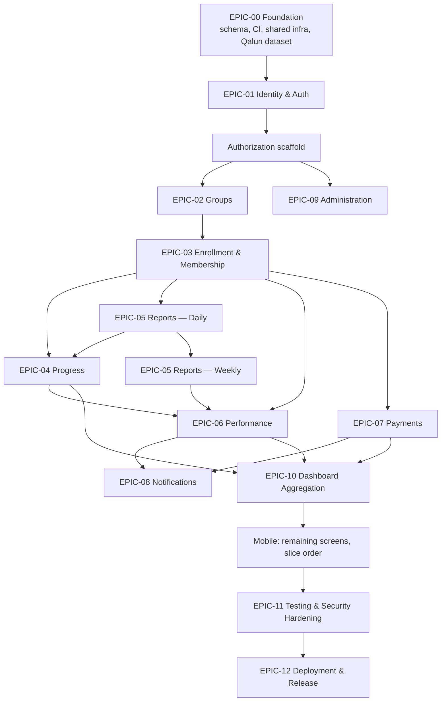

# Irtaki — Development Plan

## 1. Document Information

|                      |                                                                                                                                                                                                          |
| -------------------- | -------------------------------------------------------------------------------------------------------------------------------------------------------------------------------------------------------- |
| Document             | Development Plan                                                                                                                                                                                         |
| Pipeline position    | 11 of 15 — bridges the Technical Specification (10) into implementation-ready engineering work                                                                                                           |
| Status               | v1.0 — Draft pending your review                                                                                                                                                                         |
| Author role          | Senior Technical Project Manager / Engineering Manager / Delivery Architect                                                                                                                              |
| Product Owner        | Naim Benjedou                                                                                                                                                                                            |
| Authoritative inputs | SRS v1.0, SAS v1.0, DMS v1.0, DBD v1.0, SA v1.0, APIS v1.0, UF v1.0, TS v0.1                                                                                                                             |
| Precedence           | This document invents no business rule, domain relationship, API contract, screen, or architecture decision. It sequences and decomposes what those eight documents already decided into buildable work. |

## 2. Development Objectives

This document answers: **how should a 2–3 person team build the already-fully-specified Irtaki system, in what order, with what dependencies, and how do we know each piece is done?**

**Process assumptions confirmed with the Product Owner (this phase):**

| Item                                                                     | Decision                                                                                                                                                                                                           |
| ------------------------------------------------------------------------ | ------------------------------------------------------------------------------------------------------------------------------------------------------------------------------------------------------------------ |
| Team                                                                     | 2–3 people, no fixed role split — same people cover backend, mobile, and QA/UAT                                                                                                                                    |
| Methodology                                                              | Kanban-style continuous flow, delivered against the 10 Vertical Slices (TS §47) as the unit of "done," with a fixed **weekly** review/planning checkpoint — not fixed-length sprints with sprint-specific ceremony |
| Deadline                                                                 | None — this plan is sequence- and dependency-driven, not date-driven. No calendar dates appear anywhere below                                                                                                      |
| Estimation                                                               | T-shirt sizes (XS/S/M/L/XL) only — no hours                                                                                                                                                                        |
| QA/UAT                                                                   | Performed by the same 2–3 team members — no dedicated QA role, so Definition of Done bakes testing into every task rather than a separate QA phase                                                                 |
| GitHub                                                                   | This document is the source; issues are created manually by the team, not automated                                                                                                                                |
| Riwaya (TSQ-10)                                                          | **Resolved: Qālūn ʿan Nāfiʿ.** Previously 🔴 BLOCKED, now open — see §6 EPIC-00, F-FND-06                                                                                                                          |
| VPS provider, app-store accounts, Mailgun/FCM data-residency legal check | Explicitly **outside** this plan's scope — the Product Owner's responsibility, not tracked as blockers here                                                                                                        |

## 3. Authoritative Inputs

Unchanged from TS §3 — SRS, SAS, DMS, DBD, SA, APIS, UF, TS. All eight are baselined. This document adds no new business rule, domain relationship, role permission, calculation, API contract, or screen — only sequencing, decomposition, and delivery mechanics.

## 4. MVP Scope

| Feature                                         | MVP |        Post-MVP         | Out of Scope |
| ----------------------------------------------- | :-: | :---------------------: | :----------: |
| Auth (register/login/refresh/logout/reset)      | ✅  |                         |              |
| Group browsing + scored join application        | ✅  |                         |              |
| Join request review (Assistant accept/reject)   | ✅  |                         |              |
| Daily Report (Normal/Absence/Revision)          | ✅  |                         |              |
| Weekly Report (auto-calc, student-confirmed)    | ✅  |                         |              |
| Performance dashboards + at-risk detection      | ✅  |                         |              |
| Progress / Quran coverage (Qālūn ʿan Nāfiʿ)     | ✅  |                         |              |
| Payment status tracking (offline)               | ✅  |                         |              |
| Group creation & staff assignment (Admin)       | ✅  |                         |              |
| Push notifications (8 events)                   | ✅  |                         |              |
| Admin audit log                                 | ✅  |                         |              |
| Arabic-only, full RTL UI                        | ✅  |                         |              |
| Payment correction / reversal path              |     |   ✅ (TDR-01, ISS-02)   |              |
| Staff-reassignment history table                |     |   ✅ (TDR-02, ISS-04)   |              |
| Notification log / soft-delete retention policy |     |   ✅ (TDR-03, ISS-08)   |              |
| Automated mobile E2E (Detox)                    |     |       ✅ (TDR-04)       |              |
| Coverage point-in-time snapshots                |     |      ✅ (DBD §36)       |              |
| Read replicas / materialized dashboards         |     | ✅ (DBD §36, AR-19/20)  |              |
| Role sub-typing                                 |     | ✅ (DMS §25.2 Option B) |              |
| Online payment processing                       |     |                         |      ❌      |
| Offline mode / local sync                       |     |                         |      ❌      |
| In-app recitation / audio / video               |     |                         |      ❌      |
| Teacher grading / correction                    |     |                         |      ❌      |
| Hizb pass/fail verification in-app              |     |                         |      ❌      |
| Multi-center / multi-branch support             |     |                         |      ❌      |
| Group capacity limits                           |     |                         |      ❌      |
| Report editing or deletion                      |     |                         |      ❌      |
| Chat / messaging                                |     |                         |      ❌      |

## 5. Out of Scope

Developers must not implement, under any circumstance, without a new stakeholder decision reopening the item: online payment gateways, chat/messaging, offline sync, in-app audio/video, grading, multi-center support, capacity limits, report mutation, or any AI/analytics/social-login/gamification feature not named anywhere above. See §4's Out-of-Scope column for the complete, closed list.

## 6. Epic Structure

Adapted directly from TS §46's Implementation Order and §47's Vertical Slices — not the generic 15-epic template, per the Product Owner's confirmation (DPQ-10).

| Epic    | Name                         | Slice(s)                    |
| ------- | ---------------------------- | --------------------------- |
| EPIC-00 | Foundation                   | — (precedes all slices)     |
| EPIC-01 | Identity & Auth              | Slice 1                     |
| EPIC-02 | Groups                       | Slice 2                     |
| EPIC-03 | Enrollment & Membership      | Slice 3, 4                  |
| EPIC-04 | Progress                     | Slice 5 (part)              |
| EPIC-05 | Reports — Daily & Weekly     | Slice 5 (part), 6 (part)    |
| EPIC-06 | Performance                  | Slice 6 (part)              |
| EPIC-07 | Payments                     | Slice 7                     |
| EPIC-08 | Notifications                | Slice 8                     |
| EPIC-09 | Administration               | Slice 9                     |
| EPIC-10 | Dashboard Aggregation        | Slice 10                    |
| EPIC-11 | Testing & Security Hardening | — (continuous + final pass) |
| EPIC-12 | Deployment & Release         | — (final)                   |

## 7. Epic Definitions

### EPIC-00 — Foundation

**Objective:** Stand up the monorepo, CI skeleton, full 19-table schema, and shared infra so every subsequent Epic has a floor to build on.
**Business value:** Nothing else can start correctly without this — de-risks every later Epic.
**Included features:** F-FND-01…06 (§8).
**Dependencies:** None — first Epic.
**Risks:** Qālūn reference dataset (F-FND-06) sourced incorrectly would silently corrupt every ayah/hizb boundary downstream (TS §50).
**Acceptance criteria:** CI pipeline green on an empty commit; all 19 tables migrate cleanly on a fresh database; Qālūn dataset loaded and spot-checked against a second independent source.
**Definition of Done:** §21 (project-wide) plus: migrations reviewed per TS §41, seed guard verified to refuse `NODE_ENV=production`.

### EPIC-01 — Identity & Auth

**Objective:** Registration, login, session lifecycle, password reset, and the `RolesGuard`/`ScopeGuard` scaffolding every later Epic reuses.
**Business value:** Nothing downstream is reachable without this — literally the front door.
**Included features:** F-AUTH-01…06.
**Dependencies:** EPIC-00.
**Risks:** Authorization scaffold built wrong here propagates the mistake to every module (SA §14, NFR-19's doubled scope-filtering).
**Acceptance criteria:** All API-001…008 pass contract tests; every `@Roles()`/`ScopeGuard` combination has a passing positive and negative test (TS §36).
**Definition of Done:** §21.

### EPIC-02 — Groups

**Objective:** Group CRUD, staff assignment, enrollment toggle, browsing/discovery.
**Business value:** Groups are the organizing unit everything else attaches to.
**Included features:** F-GRP-01…10.
**Dependencies:** EPIC-01 (Admin-only endpoints need role auth working).
**Risks:** `groups.name` uniqueness (APIQ-05/TSQ-01) must be a real DB `UNIQUE` constraint, not just app-layer — miss it and duplicate groups become possible under concurrency.
**Acceptance criteria:** API-010…018 pass; duplicate group name returns `409` under concurrent creation (race test).
**Definition of Done:** §21.

### EPIC-03 — Enrollment & Membership

**Objective:** The full join-request lifecycle (submit → review → accept/reject) and the membership lifecycle it produces (roster, terminate, recovery).
**Business value:** This is the core acquisition funnel for the center — a User becoming a Student.
**Included features:** F-ENR-01…06, F-MEM-01…04.
**Dependencies:** EPIC-02 (a group must exist and be Open to apply to).
**Risks:** DS-01 spans both Enrollment and Memberships in one atomic transaction (ADR-027) — splitting the implementation carelessly across two PRs risks breaking that atomicity. Concurrent accept-race on the same `Pending` request (SA §32) needs its dedicated test.
**Acceptance criteria:** TC-JR-001…005 (§14) all pass; accepting a request atomically creates the Membership + role change + coverage seed in one transaction, verified by a rollback test.
**Definition of Done:** §21 plus the concurrency test from TS §20/§35.

### EPIC-04 — Progress

**Objective:** Quran reference data (Qālūn ʿan Nāfiʿ), the interval-set coverage engine (DS-05), and the read endpoints exposing it.
**Business value:** Powers every completion/progress figure a Student or Teacher sees.
**Included features:** F-PRG-01…06.
**Dependencies:** EPIC-00 (F-FND-06 dataset), EPIC-03 (coverage seeds on membership creation).
**Risks:** Now that TSQ-10 is resolved, the residual risk shifts from "which riwaya" to "is the Qālūn dataset itself correct" — still TS §50's highest-severity named risk, just with the blocking condition resolved.
**Acceptance criteria:** Coverage interval-merge is correct against a hand-built fixture set spanning forward, backward, and skipped-order memorization (per the interval-set model — DMS §19.3); API-041…044 pass.
**Definition of Done:** §21 plus an explicit sign-off that the Qālūn dataset was cross-checked against a second source before seeding Production.

### EPIC-05 — Reports (Daily & Weekly)

**Objective:** Daily Report submission (3 types) and the auto-calculated, student-confirmed Weekly Report.
**Business value:** The core daily-use loop of the app — this is what Students touch every day.
**Included features:** F-DR-01…07, F-WR-01…04.
**Dependencies:** EPIC-03 (an active Membership is required to report), EPIC-04 (Daily Report emits DE-05 to Progress post-commit).
**Risks:** Immutability (BR-21/22, ADR-010) must be enforced at the DB trigger layer, not just app code — a missed trigger is a silent data-integrity hole no test written only against the app layer would catch.
**Acceptance criteria:** All six weekly metrics (TS §22) independently verified against hand-built fixtures covering every `DayClassification`, including the zero-denominator case (`DEC-B04` — component `undefined`, never `0`).
**Definition of Done:** §21 plus the six-metric suite passing.

### EPIC-06 — Performance

**Objective:** Derived Commitment Score, progress breakdown, group/individual dashboards, at-risk detection.
**Business value:** The Teacher's core value proposition — visibility into every student without manual tracking.
**Included features:** F-PERF-01…04.
**Dependencies:** EPIC-05 (reads report history), EPIC-03 (reads membership state), EPIC-04 (reads coverage, read-only per SA §11).
**Risks:** At-risk predicate (3 consecutive expected days, no report, excused absences break the streak) is easy to get subtly wrong at the query level — needs its own dedicated fixture-based test, not just eyeballing.
**Acceptance criteria:** API-037…040 pass; at-risk predicate verified against a fixture set including an excused-absence-breaks-streak case.
**Definition of Done:** §21.

### EPIC-07 — Payments

**Objective:** Derived payment cycles, ledger views, cycle-paid recording.
**Business value:** Replaces the center's informal offline payment tracking with a shared, visible ledger.
**Included features:** F-PAY-01…03.
**Dependencies:** EPIC-03 (a Membership anchors the cycle-derivation arithmetic).
**Risks:** End-of-month cycle arithmetic (ISS-14) — clamping approach not yet formally confirmed by the Product Owner; flagged, not silently decided (see §24).
**Acceptance criteria:** Duplicate-cycle write returns `409` (`DB-UQ-06`); unauthorized (non-assigned) Assistant attempt returns `403`.
**Definition of Done:** §21.

### EPIC-08 — Notifications

**Objective:** Device token registration, category preferences, and the 8-event push dispatch subsystem.
**Business value:** Keeps Students/Assistants engaged without requiring them to open the app proactively.
**Included features:** F-NOT-01…05.
**Dependencies:** EPIC-01 (auth), and event-emitting Epics 02/03/05/07 (subscribes, never called into directly — SA §11).
**Risks:** Per-timezone scheduling correctness (AR-05) — a bug here silently sends notifications at the wrong local hour, hard to notice without a dedicated multi-timezone fixture test.
**Acceptance criteria:** Scheduler-evaluator tests pass for at least two distinct timezones in the fixture set; FCM-unreachable path degrades to best-effort without blocking the triggering request (ADR-032).
**Definition of Done:** §21.

### EPIC-09 — Administration

**Objective:** Role promotion, user listing, audit log.
**Business value:** Gives the single Admin the tools to run the center without direct DB access.
**Included features:** F-ADM-01…04.
**Dependencies:** EPIC-01 (auth/role machinery).
**Risks:** Low — smallest Epic, mostly read paths plus one write (role promotion).
**Acceptance criteria:** API-052…054 pass; audit entries are write-once and verified immutable.
**Definition of Done:** §21.

### EPIC-10 — Dashboard Aggregation

**Objective:** The single-call `GET /me/dashboard` orchestrator and the mobile role-based navigation shell that consumes it.
**Business value:** Directly targets NFR-11 (dashboard <3s on 3G) — this is the first screen every role sees, every session.
**Included features:** F-DASH-01…03.
**Dependencies:** EPIC-06, EPIC-04, EPIC-07 (aggregates all three — must exist first, per TS §46 step 13).
**Risks:** Easy to accidentally regress into "six separate calls masquerading as one" if not disciplined about the aggregation boundary.
**Acceptance criteria:** One network call renders a role-appropriate home screen for all five roles; NFR-11 budget test passes.
**Definition of Done:** §21.

### EPIC-11 — Testing & Security Hardening

**Objective:** The full regression pass (domain + authorization + security suites) required before first Production deploy (TS §46 step 16).
**Business value:** The gate between "feature-complete" and "safe to expose to real center data."
**Included features:** F-TEST-01…05.
**Dependencies:** All feature Epics complete.
**Risks:** With no dedicated QA role (DPQ-08), this Epic is where schedule pressure most often erodes rigor — treat it as a first-class Epic with its own exit criteria (§20), not a checkbox.
**Acceptance criteria:** Every item in TS §34–36 passes; error-envelope-leakage helper asserts clean on every error-path test.
**Definition of Done:** §21.

### EPIC-12 — Deployment & Release

**Objective:** Production cutover on the two-VPS Coolify topology, seeded Admin-only, mobile store submission.
**Business value:** Ships the product.
**Included features:** F-REL-01…04.
**Dependencies:** EPIC-11 complete.
**Risks:** VPS provisioning, app-store accounts, and the Mailgun/FCM data-residency question are all outside this plan (DPQ-09) — this Epic assumes they're resolved by the time it starts; if they aren't, this Epic itself becomes the practical blocker, even though nothing in this document tracks it as one.
**Acceptance criteria:** Release Readiness Checklist (§29) fully checked; quarterly restore drill scheduled.
**Definition of Done:** §21 plus the checklist in §29.

## 8. Feature Catalogue

Full Feature→Epic→API/Screen mapping. This is the traceability spine for §9–§14; individual features are not repeated with full ten-field task detail here — see §10 for the Task Format and worked examples.

| Feature ID | Epic    | Feature                                                                | Primary API(s)    | Primary Screen(s)      | Actor                     |
| ---------- | ------- | ---------------------------------------------------------------------- | ----------------- | ---------------------- | ------------------------- |
| F-FND-01   | EPIC-00 | Monorepo scaffold + CI skeleton                                        | —                 | —                      | —                         |
| F-FND-02   | EPIC-00 | Database schema + all 19 migrations                                    | —                 | —                      | —                         |
| F-FND-03   | EPIC-00 | Shared backend infra (exception filter, correlationId, guard base)     | —                 | —                      | —                         |
| F-FND-04   | EPIC-00 | Shared mobile infra (API client + JWT interceptor, nav shell skeleton) | —                 | —                      | —                         |
| F-FND-05   | EPIC-00 | Environment provisioning config (Dev, PR Preview, Prod)                | —                 | —                      | —                         |
| F-FND-06   | EPIC-00 | **Source & validate Qālūn ʿan Nāfiʿ Quran reference dataset**          | —                 | —                      | —                         |
| F-AUTH-01  | EPIC-01 | Register                                                               | API-001           | SCR-02                 | Anonymous                 |
| F-AUTH-02  | EPIC-01 | Login                                                                  | API-002           | SCR-01                 | Anonymous                 |
| F-AUTH-03  | EPIC-01 | Session refresh / logout                                               | API-003, 004      | —                      | Any                       |
| F-AUTH-04  | EPIC-01 | Password reset (request + confirm)                                     | API-005, 006      | SCR-03, 04             | Anonymous                 |
| F-AUTH-05  | EPIC-01 | Profile — view/update                                                  | API-007, 008      | SCR-34                 | Any                       |
| F-AUTH-06  | EPIC-01 | RolesGuard / ScopeGuard scaffold                                       | — (cross-cutting) | —                      | —                         |
| F-GRP-01   | EPIC-02 | List groups in scope                                                   | API-010           | —                      | Any (scoped)              |
| F-GRP-02   | EPIC-02 | Browse available groups                                                | API-011           | SCR-05, 06, 07         | User                      |
| F-GRP-03   | EPIC-02 | Group detail                                                           | API-012           | SCR-07                 | Admin/staff/member        |
| F-GRP-04   | EPIC-02 | Create group                                                           | API-013           | SCR-28                 | Admin                     |
| F-GRP-05   | EPIC-02 | Update group name                                                      | API-014           | SCR-29                 | Admin                     |
| F-GRP-06   | EPIC-02 | Toggle enrollment open/closed                                          | API-015           | SCR-23                 | Teacher                   |
| F-GRP-07   | EPIC-02 | Reassign staff                                                         | API-016           | SCR-29, 32             | Admin                     |
| F-GRP-08   | EPIC-02 | Archive / un-archive lifecycle                                         | API-017           | SCR-29                 | Admin                     |
| F-GRP-09   | EPIC-02 | Delete group                                                           | API-018           | SCR-29                 | Admin                     |
| F-GRP-10   | EPIC-02 | Groups List (Admin)                                                    | —                 | SCR-27                 | Admin                     |
| F-ENR-01   | EPIC-03 | Submit join application                                                | API-019           | SCR-06                 | User                      |
| F-ENR-02   | EPIC-03 | View own pending request                                               | API-020           | SCR-05                 | User                      |
| F-ENR-03   | EPIC-03 | Assistant review queue (score-sorted)                                  | API-021           | SCR-18                 | Assistant                 |
| F-ENR-04   | EPIC-03 | Applicant full profile                                                 | API-022           | SCR-19                 | Assistant, Admin          |
| F-ENR-05   | EPIC-03 | Accept join request                                                    | API-023           | SCR-19                 | Assistant                 |
| F-ENR-06   | EPIC-03 | Reject join request                                                    | API-024           | SCR-19                 | Assistant                 |
| F-MEM-01   | EPIC-03 | Own active membership                                                  | API-025           | SCR-08                 | Student                   |
| F-MEM-02   | EPIC-03 | Group roster                                                           | API-026           | SCR-30                 | Teacher, Assistant, Admin |
| F-MEM-03   | EPIC-03 | Terminate / remove student                                             | API-027           | SCR-29                 | Admin                     |
| F-MEM-04   | EPIC-03 | Recovery view (soft-deleted)                                           | API-028           | SCR-31                 | Admin                     |
| F-PRG-01   | EPIC-04 | Coverage engine (DS-05 interval merge)                                 | —                 | —                      | —                         |
| F-PRG-02   | EPIC-04 | Own progress view                                                      | API-041           | SCR-13                 | Student                   |
| F-PRG-03   | EPIC-04 | Student progress for staff                                             | API-042           | SCR-24                 | Teacher, Admin            |
| F-PRG-04   | EPIC-04 | Surah reference data                                                   | API-043           | —                      | Any authenticated         |
| F-PRG-05   | EPIC-04 | Hizb boundary reference data                                           | API-044           | —                      | Any authenticated         |
| F-PRG-06   | EPIC-04 | Quran Range Picker (shared component)                                  | —                 | SCR-11                 | Student                   |
| F-DR-01    | EPIC-05 | Today's report status / block reason                                   | API-029           | SCR-08, 09             | Student                   |
| F-DR-02    | EPIC-05 | Submit Normal report                                                   | API-030           | SCR-10                 | Student                   |
| F-DR-03    | EPIC-05 | Submit Absence report                                                  | API-030           | SCR-10                 | Student                   |
| F-DR-04    | EPIC-05 | Submit Revision-type report                                            | API-030           | SCR-10                 | Student                   |
| F-DR-05    | EPIC-05 | Own report history                                                     | API-031           | SCR-14                 | Student                   |
| F-DR-06    | EPIC-05 | Raw report list (staff)                                                | API-032           | SCR-25                 | Teacher, Admin            |
| F-DR-07    | EPIC-05 | Report detail (read-only)                                              | —                 | SCR-15                 | Student/Teacher/Admin     |
| F-WR-01    | EPIC-05 | Current week live metrics                                              | API-033           | SCR-12                 | Student                   |
| F-WR-02    | EPIC-05 | Confirm & finalize week                                                | API-034           | SCR-12                 | Student                   |
| F-WR-03    | EPIC-05 | Own weekly history                                                     | API-035           | SCR-14                 | Student                   |
| F-WR-04    | EPIC-05 | Weekly history (staff)                                                 | API-036           | SCR-25                 | Teacher, Admin            |
| F-PERF-01  | EPIC-06 | Own performance                                                        | API-037           | SCR-13                 | Student                   |
| F-PERF-02  | EPIC-06 | Group performance dashboard                                            | API-038           | SCR-23                 | Teacher, Admin            |
| F-PERF-03  | EPIC-06 | Individual performance (staff view)                                    | API-039           | SCR-24                 | Teacher, Student, Admin   |
| F-PERF-04  | EPIC-06 | At-risk list                                                           | API-040           | SCR-23                 | Teacher, Admin            |
| F-PAY-01   | EPIC-07 | Own payment ledger                                                     | API-045           | SCR-16                 | Student                   |
| F-PAY-02   | EPIC-07 | Group payment ledger (staff)                                           | API-046           | SCR-20                 | Assistant, Admin          |
| F-PAY-03   | EPIC-07 | Record a paid cycle                                                    | API-047           | SCR-21                 | Assistant                 |
| F-NOT-01   | EPIC-08 | Register device token                                                  | API-048           | —                      | Any                       |
| F-NOT-02   | EPIC-08 | Unregister device token                                                | API-049           | —                      | Any                       |
| F-NOT-03   | EPIC-08 | View notification preferences                                          | API-050           | SCR-35                 | Any                       |
| F-NOT-04   | EPIC-08 | Mute/unmute category                                                   | API-051           | SCR-35                 | Any                       |
| F-NOT-05   | EPIC-08 | Scheduled evaluators (8 events)                                        | —                 | —                      | — (system)                |
| F-ADM-01   | EPIC-09 | Promote user role                                                      | API-052           | SCR-32                 | Admin                     |
| F-ADM-02   | EPIC-09 | List users for assignment                                              | API-053           | SCR-32                 | Admin                     |
| F-ADM-03   | EPIC-09 | Audit log view                                                         | API-054           | SCR-33                 | Admin                     |
| F-ADM-04   | EPIC-09 | Admin Home hub                                                         | —                 | SCR-26                 | Admin                     |
| F-DASH-01  | EPIC-10 | `GET /me/dashboard` orchestrator                                       | API-009           | —                      | Any                       |
| F-DASH-02  | EPIC-10 | Role-based navigation root switch                                      | —                 | —                      | —                         |
| F-DASH-03  | EPIC-10 | Per-role home wiring                                                   | —                 | SCR-05, 08, 17, 22, 26 | All roles                 |

## 9. Technical Task Catalogue — Format

Every task uses this format (Phase 7):

```
Task ID:
Title:
Type:            FOUNDATION | BACKEND | FRONTEND | DATABASE | API | DOMAIN | SECURITY | TEST | DEVOPS | DOCUMENTATION
Epic:
Feature:
Description:
Goal:
Dependencies:
Inputs:
Expected Output:
Affected Layer:
Acceptance Criteria:
Testing:
Estimated Complexity: XS | S | M | L | XL
Parallelizable:  Yes | No
Status:          Not Started
```

Given 65+ features across 13 Epics, this document does not repeat all ten fields for every atomic task — that would run to several thousand lines duplicating what §8, §11, §12, and §13's tables already state once. Instead: two fully-worked examples below (matching the depth requested for Join Request and Daily Report), plus complete summary tables in §11–§14 giving every task's category, dependency, and test — sufficient for a developer to expand any row into the full ten-field format on demand.

### Worked Example 1 — F-ENR-01 Submit Join Request

| Task ID    | Title                                                                 | Type     | Dependencies               | Complexity |
| ---------- | --------------------------------------------------------------------- | -------- | -------------------------- | ---------- |
| BE-ENR-001 | `SubmitJoinRequestDto` (class-validator)                              | API      | AUTH-06                    | XS         |
| BE-ENR-002 | Guard chain: `AuthGuard` → `RolesGuard(role=User)`                    | SECURITY | AUTH-06                    | XS         |
| BE-ENR-003 | Eligibility validation (gender match, no existing Pending — `INV-10`) | DOMAIN   | BE-ENR-001                 | S          |
| BE-ENR-004 | `SubmitJoinRequestUseCase` (application service)                      | BACKEND  | BE-ENR-003                 | M          |
| BE-ENR-005 | `JoinRequestRepository` + `join_request_ahzab` insert                 | BACKEND  | DB migration for DBT-04/05 | S          |
| BE-ENR-006 | Partial unique index enforcement test (`DB-UQ-03`)                    | TEST     | BE-ENR-005                 | S          |
| BE-ENR-007 | `JoinRequestResponseDto`                                              | API      | BE-ENR-004                 | XS         |
| BE-ENR-008 | Integration test: eligible / ineligible / duplicate / already-member  | TEST     | BE-ENR-004…007             | M          |
| FE-ENR-001 | Join Stepper screen shell (SCR-06), 3-step wizard                     | FRONTEND | FND-04                     | M          |
| FE-ENR-002 | Group Detail Sheet (SCR-07)                                           | FRONTEND | F-GRP-03 API               | S          |
| FE-ENR-003 | Ahzab multi-select chip grid (UF §19.1)                               | FRONTEND | FE-ENR-001                 | M          |
| FE-ENR-004 | API client call + loading/success/error states                        | FRONTEND | BE-ENR-007                 | S          |
| FE-ENR-005 | Form validation (zod schema mirroring `SubmitJoinRequestDto`)         | FRONTEND | TD-01                      | S          |
| FE-ENR-006 | Navigation wiring (Home → stepper → submission states)                | FRONTEND | FE-ENR-001…005             | XS         |
| FE-ENR-007 | Component/unit tests (RNTL)                                           | TEST     | FE-ENR-001…006             | S          |

**Full ten-field example — BE-ENR-004:**

```
Task ID:        BE-ENR-004
Title:           Implement SubmitJoinRequestUseCase
Type:            BACKEND
Epic:            EPIC-03 Enrollment & Membership
Feature:         F-ENR-01 Submit join application
Description:     Application-layer orchestrator for API-019. Validates eligibility
                 (gender match, role=User, no existing Pending request — INV-10),
                 constructs the JoinRequest aggregate with its ahzab selection
                 (VO-08), persists via JoinRequestRepository, returns the created
                 record.
Goal:            A User meeting eligibility criteria can submit exactly one
                 Pending join request per group-open-window, enforced atomically
                 under concurrent submission.
Dependencies:    BE-ENR-001 (DTO), BE-ENR-003 (domain validation), Groups module
                 (target group must be Open+Active), Identity module (auth)
Inputs:          Authenticated User, SubmitJoinRequestDto, target group ID
Expected Output: 201 with JoinRequestResponseDto, or a domain-layer rejection
                 (ineligible) / DB-layer 409 (duplicate)
Affected Layer:  Application (use-case service), calls Domain (JoinRequest
                 entity, INV-10) and Infrastructure (JoinRequestRepository)
Acceptance Criteria:
  Given a User whose gender matches the group and has no existing Pending request
  When they submit a join application to an Open, Active group
  Then the system creates a Pending JoinRequest with its ahzab selection persisted
  Given a User with gender mismatch
  When they submit
  Then the request is rejected at domain construction (INV-10), never reaching the DB
  Given a User with an existing Pending request
  When they submit again (including a near-simultaneous second request)
  Then the second attempt returns 409 via the partial unique index (DB-UQ-03),
       not an application-layer race condition
Testing:         Unit (domain eligibility rules, no I/O) + Integration (real test
                 Postgres, concurrency test firing two near-simultaneous requests)
Estimated Complexity: M
Parallelizable:  No — blocks BE-ENR-005…008
Status:          Not Started
```

### Worked Example 2 — F-DR-02/03/04 Submit Daily Report

| Task ID   | Title                                                                                             | Type     | Dependencies           | Complexity |
| --------- | ------------------------------------------------------------------------------------------------- | -------- | ---------------------- | ---------- |
| BE-DR-001 | `SubmitDailyReportDto` — discriminated union on report type                                       | API      | AUTH-06                | S          |
| BE-DR-002 | `AyahRange` VO construction + validation (BR-52)                                                  | DOMAIN   | FND-06 (Qālūn dataset) | S          |
| BE-DR-003 | Reporting-day validation (not backdated, is today — BR-19/21)                                     | DOMAIN   | —                      | S          |
| BE-DR-004 | Duplicate-report-for-date check (`DB-UQ-04`)                                                      | DATABASE | Migration DBT-06       | XS         |
| BE-DR-005 | Conditional field validation per type (`absence_reason` required — VR-19)                         | DOMAIN   | BE-DR-001              | S          |
| BE-DR-006 | `SubmitDailyReportUseCase`                                                                        | BACKEND  | BE-DR-002…005          | M          |
| BE-DR-007 | Immutability trigger (DB-level, BR-21/22)                                                         | DATABASE | Migration DBT-06       | S          |
| BE-DR-008 | Post-commit event emission (DE-05 → Progress)                                                     | BACKEND  | BE-DR-006, ADR-026/032 | S          |
| BE-DR-009 | Integration tests: valid ×3 types, invalid range, wrong day, duplicate, missing conditional field | TEST     | BE-DR-001…008          | L          |
| FE-DR-001 | Report Type Selection screen (SCR-09)                                                             | FRONTEND | FND-04                 | S          |
| FE-DR-002 | Daily Report Form — progressive disclosure shell (SCR-10)                                         | FRONTEND | FE-DR-001              | M          |
| FE-DR-003 | Normal-report fields + Quran Range Picker integration                                             | FRONTEND | F-PRG-06               | M          |
| FE-DR-004 | Absence-report fields (reason selector)                                                           | FRONTEND | FE-DR-002              | S          |
| FE-DR-005 | Revision-report fields                                                                            | FRONTEND | FE-DR-002              | S          |
| FE-DR-006 | Submission states — loading/success/error (UF §15)                                                | FRONTEND | BE-DR-006 API          | S          |
| FE-DR-007 | Report History list (SCR-14) + Report Detail read-only (SCR-15)                                   | FRONTEND | API-031                | M          |
| FE-DR-008 | Component/unit tests                                                                              | TEST     | FE-DR-001…007          | M          |

## 10. Backend Work Breakdown

Per Epic, the standard layer sequence (SA §10, TS §9): Domain logic → Application service → Repository → DTO → Validation → Authorization → Controller → Error handling → Tests. Applied to every feature in §8; full detail follows the pattern of §9's worked examples.

| Epic    | Domain-layer work                                            | Key application services                                         | Notable DB/infra work                                                    |
| ------- | ------------------------------------------------------------ | ---------------------------------------------------------------- | ------------------------------------------------------------------------ |
| EPIC-01 | `User` entity, `ST-01` role state machine                    | Register/Login/Refresh/Logout/ResetPassword use cases            | argon2id hashing, JWT issuance, `auth_tokens` table                      |
| EPIC-02 | `Group` entity, DS-07 (archival), DS-08 (staff reassignment) | Create/Update/ToggleEnrollment/ReassignStaff/Archive/Delete      | Partial unique index on `groups.name`                                    |
| EPIC-03 | `JoinRequest`/`Membership` entities, ST-03/ST-04, DS-01      | Submit/Review/Accept/Reject, Terminate, RecoveryView             | Two-table transaction (join_requests + memberships), soft-delete cascade |
| EPIC-04 | `MemorizationCoverage`, DS-05 interval-merge                 | CoverageReconciliationJob (ADR-029), Progress read services      | `coverage_intervals`, `surahs`, `hizb_boundaries` seed                   |
| EPIC-05 | `DailyReport`/`WeeklyReport`, VO-01/02/03                    | SubmitDailyReport, ComputeWeeklyMetrics, ConfirmWeeklyReport     | Immutability trigger, six-metric calculation (DS-02)                     |
| EPIC-06 | DS-03 Commitment Score, DS-04 at-risk predicate              | Performance read services (no owned table)                       | Read-only across Reports/Memberships/Progress                            |
| EPIC-07 | `PaymentRecord`, DS-06 cycle derivation                      | RecordPayment, GetLedger                                         | `DB-UQ-06` duplicate-cycle constraint                                    |
| EPIC-08 | Notification dispatch interface (ADR-009)                    | Scheduler-evaluator per event, preference resolution             | `device_tokens`, `notification_log`, Mailgun/FCM adapters                |
| EPIC-09 | `AuditEntry` (write-once)                                    | PromoteRole, ListUsers, AuditQuery                               | Subscribes to 3 audited events                                           |
| EPIC-10 | — (orchestration only)                                       | `GetDashboardUseCase` — fan-out to Performance/Progress/Payments | —                                                                        |

## 11. Database Work Breakdown

Sequenced per DBD §5 catalogue and TS §17/§41. Migration → Constraint → Index → Seed → Verification, one migration file per table (or logical group), each reviewed in its owning feature's PR (TD-03).

| Order | Table(s)                                                                                   | Migration scope         | Constraints                                       | Notable indexes              |
| ----- | ------------------------------------------------------------------------------------------ | ----------------------- | ------------------------------------------------- | ---------------------------- |
| 1     | `users`, `auth_tokens`                                                                     | Registration/role model | Role CHECK, unique email                          | email, role                  |
| 2     | `groups`                                                                                   | Lifecycle model         | Unique `name` (APIQ-05), CHECK status             | teacher_id, assistant_id     |
| 3     | `memberships`, `join_requests`, `join_request_ahzab`                                       | Enrollment model        | Partial unique (`DB-UQ-03`), state CHECKs         | group_id, status, student_id |
| 4     | `daily_reports`                                                                            | Reporting model         | Partial unique (`DB-UQ-04`), immutability trigger | membership_id + date         |
| 5     | `weekly_reports`                                                                           | Weekly model            | State CHECK (Open→Finalised)                      | membership_id + week         |
| 6     | `payment_records`                                                                          | Payment model           | Partial unique (`DB-UQ-06`)                       | membership_id, cycle_index   |
| 7     | `memorization_coverage`, `coverage_intervals`                                              | Coverage model          | 1:1 with membership                               | membership_id                |
| 8     | `surahs`, `hizb_boundaries`, `reference_data_version`                                      | Quran reference         | Natural keys                                      | number, hizb_number          |
| 9     | `device_tokens`, `notification_categories`, `notification_preferences`, `notification_log` | Notification model      | —                                                 | user_id, category            |
| 10    | `audit_entries`                                                                            | Audit model             | Write-once                                        | actor_id, occurred_at        |

Seed data per TS §42: development/PR-preview only, scoped exactly as specified there (1 Admin, 2 Teachers, 2 Assistants, ~10–15 Students, 2 groups, mixed membership states, several weeks of report history, mixed payment states). **Quran reference seed is now unblocked (Qālūn confirmed) but gated on F-FND-06's dataset sourcing/verification task before it runs against any environment, including Dev.**

## 12. API Work Breakdown

Every one of the 54 endpoints, mapped to its owning Epic, backend task cluster, and mobile consumer. Full request/response contract is APIS.md §10 — not restated here.

| API          | Epic    | Backend task cluster | Mobile consumer            |
| ------------ | ------- | -------------------- | -------------------------- |
| API-001…006  | EPIC-01 | F-AUTH-01…04         | SCR-01, 02, 03, 04         |
| API-007, 008 | EPIC-01 | F-AUTH-05            | SCR-34                     |
| API-009      | EPIC-10 | F-DASH-01            | SCR-05, 08, 17, 22, 26     |
| API-010…018  | EPIC-02 | F-GRP-01…09          | SCR-05, 06, 07, 27, 28, 29 |
| API-019…024  | EPIC-03 | F-ENR-01…06          | SCR-06, 18, 19             |
| API-025…028  | EPIC-03 | F-MEM-01…04          | SCR-08, 30, 31             |
| API-029…032  | EPIC-05 | F-DR-01…06           | SCR-08, 09, 10, 14, 25     |
| API-033…036  | EPIC-05 | F-WR-01…04           | SCR-12, 14                 |
| API-037…040  | EPIC-06 | F-PERF-01…04         | SCR-13, 23, 24             |
| API-041…044  | EPIC-04 | F-PRG-02…05          | SCR-13, 24                 |
| API-045…047  | EPIC-07 | F-PAY-01…03          | SCR-16, 20, 21             |
| API-048…051  | EPIC-08 | F-NOT-01…04          | SCR-35                     |
| API-052…054  | EPIC-09 | F-ADM-01…03          | SCR-32, 33                 |

Every endpoint gets: a contract test (request/response shape vs. APIS.md), an authorization test (correct role/scope 200, wrong role 403, wrong scope 403), and where applicable a concurrency test (§16's five hazards). No endpoint in this table is optional for MVP.

## 13. Mobile Work Breakdown

All 35 screens, grouped by Epic. Each screen task includes: Navigation wiring, Screen component, API integration, State (TanStack Query/Zustand), Form (where applicable), Validation (zod), Loading/Empty/Error/Success states (UF §22–25), Accessibility, RTL layout — per UF §20's Form Design Rules and §21–25's cross-cutting states, applied uniformly, not screen-by-screen invention.

| Epic    | Screens                                                                                                                                                                  |
| ------- | ------------------------------------------------------------------------------------------------------------------------------------------------------------------------ |
| EPIC-01 | SCR-01 Login, SCR-02 Register, SCR-03/04 Forgot Password, SCR-34 Profile                                                                                                 |
| EPIC-02 | SCR-27 Groups List, SCR-28 Create Group, SCR-29 Group Detail (Admin)                                                                                                     |
| EPIC-03 | SCR-05 User Home, SCR-06 Join Stepper, SCR-07 Group Detail Sheet, SCR-18 Join Requests Queue, SCR-19 Applicant Detail, SCR-30 Roster, SCR-31 Recovery                    |
| EPIC-04 | SCR-11 Quran Range Picker (shared)                                                                                                                                       |
| EPIC-05 | SCR-08 Student Home, SCR-09 Report Type Selection, SCR-10 Daily Report Form, SCR-12 Weekly Report, SCR-14 Report History, SCR-15 Report Detail, SCR-25 Raw Daily Reports |
| EPIC-06 | SCR-13 Progress/Performance Tab, SCR-22 Teacher Home, SCR-23 Group Detail (Teacher), SCR-24 Individual Performance                                                       |
| EPIC-07 | SCR-16 Payment Tab (Student), SCR-17 Assistant Home, SCR-20 Payments Ledger, SCR-21 Payment Detail                                                                       |
| EPIC-08 | SCR-35 Notification Preferences                                                                                                                                          |
| EPIC-09 | SCR-26 Admin Home, SCR-32 Staff/Users List, SCR-33 Audit Log                                                                                                             |
| EPIC-10 | Role-based root navigator (cross-cutting, not a single screen)                                                                                                           |

Component Inventory (UF §29) is built once, shared: Status badge, primary/secondary buttons, form field wrapper, segmented control, list row, skeleton loader, donut/completion ring, confirmation dialog (3 tiers), applicant/student detail card, ahzab chip grid, cycle/payment row, notification preference row. Build these as part of EPIC-00/F-FND-04 (shared mobile infra), not re-derived per screen.

## 14. Testing Work Breakdown

Per TS §34–36, applied per Epic — not a separate end-of-project phase:

| Level                                                 | Owning Epic(s)                                                                                              | Tooling                                    |
| ----------------------------------------------------- | ----------------------------------------------------------------------------------------------------------- | ------------------------------------------ |
| Unit (domain entities, VOs, DS-01…08)                 | Every Epic, as its domain layer is built                                                                    | Jest                                       |
| Integration (use cases + real repo)                   | Every Epic                                                                                                  | Jest + Supertest, Dockerized test Postgres |
| API/Contract                                          | Every Epic (§12's table)                                                                                    | Jest + Supertest, in-process Nest app      |
| Authorization (positive + negative per role×resource) | Every Epic, especially EPIC-01/03                                                                           | Jest + Supertest, parameterized            |
| Mobile component/unit                                 | Every Epic's screens (§13)                                                                                  | Jest + RNTL, mocked API client             |
| Concurrency (5 hazards)                               | EPIC-02 (group name), EPIC-03 (join accept, archive), EPIC-05 (duplicate report), EPIC-07 (duplicate cycle) | Jest, simulated near-simultaneous requests |
| Manual E2E / UAT                                      | EPIC-11 (final pass) + ongoing spot-checks per Epic, performed by the same 2–3 team members (DPQ-08)        | Manual, against PR Preview environment     |

## 15. Security Work Breakdown

Every item in TS §16/§36's checklist, mapped to when it gets built — security is built into each Epic, not deferred to EPIC-11 alone:

| Check                                                             | Built during                                                    | Verified during                       |
| ----------------------------------------------------------------- | --------------------------------------------------------------- | ------------------------------------- |
| `@Roles()` correctness, every endpoint                            | Each Epic, at controller creation                               | EPIC-11 full parameterized pass       |
| `ScopeGuard`/IDOR, every scoped endpoint                          | Each Epic                                                       | EPIC-11                               |
| Mass-assignment stripping                                         | EPIC-01 (DTO conventions established), applied everywhere after | EPIC-11                               |
| Rate limiting (`/auth/*`, `/join-requests`)                       | EPIC-01, EPIC-03                                                | EPIC-11                               |
| Error-envelope leakage (no stack trace/SQL error in any response) | EPIC-00 (shared exception filter)                               | EPIC-11, automated shared test helper |
| SQL injection                                                     | Structurally prevented by TypeORM parameterization (TD-04)      | Code-review rule, not a test suite    |

## 16. Dependency Graph

TSQ-10 now resolved — Progress is no longer blocked, only gated on F-FND-06 (dataset sourcing).



## 17. Critical Path

**Foundation → Identity & Auth → Authorization scaffold → Groups → Enrollment & Membership → Reports (Daily) → Performance → Dashboard Aggregation → Testing & Security Hardening → Deployment.**

Everything on this path is a hard blocker for what follows — no shortcuts without breaking a real dependency (DS-01's atomic transaction, the module boundaries in SA §11). Progress, Payments, and Notifications hang off this spine but don't sit on it.

## 18. Parallel Work

With 2–3 people and no fixed role split, parallelism is opportunistic, not role-assigned. Suggested split once Foundation + Identity + Authorization scaffold exist (the un-parallelizable base):

```
Person/Pair A (backend-lead-for-the-moment)
    ├── Groups → Enrollment & Membership (critical path)
    └── Reports (Daily → Weekly)

Person/Pair B
    ├── Progress module (once F-FND-06 dataset lands)
    ├── Mobile shared infra + Identity/Groups screens
    └── Payments (once Membership exists)

Whoever is free
    └── Notifications, Administration — both are pure event-subscribers /
        low-dependency, safe to pick up opportunistically without blocking
        anyone else
```

Do not parallelize: EPIC-01's authorization scaffold (everyone waits on this), Dashboard Aggregation (waits on Performance + Progress + Payments all existing), the final EPIC-11 regression pass (needs everything done).

## 19. Flow Strategy

No fixed-length sprints (per DPQ-02/03). Kanban-style continuous flow against the 10 Vertical Slices (TS §47) as delivery units, with a **weekly** checkpoint for: what moved to Done, what's next in the queue, and whether any Epic-level risk (§7's risk rows) has materialized. Each slice ends with its own regression pass before the next begins (TS §47) — this is the actual unit of "shippable," not the weekly checkpoint itself.

## 20. Milestones

No calendar dates (DPQ-04) — sequenced only.

| Milestone                            | Scope                                                                 |
| ------------------------------------ | --------------------------------------------------------------------- |
| M0 — Foundation Complete             | EPIC-00 fully done, including Qālūn dataset sourced and spot-verified |
| M1 — Auth Complete                   | EPIC-01 done, authorization scaffold reused-ready                     |
| M2 — Groups & Enrollment Complete    | EPIC-02, EPIC-03 done                                                 |
| M3 — Reporting Complete              | EPIC-04, EPIC-05 done                                                 |
| M4 — Performance & Payments Complete | EPIC-06, EPIC-07 done                                                 |
| M5 — Notifications & Admin Complete  | EPIC-08, EPIC-09 done                                                 |
| M6 — MVP Feature Complete            | EPIC-10 done — every screen, every endpoint                           |
| M7 — Hardening Complete              | EPIC-11 done — full regression + security suites green                |
| M8 — Production Ready                | EPIC-12 done — deployed, seeded Admin-only, backup drill verified     |

## 21. Milestone Exit Criteria

Every milestone requires: all included Epics' Definition of Done (§22) satisfied; all tests for those Epics passing in CI; no open 🔴 blocker against any included feature; a manual walkthrough by the team (in lieu of separate QA sign-off, per DPQ-08).

## 22. Definition of Done (project-wide)

Restated from TS §48, unchanged — a feature is complete only when:

- [ ] Every SRS FR/BR it covers is implemented exactly as specified — no silent scope change
- [ ] Every DMS invariant/VO validation it touches is enforced at the domain layer, not just the DTO layer
- [ ] The API contract matches APIS.md exactly — endpoint, method, status codes, error codes, response shape
- [ ] The UI matches UF.md's screen spec and component inventory
- [ ] All four validation layers (transport, application, domain, database) are in place
- [ ] Authorization is tested for every role×resource combination, including at least one negative test per endpoint
- [ ] Error states handled per UF §24 — no unhandled promise rejection, no raw error surfaced to mobile UI
- [ ] Unit + integration + security tests pass
- [ ] Migration files (if any) reviewed and applied cleanly against a fresh database
- [ ] This document's traceability (§27) updated if the feature introduces or closes a row
- [ ] Code reviewed and approved per TS §39, merged via squash to `main`

## 23. Feature Acceptance Criteria

Representative set (Given/When/Then) — full per-feature criteria live inline in §9's worked examples and §7's Epic definitions; not re-derived exhaustively for all 65 features here.

```
Feature: Submit Join Request (F-ENR-01)
  Given a User eligible for a Group
  When the User submits a Join Request
  Then the system creates a Pending Join Request

Feature: Accept Join Request (F-ENR-05)
  Given a Pending Join Request and an Assistant assigned to that group
  When the Assistant accepts it
  Then the system atomically creates a Membership, promotes the User to Student,
       and seeds MemorizationCoverage — as one transaction, one outcome

Feature: Submit Daily Report (F-DR-02/03/04)
  Given a Student with an active Membership and no report yet submitted today
  When the Student submits a valid report of any of the three types
  Then the report is persisted immutably and a coverage-update event is emitted
       post-commit

Feature: Confirm Weekly Report (F-WR-02)
  Given a Student on their recitation day with a live current-week calculation
  When the Student confirms the week
  Then the WeeklyReport transitions Open → Finalised and becomes immutable

Feature: Record Payment Cycle (F-PAY-03)
  Given an Assistant assigned to a Student's group and an unpaid due cycle
  When the Assistant records that cycle as paid
  Then a PaymentRecord is created once, immutably, and a duplicate attempt
       for the same cycle returns 409
```

## 24. Risk Register

| Risk                                                                                                 | Probability                              | Impact                                                   | Mitigation                                                                                                                                      | Owner         |
| ---------------------------------------------------------------------------------------------------- | ---------------------------------------- | -------------------------------------------------------- | ----------------------------------------------------------------------------------------------------------------------------------------------- | ------------- |
| Qālūn ʿan Nāfiʿ reference dataset sourced incorrectly                                                | Low                                      | High — every ayah/hizb ordinal downstream would be wrong | Cross-check against a second independent source before any seed run; do not seed Production until verified (F-FND-06)                           | Team          |
| CoverageReconciliationJob fails silently                                                             | Low                                      | Medium — dashboards show stale progress                  | Healthchecks.io dead-man's-switch (already architected, SA §31)                                                                                 | Team          |
| Small team (2–3, no dedicated QA) under-tests EPIC-11 due to schedule pressure                       | Medium                                   | Medium–High — undetected regressions reach Production    | EPIC-11 has its own exit criteria (§21), not a soft checkbox; weekly checkpoint (§19) surfaces slippage early                                   | Team          |
| End-of-month payment-cycle clamping (ISS-14) not yet formally confirmed                              | Low                                      | Low                                                      | Flagged here explicitly; confirm before EPIC-07 starts, not after                                                                               | Product Owner |
| VPS/app-store/data-residency prerequisites (outside this plan, DPQ-09) not ready when EPIC-12 starts | Unknown — outside this plan's visibility | High for EPIC-12 specifically                            | Product Owner tracks separately; EPIC-12 should not start until confirmed ready                                                                 | Product Owner |
| Scope creep — a developer "fixes" a spec gap by inventing behavior                                   | Medium                                   | Medium                                                   | §22's Definition of Done requires an explicit traceability check; any gap found is a new question for the specs, not a unilateral code decision | Team          |

## 25. Blockers

None currently 🔴 blocking implementation start. TSQ-10 (the only formal blocker in the upstream documents) is resolved as of this phase. The items below are named for completeness, not because they stop work:

| Item                                                         | Affected          | Severity                                                       | Status                                                        |
| ------------------------------------------------------------ | ----------------- | -------------------------------------------------------------- | ------------------------------------------------------------- |
| Qālūn dataset sourcing/verification                          | EPIC-04, F-FND-06 | Not a blocker, but a hard prerequisite before Progress seeding | Open task, not a decision gate                                |
| ISS-14 end-of-month cycle clamping                           | EPIC-07           | Low                                                            | Recommend confirming with Product Owner before EPIC-07 starts |
| VPS provider, app-store accounts, data-residency legal check | EPIC-12 only      | Outside this plan (DPQ-09)                                     | Product Owner's responsibility                                |

## 26. Complexity Estimates

T-shirt sizes per Epic (aggregate — see §9–§10 for feature/task-level sizing):

| Epic                                 | Complexity       | Basis                                                                                    |
| ------------------------------------ | ---------------- | ---------------------------------------------------------------------------------------- |
| EPIC-00 Foundation                   | M                | Mostly scaffolding, but the Qālūn dataset sourcing carries real, non-mechanical risk     |
| EPIC-01 Identity & Auth              | M                | Auth mechanics + the reusable authorization scaffold everyone depends on                 |
| EPIC-02 Groups                       | S                | Mostly straightforward CRUD with one uniqueness constraint to get right                  |
| EPIC-03 Enrollment & Membership      | L                | DS-01's cross-module atomic transaction, concurrency hazards, scoring                    |
| EPIC-04 Progress                     | L                | Interval-set coverage engine is the most conceptually complex domain logic in the system |
| EPIC-05 Reports                      | L                | Three report types, six-metric weekly calculation, immutability triggers                 |
| EPIC-06 Performance                  | M                | Derived-only, but at-risk predicate and Commitment Score need careful fixture testing    |
| EPIC-07 Payments                     | S                | Small surface, one open clamping question                                                |
| EPIC-08 Notifications                | M                | Per-timezone scheduling correctness is easy to get subtly wrong                          |
| EPIC-09 Administration               | XS               | Smallest Epic, mostly reads                                                              |
| EPIC-10 Dashboard Aggregation        | S                | Small surface, but must genuinely be one call, not six                                   |
| EPIC-11 Testing & Security Hardening | L                | Full regression across everything built                                                  |
| EPIC-12 Deployment & Release         | S (for the team) | Mechanically simple per SA/TS; real risk sits in the outside-scope prerequisites         |

## 27. GitHub / Issue Structure

Manual creation (DPQ-06) — this document is the source, not an automation target.

```
Epic (GitHub Milestone)
 └── Feature (GitHub Issue, labeled by Epic)
      └── Task (GitHub Issue, linked to Feature issue, or a checklist item within it)
```

Recommended labels: `backend`, `frontend`, `database`, `api`, `domain`, `security`, `testing`, `devops`, `documentation`, `blocked`, `bug`. One label per Task Type (§9's format) plus `blocked` reserved for anything genuinely gated (currently: none — see §25).

## 28. Release Strategy

SA/TS architected exactly three environments (ADR-022, ADR-036) — Development, PR Preview, Production. **No separate Staging/UAT tier exists upstream, and this plan does not invent one** (Rule 1). UAT (§29) runs against ephemeral, fixture-seeded PR Preview environments, per ADR-036 — never against Production data.

| Environment | Purpose                   | Trigger                                                 | Data                                 |
| ----------- | ------------------------- | ------------------------------------------------------- | ------------------------------------ |
| Development | Local iteration           | Manual `docker compose up`                              | Local Docker Postgres, dev seed      |
| PR Preview  | Integration testing + UAT | Auto per PR, torn down on close/merge                   | Disposable, fixture-seeded (ADR-036) |
| Production  | Live center data          | Auto on merge to `main` (backend); release tag (mobile) | Seeded Admin-only                    |

## 29. Release Readiness Checklist

- [ ] **Functional** — All MVP features (§4) complete, every row in §8 done
- [ ] **Security** — EPIC-11's security suite fully green, no critical/high finding open
- [ ] **Data** — All 19 tables' migrations verified against a fresh Postgres; Qālūn reference data verified and seeded
- [ ] **API** — Contract verified against APIS.md for all 54 endpoints
- [ ] **Mobile** — Critical flows (auth, join, daily report, weekly confirm, payment record) manually walked through on both iOS and Android
- [ ] **UX** — Loading/empty/error/success states implemented for every screen in §13
- [ ] **Monitoring** — Healthchecks.io dead-man's-switch live for the scheduler
- [ ] **Backup** — First `pg_dump` → MinIO cycle confirmed running on schedule, restore drill performed at least once
- [ ] **Outside-scope prerequisites** — VPS provisioned, app-store accounts ready, Mailgun/FCM cross-border question resolved (Product Owner confirms, not tracked as a task here)

## 30. UAT Preparation

| Requirement | Acceptance Criteria                    | Test Scenario                                                       | UAT Case |
| ----------- | -------------------------------------- | ------------------------------------------------------------------- | -------- |
| FR-JOIN     | §23's Join Request G/W/T               | Eligible User submits and is accepted                               | UAT-01   |
| FR-DR       | §23's Daily Report G/W/T               | Student submits all three report types across a week                | UAT-02   |
| FR-WR       | §23's Weekly Report G/W/T              | Student confirms a finalized week, sees correct metrics             | UAT-03   |
| FR-PERF     | Commitment Score / at-risk correctness | Teacher reviews a group with a mix of on-track and at-risk students | UAT-04   |
| FR-PAY      | §23's Payment G/W/T                    | Assistant records a cycle, sees it reflected in both ledgers        | UAT-05   |

## 31. UAT Scenarios

Only approved MVP functionality (no invented flows):

**User:** Login → Browse eligible groups → Submit join request → check status.
**Student:** View dashboard → Submit daily report (each type across different days) → Submit weekly report on recitation day → View performance/progress → View payment ledger.
**Assistant:** View assigned groups → Review and accept/reject a join request → View and record a payment cycle.
**Teacher:** View assigned groups → Track group performance and at-risk list → View an individual student's dashboard.
**Admin:** Create a group → Assign staff → Promote a User to Teacher/Assistant → Terminate a membership → View recovery/audit log.

## 32. Post-MVP Boundary

Restated from §4's table — strict boundary, no scope creep during implementation: payment correction/reversal, staff-reassignment history, log/soft-delete retention policy, automated E2E (Detox), coverage point-in-time snapshots, read replicas/materialized dashboards, role sub-typing. Anything not in §4's MVP column is Post-MVP or explicitly Out of Scope — nothing in between.

## 33. Requirement Traceability

Representative chain — full row-per-requirement detail lives in each upstream document's own traceability section (SAS §27, APIS §13, UF §38–40, TS §49) and is bridged here to Epic/Milestone rather than re-derived:

| Requirement        | Use Case            | Epic    | Milestone | Tests                            |
| ------------------ | ------------------- | ------- | --------- | -------------------------------- |
| FR-AUTH            | UC-01               | EPIC-01 | M1        | §14 Auth suite                   |
| FR-JOIN, FR-REQ    | UC-03, UC-04        | EPIC-03 | M2        | §14, concurrency §16             |
| FR-GRP             | UC-10, 11, 13, 14   | EPIC-02 | M2        | §14 Group lifecycle              |
| FR-DR              | UC-05               | EPIC-05 | M3        | §14 Daily Report suite           |
| FR-WR              | UC-06               | EPIC-05 | M3        | §14 six-metric suite             |
| FR-PERF            | UC-02, 07, 08       | EPIC-06 | M4        | §14 Commitment Score, at-risk    |
| FR-PROG            | (implicit UC-02/08) | EPIC-04 | M3        | Quran-range tests, now unblocked |
| FR-PAY             | UC-09               | EPIC-07 | M4        | §14 Payment suite                |
| FR-NOTIF           | UC-15, 18           | EPIC-08 | M5        | Scheduler-evaluator tests        |
| FR-AUDIT, FR-ADMIN | UC-16, 17           | EPIC-09 | M5        | Audit-entry write tests          |
| — (aggregation)    | UC-02               | EPIC-10 | M6        | NFR-11 budget test               |

## 34. Final Development Roadmap

**Sequence, no dates:** M0 Foundation → M1 Auth → M2 Groups & Enrollment → M3 Reporting (Daily/Weekly/Progress) → M4 Performance & Payments → M5 Notifications & Admin → M6 MVP Feature Complete → M7 Hardening → M8 Production Ready.

**What changed this phase:** TSQ-10 resolved (Qālūn ʿan Nāfiʿ), unblocking EPIC-04; process decisions locked (2–3 person team, Kanban + weekly checkpoint, no deadline, T-shirt sizing, manual GitHub, shared QA); one new Foundation task added (F-FND-06, dataset sourcing/verification) that didn't exist in any upstream document, since it's a direct consequence of resolving TSQ-10 during this phase rather than earlier.

**Nothing in this document changes a business rule, domain relationship, database schema, API contract, or screen from the eight baselined upstream documents.** Every task traces to a requirement, use case, domain concept, API endpoint, screen, or test, per Rule 4.

---

_End of Irtaki Development Plan v1.0._
