# Irtaki — System Architecture Specification

## 1. Document Information

|                          |                                                                                                                                                                                                                                                                                                                                                                             |
| ------------------------ | --------------------------------------------------------------------------------------------------------------------------------------------------------------------------------------------------------------------------------------------------------------------------------------------------------------------------------------------------------------------------- |
| **Document**             | System Architecture Specification (ASD)                                                                                                                                                                                                                                                                                                                                     |
| **Version**              | 1.0 — Baseline                                                                                                                                                                                                                                                                                                                                                              |
| **Product**              | Irtaki — Quran Memorization Mobile Application                                                                                                                                                                                                                                                                                                                              |
| **Status**               | Baselined — sole source of truth for all downstream phases (API Specification, UX/UI Specification, Technical Specification, Implementation)                                                                                                                                                                                                                                |
| **Author role**          | Senior Software Architect / Solution Architect                                                                                                                                                                                                                                                                                                                              |
| **Product Owner**        | Naim Benjedou                                                                                                                                                                                                                                                                                                                                                               |
| **Authoritative inputs** | SRS v1.0, SAS v1.0 (System Analysis Specification), DMS v1.0 (Domain Model Specification), DBD v1.0 (Database Design Specification)                                                                                                                                                                                                                                         |
| **Precedence**           | Where this document adds implementation detail not present in SAS/DMS/DBD, it is additive, not a supersession — those documents remain authoritative for business rules, domain model, and schema. Where this document makes a technology or topology decision SAS explicitly deferred (ADR-011, ADR-012, EXT-01/02/03 provider selection), this document is authoritative. |

## 2. Architecture Objectives

This document answers one question: **how will Irtaki's software components collaborate to implement the validated requirements (SRS), the analyzed system (SAS), the domain model (DMS), and the persistence model (DBD)?**

It defines application boundaries, backend/mobile responsibilities, layering, authentication and authorization mechanics, API structure, transaction and validation boundaries, reporting/dashboard/notification architecture, error handling, security posture, deployment topology, and scalability strategy — and does so as the **simplest architecture that correctly implements Irtaki's validated requirements and can evolve safely**, per the governing principle of this exercise. No requirement was invented anywhere in this document; every decision traces to a specific SRS/SAS/DMS/DBD requirement or to an explicit stakeholder decision made during this phase (recorded as AQ-01…AQ-10 and formalized as ADR-013 onward).

## 3. Architectural Drivers

| Driver                                                                                           | Source                            | Architectural Impact                                                                                            | Priority |
| ------------------------------------------------------------------------------------------------ | --------------------------------- | --------------------------------------------------------------------------------------------------------------- | -------- |
| Everything of value is _derived_ (scores, coverage, cycles, at-risk) — read-heavy, compute-heavy | SAS §26.4, ADR-003/004/006        | Optimize the read path; no premature caching; correctness from indexing, not a sizing target that doesn't exist |
| Per-user timezone day boundaries                                                                 | DEC-B03, ADR-002                  | Timezone rides the session hot path; scheduled jobs run per-timezone (AR-05)                                    |
| Reports immutable & non-backdatable                                                              | BR-21/22, ADR-010                 | Immutability enforced at storage layer (triggers), not app code alone                                           |
| Push notifications — 8 events, per-timezone, best-effort                                         | DEC-C10, AR-09, ADR-009           | Dedicated notification subsystem, provider-agnostic dispatch behind an interface                                |
| Server-enforced RBAC + instance-level scope                                                      | AR-02, NFR-08/09, §13–14          | Scope filtering in the data-access layer by default (NFR-19), not per-controller                                |
| ACID multi-entity transactions (join acceptance, student removal)                                | AR-04                             | Explicit transaction boundaries around EnrollmentService / removal use cases                                    |
| Interval-set memorization coverage                                                               | AR-08, ADR-008                    | Dedicated computation module (DS-05); materialized, not computed per-render                                     |
| Soft-delete-by-default access                                                                    | AR-07, DEC-B10                    | Default query scope at the data-access layer, two period-aware exceptions                                       |
| Mobile-first, Arabic-only, full RTL, **online-only**                                             | NFR-01…04                         | No offline sync engine needed                                                                                   |
| Scale-agnostic — no population target, by conscious decision                                     | DEC-C11, NFR-13                   | Architecture correct-by-construction; caching/read-replicas deferred                                            |
| Scheduled-job facility, per-timezone, idempotent                                                 | AR-05, AR-17, A-06                | In-process job runner with per-timezone triggers, missed-run detection                                          |
| Two subsystems added mid-analysis beyond original SRS scope (Notifications, Progress Engine)     | SAS Appendix A.1                  | Both first-class modules, not add-ons                                                                           |
| Identity/auth provider left open by SAS                                                          | ADR-011, ISS-05                   | Resolved in this document — ADR-018                                                                             |
| External integrations required but provider-agnostic                                             | §3.3, EXT-02/03                   | Adapter pattern; providers named in this document                                                               |
| Several NFR targets undefined by conscious decision                                              | §25 (NFR-21/26/27/28/29/30/32)    | Conservative MVP defaults proposed and flagged, not silently invented                                           |
| **Data residency — personal data must not leave Tunisia**                                        | Stakeholder decision (this phase) | Rules out foreign PaaS/serverless hosting; forces self-managed local VPS (ADR-014)                              |
| **Cost-sensitive, single-center, small-team delivery**                                           | Stakeholder decision (this phase) | Rules out managed-service-heavy stacks; favors self-hosted, open-source tooling                                 |

## 4. Quality Attributes

| Attribute           | Target / Posture                                                                                                                                                                                                                                                                                                                         |
| ------------------- | ---------------------------------------------------------------------------------------------------------------------------------------------------------------------------------------------------------------------------------------------------------------------------------------------------------------------------------------- |
| **Performance**     | NFR-11 (dashboard <3s/3G), NFR-12 (weekly calc <2s), NFR-14 (report submission <60s), NFR-23 (coverage update imperceptible). Achieved via index-backed bounded queries (DBD §29), not caching or auto-scaling. Static Quran reference data served with long cache headers (ADR-031) since there's no CDN by default on self-hosted VPS. |
| **Security**        | argon2id hashing, HTTPS via automatic Let's Encrypt, server-side authz on every endpoint, scope filtering doubled at Guard + repository layer. VPS-specific additions: disk-level LUKS encryption, fail2ban, SSH key-only auth, 2FA on the Coolify admin account (Phase 26).                                                             |
| **Availability**    | 99% monthly target, single instance, no failover — honestly stated, not invented (NFR-26 recommended default). Patching ownership shifts to the team since there's no PaaS absorbing it.                                                                                                                                                 |
| **Scalability**     | Scale-agnostic per DEC-C11. Vertical scaling first; horizontal path exists via the modular monolith's module seams but isn't built prematurely (Phase 32).                                                                                                                                                                               |
| **Maintainability** | NestJS module boundaries = Phase 8 module boundaries, 1:1. One language (TypeScript) across backend and mobile.                                                                                                                                                                                                                          |
| **Testability**     | Domain layer is plain TypeScript with zero I/O (NFR-31), independently unit-testable without mocks for entity-intrinsic rules.                                                                                                                                                                                                           |
| **Observability**   | Structured JSON logs + correlationId + Healthchecks.io dead-man's-switch — no metrics/tracing platform, sized to the deployment's actual operational capacity (Phase 25, ADR-033).                                                                                                                                                       |
| **Reliability**     | Both external dependencies (Mailgun, FCM) are non-blocking to every core flow by design (BR-60, API-01's unconditional 202). Postgres is the one hard dependency, covered by ADR-038's backup strategy.                                                                                                                                  |

## 5. Architectural Principles

1. **Do not invent requirements.** Every decision in this document traces to SRS/SAS/DMS/DBD or to an explicit stakeholder decision (AQ-01…AQ-10).
2. **Every technology choice is justified**, not chosen for popularity — see the ADR for each.
3. **Do not over-engineer.** No Kubernetes, Kafka, Elasticsearch, event sourcing, CQRS, service mesh, or distributed transactions appear anywhere in this document; each near-miss (job queue, Redis, Vault) was explicitly considered and rejected on the record.
4. **Domain protection.** The domain layer (entities, value objects, domain services DS-01…DS-08) never imports a framework or database concern — this is enforced by the dependency-inversion structure in §16, not just stated as an intention.
5. **Correct-by-construction over sized-by-measurement.** DEC-C11 removed the basis for load-testing against a population target; every performance guarantee in this document comes from index design and bounded queries, not from capacity planning against a number that doesn't exist.
6. **Analyze → Question → Validate → Decide → Document.** Every ADR in §36 records the options considered and why the chosen one won, not just the outcome.

## 6. Architecture Style

| Architecture                           | Advantages                                                                                                                         | Disadvantages                                                                                                                                    | Fit        |
| -------------------------------------- | ---------------------------------------------------------------------------------------------------------------------------------- | ------------------------------------------------------------------------------------------------------------------------------------------------ | ---------- |
| A. Monolithic (no internal boundaries) | Simplest start                                                                                                                     | Wastes the clean module lines SAS §8/DMS already establish                                                                                       | Weak       |
| **B. Modular Monolith**                | One deployable, fits the single-VPS/Coolify model; AR-04's cross-entity transactions stay trivial ACID transactions in one process | Requires discipline to keep module boundaries honest                                                                                             | **Chosen** |
| C. Microservices                       | Independent scaling                                                                                                                | AR-04 becomes distributed transactions/sagas for zero benefit at this scale; against the explicit no-microservices-for-their-own-sake constraint | Poor       |
| D. Serverless                          | Pay-per-use                                                                                                                        | Runs on foreign hyperscaler infrastructure — incompatible with the data-residency decision; cold starts work against NFR-11/12                   | Ruled out  |

**ADR-023 — Architectural Style.** Decision: Modular monolith. Reason: forced by the VPS-hosting decision (rules out D) and the small-team/AR-04-transaction combination (rules out C). NestJS's module system implements this directly. A future split into services, if population ever genuinely requires it, is a lift-and-shift on the module seams defined in §11, not a rewrite. Status: Decided.

## 7. System Context

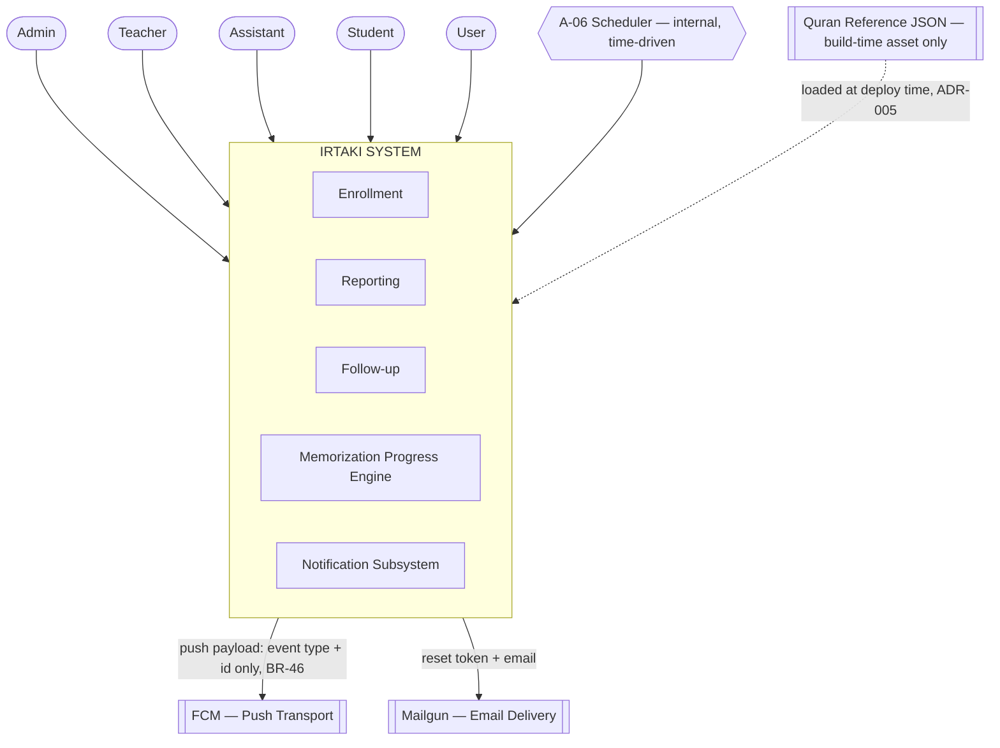

External systems: **EXT-01** (Identity) resolved as in-house, no longer external (ADR-018). **EXT-02** (email) = Mailgun (ADR-019). **EXT-03** (push) = FCM via Expo (ADR-020). **EXT-04** (Quran reference data) remains a build-time asset, never a runtime integration (ADR-005, unchanged). **EXT-05** (WhatsApp) and **EXT-06** (payment gateway) remain out of the system boundary, unchanged from SAS.

## 8. Container Architecture

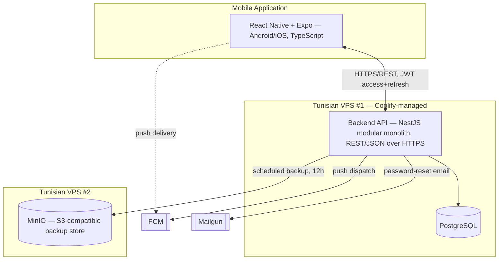

| Container          | Responsibilities                                                                                                                                                                |
| ------------------ | ------------------------------------------------------------------------------------------------------------------------------------------------------------------------------- |
| Mobile Application | Auth UI, dashboards, group browsing, report submission, performance views, push-token registration; local state only, no persistent offline store (NFR-02)                      |
| Backend API        | JWT issuance/verification, authorization guards, DTO validation, use-case orchestration, domain service execution, response formatting, **in-process scheduled jobs** (ADR-024) |
| PostgreSQL         | Persistent data, referential integrity, ACID transactions, partial-unique-index concurrency guards, trigger-enforced immutability                                               |
| MinIO              | Backup target only — never in the runtime request path                                                                                                                          |
| FCM / Mailgun      | Transport only — no business logic                                                                                                                                              |

**ADR-024 — Scheduler implementation.** In-process cron via `@nestjs/schedule`, not a separate worker service or a broker-backed queue (BullMQ/Celery). Reason: AR-05's per-timezone jobs run against a bounded, single-center dataset — a second deployable and message broker add no throughput benefit at this scale. Status: Decided.

## 9. Mobile Architecture

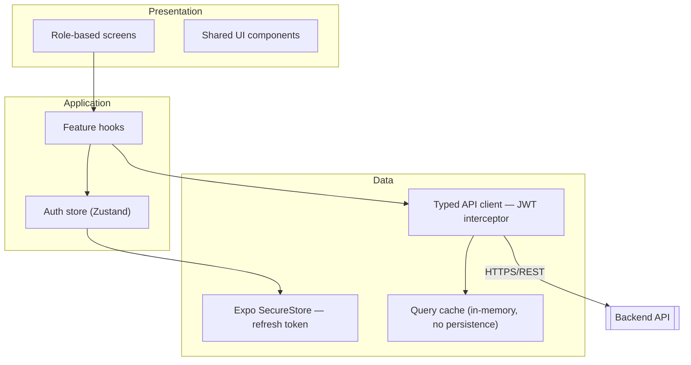

No separate client-side Domain layer — every business rule is authoritative server-side (NFR-08); client-side rule mirroring is UX convenience only, never a source of truth.

**Navigation** (root determined by role at login, per FR-AUTH-05):

| Role             | Screens                                                                                                                             |
| ---------------- | ----------------------------------------------------------------------------------------------------------------------------------- |
| Anonymous        | Login, Register, Password reset                                                                                                     |
| User (applicant) | Group browsing, Apply, status-only view (DEC-C09)                                                                                   |
| Student          | Dashboard, Daily Report, Weekly Report, Performance, Payments                                                                       |
| Teacher          | Dashboard, Group roster, Performance, At-risk list                                                                                  |
| Assistant        | Join request queue, Payments — **no reports/performance routes exist at all** (DEC-B09 enforced by the navigator, not just the API) |
| Admin            | Groups, Staff, Recovery, Audit log                                                                                                  |

**ADR-025 — Mobile state management.** TanStack Query (server state) + Zustand (auth session state only). Reason: nearly everything the client renders is a server read; Redux's global-store ceremony manages state the app barely has once server state is handled by a purpose-built cache. Status: Decided, pure engineering call.

| Concern          | Approach                                                                                                                                                     |
| ---------------- | ------------------------------------------------------------------------------------------------------------------------------------------------------------ |
| Error mapping    | 401→silent refresh then logout; 403→permission-denied, no explanation (NFR-20); 409→inline conflict; 422→field errors in Arabic (API-X06); 5xx→generic retry |
| Offline behavior | None by design (NFR-02) — "no connection" state, no drafting                                                                                                 |

## 10. Backend Architecture

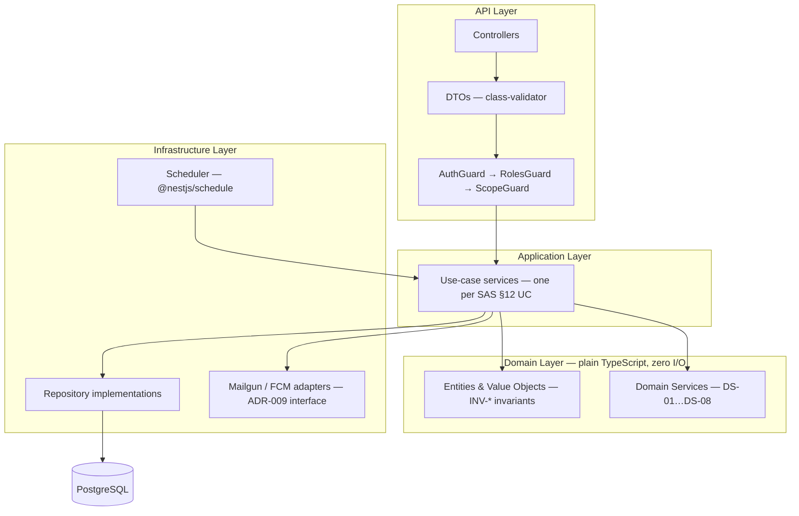

| Layer          | Responsibility                                                                      | Must NOT contain                                |
| -------------- | ----------------------------------------------------------------------------------- | ----------------------------------------------- |
| API            | Routing, auth/role/scope check, input shape validation                              | Business rules, SQL, transactions               |
| Application    | Orchestrates one use case per UC-01…UC-18, wraps AR-04 transactions, calls adapters | Direct SQL, provider-specific transport details |
| Domain         | Entity invariants, DS-01…DS-08, value objects                                       | Anything framework-specific                     |
| Infrastructure | Repository implementations, transport adapters, job triggers                        | Business rules                                  |
| Database       | Persistence, referential integrity, immutability triggers                           | —                                               |

**ADR-026 — Domain event dispatch.** NestJS `EventEmitter2`, events emitted only after the enclosing transaction commits. Reason: decouples side effects (notification, coverage update) from the write that triggers them, matching ADR-009's "one place to enforce suppression/muting rules" requirement, without event-sourcing Postgres. Status: Decided.

**ADR-032 — Non-blocking event dispatch.** Emitted events are never awaited by the triggering use case; each `EventEmitter2` handler runs fire-and-forget with its own try/catch. Reason: this is what actually makes ADR-024/026's "no broker needed" claim true — a request returns as soon as its own transaction commits, regardless of how long a downstream FCM call takes. Status: Decided.

## 11. Module Boundaries

| Module             | Responsibility                                      | Owns                                                                              | Dependencies                                   | External |
| ------------------ | --------------------------------------------------- | --------------------------------------------------------------------------------- | ---------------------------------------------- | -------- |
| **Identity**       | Registration, session, profile, role admin          | `users`, `auth_tokens`                                                            | none (leaf)                                    | Mailgun  |
| **Groups**         | Group lifecycle, staff, enrollment, archival        | `groups`; DS-07, DS-08                                                            | Identity                                       | —        |
| **Enrollment**     | Application → review → accept/reject                | `join_requests`, `join_request_ahzab`; DS-01                                      | Groups, Memberships, Progress                  | —        |
| **Memberships**    | Enrollment lifecycle, roster, termination, recovery | `memberships`                                                                     | Reports, Payments, Progress (cascade)          | —        |
| **Reports**        | Daily + weekly reporting                            | `daily_reports`, `weekly_reports`; DS-02                                          | — (emits events)                               | —        |
| **Progress**       | Memorization coverage, Quran reference              | `memorization_coverage`, `coverage_intervals`, `surahs`, `hizb_boundaries`; DS-05 | — (subscribes to Reports)                      | —        |
| **Performance**    | Derived indicators — owns no table                  | DS-03, DS-04                                                                      | Reports, Memberships, **Progress** (read-only) | —        |
| **Payments**       | Ledger, derived cycles                              | `payment_records`; DS-06                                                          | Memberships                                    | —        |
| **Notifications**  | Push dispatch, preferences, tokens                  | `device_tokens`, `notification_preferences`, `notification_log`                   | subscribes to all producer modules             | FCM      |
| **Administration** | Audit log only                                      | `audit_entries`                                                                   | subscribes to 3 audited events                 | —        |

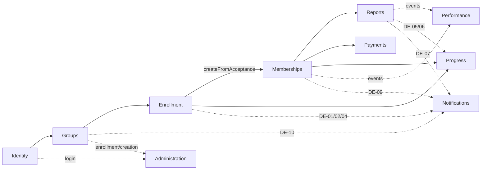

Solid = direct call (allowed direction only, no cycles). Dashed = event subscription (ADR-026) — Performance/Notifications/Administration are never called into directly, they listen.

**ADR-027 — Enrollment/Memberships split.** Two modules despite DS-01 spanning both; Enrollment calls Memberships' creation API rather than merging or splitting further. Reason: applying/reviewing is a bounded workflow distinct from operating a multi-month enrollment history; merging dilutes cohesion, further splitting scatters DS-01's single atomic transaction. Status: Decided.

**Note:** DeviceToken/NotificationPreference sit in DMS's User aggregate (AGG-01) for consistency purposes but in the Notifications _module_ for capability purposes — aggregate boundary and module boundary are not required to coincide.

## 12. Domain / Application / Infrastructure Boundaries

**Rule placement:**

| Rule                                    | Placement                                                              | Reasoning                                              |
| --------------------------------------- | ---------------------------------------------------------------------- | ------------------------------------------------------ |
| Gender eligibility (VR-08)              | Domain + DB trigger (DB-CHK-12)                                        | Fail fast, DB is the backstop                          |
| One active Membership per User (INV-03) | Cross-aggregate — DS-01 procedurally, DB partial unique index backstop | Spans User + Membership aggregates                     |
| One Pending JoinRequest (BR-01)         | DB partial unique index primary                                        | Concurrency hazard                                     |
| Commitment Score / weekly metrics       | Domain service, pure (DS-03)                                           | NFR-31                                                 |
| At-risk detection                       | Domain service (DS-04)                                                 | Read-time predicate                                    |
| Report / recitation-day immutability    | Database trigger                                                       | Survives future code paths                             |
| Coverage never shrinks (INV-18)         | Domain service (DS-05)                                                 | Diff-across-write, not a static constraint             |
| Referential integrity                   | Database (FK)                                                          | Domain pre-validates for a clean error                 |
| Soft-delete scope filtering             | Infrastructure — default repository scope                              | Cross-cutting, must not depend on per-use-case memory  |
| Instance-level authorization scope      | API Guards + Infrastructure repository filter                          | NFR-19 requires the data-access-layer check explicitly |
| Payment cycle derivation                | Domain service (DS-06), pure, read-time                                | Nothing stored (ADR-006)                               |
| Effective window / prorating            | Domain — shared pure function                                          | Used identically by Performance and Payments           |

**Responsibility matrix** (concern × layer):

| Concern                            | Mobile | API | Application    | Domain | Infra | DB        |
| ---------------------------------- | ------ | --- | -------------- | ------ | ----- | --------- |
| UI convenience validation          | ✓      |     |                |        |       |           |
| Input/DTO validation               |        | ✓   |                |        |       |           |
| Auth (JWT verify)                  |        | ✓   |                |        |       |           |
| Authz — role                       |        | ✓   |                |        |       |           |
| Authz — scope (doubled)            |        | ✓   |                |        | ✓     |           |
| Business rules — entity-intrinsic  |        |     |                | ✓      |       |           |
| Business rules — context-dependent |        |     | ✓              |        |       |           |
| Domain services DS-01…08           |        |     |                | ✓      |       |           |
| Transaction atomicity              |        |     | ✓              |        |       |           |
| Concurrency-hazard uniqueness      |        |     | (UX pre-check) |        |       | ✓ primary |
| Referential integrity              |        |     |                |        |       | ✓         |
| Immutability                       |        |     |                |        |       | ✓         |
| Persistence translation            |        |     |                |        | ✓     | ✓         |
| Soft-delete default scope          |        |     |                |        | ✓     |           |
| Error localization                 |        | ✓   |                |        |       |           |
| Rate limiting                      |        | ✓   |                |        |       |           |
| Push payload construction          |        |     | ✓              |        |       |           |
| Transport calls                    |        |     |                |        | ✓     |           |
| Scheduled-job triggering           |        |     |                |        | ✓     |           |

The empty Domain-layer I/O rows are the point — NFR-31's purity requirement made structurally visible, not just claimed.

## 13. Authentication Architecture

Password hashing: **argon2id**, ~250ms work factor. Never returned by any query.

**New table required beyond DBD v1.0's 18-table catalogue** (versioned delta, becomes DBT-19):

```
auth_tokens
  id               UUID PK
  user_id          UUID FK → users
  token_hash       TEXT NOT NULL          -- SHA-256 of the opaque token
  purpose          TEXT NOT NULL CHECK (purpose IN ('refresh','password_reset'))
  device_token     TEXT NULL
  issued_at        TIMESTAMPTZ NOT NULL DEFAULT now()
  expires_at       TIMESTAMPTZ NOT NULL
  revoked_at       TIMESTAMPTZ NULL
  replaced_by      UUID NULL FK → auth_tokens   -- rotation chain, reuse detection
```

| Token          | Lifetime                         | Client storage   | Server storage                |
| -------------- | -------------------------------- | ---------------- | ----------------------------- |
| Access (JWT)   | 1 hour                           | Memory only      | Stateless, signature-verified |
| Refresh        | 30 days, sliding, rotated on use | Expo SecureStore | `auth_tokens`, hashed         |
| Password reset | 30 min, single-use               | Emailed link     | `auth_tokens`, hashed         |

Rotation includes **reuse detection**: presenting an already-`revoked_at` refresh token revokes its entire `replaced_by` chain and forces re-login — a stolen-token signal. Successful password reset revokes every outstanding refresh token for that user.

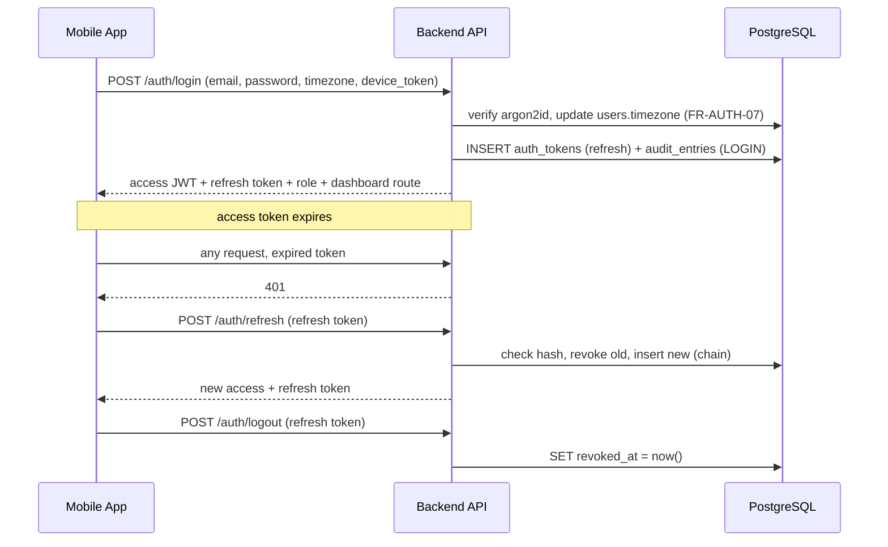

**ADR-018 — Identity provider.** In-house credential storage, not a managed provider (Auth0/Cognito/Firebase Auth). Reason: the requirement set (email/password, reset, session, one seeded Admin, no SSO/MFA) gains no data-modeling benefit from a managed provider — role/gender/timezone/membership linkage would still need to live in this database regardless. Status: Decided.

## 14. Authorization Architecture

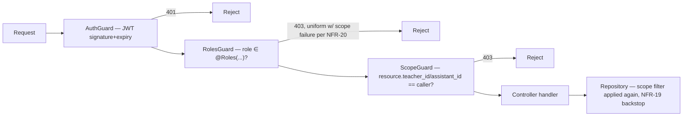

Two independent axes: **RBAC** (coarse, "can this role ever do X") via `RolesGuard`, and **instance-level scope** ("can this user do X on this specific resource") via `ScopeGuard`. The scope filter runs twice — Guard for single-resource routes, repository-level for list routes — because a Guard alone doesn't protect an unfiltered list endpoint from leaking out-of-scope rows (NFR-19's actual concern).

Resource ownership resolution: one indexed lookup — `SELECT 1 FROM groups WHERE id=:id AND (teacher_id=:uid OR assistant_id=:uid)` — no caching layer, consistent with DEC-C11's scale-agnostic posture.

Assistant's blanket exclusion from Reports/Performance (DEC-B09) needs only `RolesGuard` — Assistant isn't in the `@Roles()` list for those routes at all. Admin bypasses `ScopeGuard` entirely via early-return (DEC-C07), not by being silently added to every group's staff columns.

Out-of-scope and not-found resources return **the same 403**, uniformly — a scope-guarded lookup's single query returns zero rows for both cases identically, so there is nothing to distinguish (NFR-20).

## 15. API Architecture

Full endpoint contract is authoritative in SAS §23 (API-01…API-11) — this section binds it to the module boundaries in §11 and fixes cross-cutting mechanics.

| Module         | Resources                                                          | Authorization pattern                                                 |
| -------------- | ------------------------------------------------------------------ | --------------------------------------------------------------------- |
| Identity       | `/auth`, `/me`, `/users`                                           | Public → self-scope → Admin-only                                      |
| Groups         | `/groups`                                                          | RolesGuard+ScopeGuard — Admin structural, assigned Teacher for toggle |
| Enrollment     | `/join-requests`                                                   | role=User to submit; assigned Assistant to review                     |
| Memberships    | `/memberships`                                                     | Student own; scoped staff; Admin-only terminate                       |
| Reports        | `/daily-reports`, `/weekly-reports`                                | Student own; scoped staff; **Assistant 403 unconditionally**          |
| Progress       | `/me/progress`, `/quran/*`                                         | Scoped; reference data open to any authenticated                      |
| Performance    | `/me`, `/groups/{id}`, `/memberships/{id}/performance`, `/at-risk` | Scoped; **Assistant 403 on every endpoint**                           |
| Payments       | `/me/payments`, `/groups/{id}/payments`                            | Scoped; **Teacher 403**                                               |
| Notifications  | `/devices`, `/me/notification-preferences`                         | Own only                                                              |
| Administration | `/users/{id}/role`, `/audit`, `/recovery`                          | Admin only                                                            |

**Cross-cutting mechanics:**

| Requirement      | Implementation                                                          |
| ---------------- | ----------------------------------------------------------------------- |
| API-X01/X02      | Global `APP_GUARD` chain, never opted in per controller                 |
| API-X03 (NFR-20) | Same 404/403 for out-of-scope and non-existent                          |
| API-X04 (ISS-18) | Cursor pagination on every unbounded list                               |
| API-X05          | Constraint-violation-first conflict detection, never a preceding SELECT |
| API-X06          | Global exception filter maps through Arabic i18n table                  |
| NFR-22           | `ThrottlerModule` on `/auth/*` and `POST /join-requests`                |

**ADR-021 — API protocol.** REST/JSON. Reason: §23's surface is a small, fixed resource set with period-parameterized reads — not a case GraphQL's flexible querying benefits. Status: Decided.

## 16. Database Integration

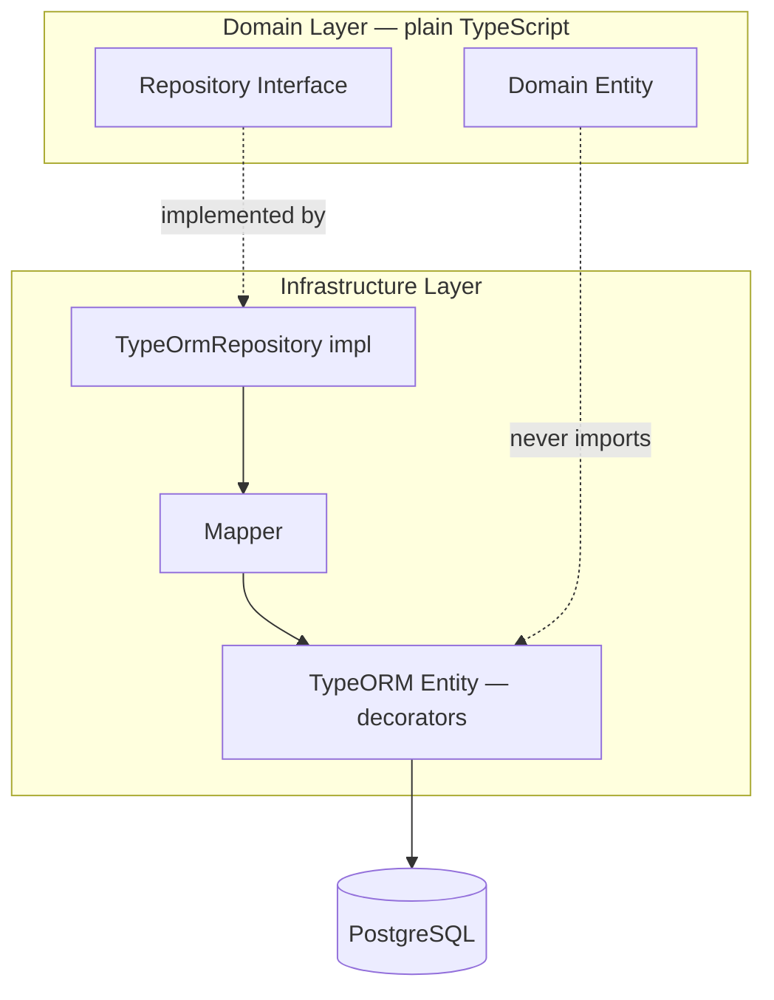

**ADR-028 (data access) — TypeORM**, over Prisma, Drizzle, or raw SQL. Reason: DBD's schema is unusually opinionated (5 partial unique indexes, `BEFORE UPDATE` triggers, UUIDv7 PKs, `TEXT`+`CHECK` enums) — Prisma's declarative schema has no native way to express a partial unique index or a trigger. TypeORM's hand-written migrations express DBD's constraints exactly as specified, and `@DeleteDateColumn` gives soft-delete-as-default-scope (AR-07) as a built-in, with `.withDeleted()` for the one deliberately-inverted case (UC-16). Drizzle is the named fallback if relation-loading proves painful in practice. Status: Decided.

**ADR-028 (transactions) — Transaction boundary ownership.** Use cases own transactions via TypeORM's `QueryRunner`, passed through to every repository call they make; domain services stay transaction-agnostic. Only `AcceptJoinRequestUseCase` and `RemoveStudentUseCase` open a `QueryRunner` directly — every other use case's single repository call auto-commits. Status: Decided.

## 17. Validation Architecture

| Class                                        | Tier                | Mechanism                                                       |
| -------------------------------------------- | ------------------- | --------------------------------------------------------------- |
| Format/shape                                 | Input               | DTOs + `class-validator`, rejected pre-handler                  |
| Cross-field business rules                   | Business            | Split below                                                     |
| Concurrency-sensitive uniqueness (5 hazards) | Database, primary   | Partial unique indexes — business-tier checks exist for UX only |
| Referential existence                        | Database            | FK RESTRICT                                                     |
| Immutability                                 | Database            | `BEFORE UPDATE` triggers                                        |
| Account-critical mute block                  | Business + Database | App gives clean 422; DB trigger is the backstop                 |
| Error localization                           | Response            | Global filter, Arabic message table                             |

**Business-tier split:**

- **Entity-intrinsic** (needs only the entity's own state) → domain entity guard clause, zero I/O, unit-testable instantly.
- **Context-dependent** (needs another entity or cross-module fact) → application use case, after repositories load the relevant entities.

## 18. Transaction Architecture

| Operation                      | Transaction     | Isolation                        | Reason                                                                                               |
| ------------------------------ | --------------- | -------------------------------- | ---------------------------------------------------------------------------------------------------- |
| Login                          | Yes, thin       | default                          | Token + audit row must not drift apart                                                               |
| Submit Daily Report            | No              | default                          | Single insert; coverage update deliberately separate (see below)                                     |
| Confirm/Finalize Weekly Report | No              | default                          | Read set is immutable by BR-21/22 — no race to protect                                               |
| **Accept Join Request**        | **Yes — AR-04** | default                          | DS-01: role+membership+coverage, one outcome; `WHERE status='Pending'` guard in the same transaction |
| Archive Group                  | **Yes**         | **SERIALIZABLE/REPEATABLE READ** | Only operation needing elevated isolation — accept-vs-archive race (DBD §27)                         |
| **Remove Student**             | **Yes — AR-04** | default                          | Membership termination + 4-table cascade + role revert                                               |
| Record Payment                 | No              | default                          | `DB-UQ-06` is the authoritative guard                                                                |

**ADR-029 — Coverage-update failure handling.** `CoverageReconciliationJob` promoted from Recommended (AR-15) to **Required**. Reason: Daily Report submission and its coverage update are deliberately two separate transactions (ADR-026's post-commit event dispatch) — if the second fails, the report stays safely persisted but coverage silently drifts until reconciled. A nightly job recomputes coverage from `daily_reports` and corrects `memorization_coverage`. Status: Decided.

**ADR-030 — Per-timezone scheduled job mechanism.** A single tick every 15 minutes, filtering by each user's computed local time from their persisted `timezone` — not one cron entry dynamically registered per distinct timezone present. Reason: avoids fragile dynamic cron management around DST for a problem this single-center MVP doesn't have yet. Idempotency (AR-17) falls out naturally: a user already finalized/reminded this cycle is excluded because the triggering state no longer exists. Status: Decided.

## 19. Reporting Architecture

| Report/Metric             | Trigger                 | Storage                          | Decision        |
| ------------------------- | ----------------------- | -------------------------------- | --------------- |
| Daily Report              | Write, on submission    | Persisted, immutable             | Primary record  |
| Weekly Report (open)      | Read, live              | Never stored                     | ADR-003         |
| Weekly Report (finalized) | Write once              | Snapshotted, immutable           | ADR-003         |
| Commitment Score          | Read, per period        | Never stored                     | ADR-004         |
| At-Risk flag              | Read/scheduler          | Never stored                     | DS-04           |
| Coverage                  | Async write post-report | Materialized, nightly-reconciled | ADR-008/ADR-029 |
| Payment cycle             | Read                    | Never stored                     | ADR-006         |

No database views; derivation logic lives in the domain layer as plain TypeScript. No materialized aggregate tables — premature without a sizing target.

**Background jobs** (all via ADR-024's in-process scheduler, riding ADR-030's tick):

| Job                           | Frequency                        | Does                            |
| ----------------------------- | -------------------------------- | ------------------------------- |
| `WeeklyReportFinalizationJob` | Tick, filtered to local midnight | DS-02 finalization              |
| `DailyReminderEvaluationJob`  | Tick, filtered to local 20:00    | N-01, §22.3 suppression applied |
| `AtRiskEvaluationJob`         | Tick, daily                      | N-07, once per episode (ISS-17) |
| `PaymentDueSoonEvaluationJob` | Tick, daily                      | N-06, once per cycle (ISS-17)   |
| `CoverageReconciliationJob`   | Nightly, global                  | ADR-029                         |

**ADR-031 — Caching.** No application-level cache (Redis) anywhere. One narrow exception: HTTP `Cache-Control` headers on `/quran/*` reference endpoints (near-static data), plus a build-time client bundle. Reason: dashboard reads are already correct-by-construction via indexes with no sizing target to justify a cache; the reference-data exception costs no new infrastructure. Status: Decided.

## 20. Dashboard Architecture

**Strategy: dedicated endpoint per dashboard, one round trip** — matches NFR-11's 3s/3G budget; six-to-eight separate calls on a poor connection would exhaust that budget on latency alone.

| Individual dashboard element (SRS §9.4.1)                              | Owning module                                                 |
| ---------------------------------------------------------------------- | ------------------------------------------------------------- |
| 1. Commitment Score + trend                                            | Performance (DS-03)                                           |
| 2. Memorization progress (ahzab completed + `last_memorized_position`) | **Progress** — cross-module read, corrected during this phase |
| 3. Day breakdown donut                                                 | Performance                                                   |
| 4. Repetition quality %                                                | Performance                                                   |
| 5. Recitation attendance %                                             | Performance                                                   |
| 6. Days since last report                                              | Performance                                                   |

| Group dashboard element (SRS §9.4.2) | Owning module       |
| ------------------------------------ | ------------------- |
| 1. Group Commitment average          | Performance         |
| 2. Student list, sorted ascending    | Performance         |
| 3. At-risk list                      | Performance (DS-04) |
| 4. Absence reasons donut             | Performance         |
| 5. Submission rate %                 | Performance         |

Elements 3–6 (individual) and 4–5 (group) derive from one bounded `daily_reports` range scan per request, not per-element queries — this is what actually delivers the NFR-11 budget, not just "one HTTP call" framing.

## 21. Notification Architecture

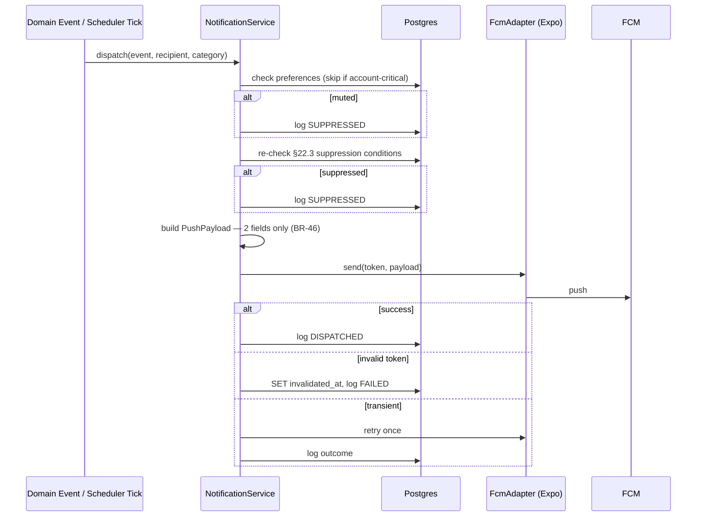

Payload type structurally limited: `{ eventType: NotificationCategory; resourceId: string }` — no name/content/score/amount field exists on the type at all (BR-46, enforced by TypeScript, not convention).

Cadence (ISS-17): N-06/N-07 fire once per cycle/episode — checked against existing `notification_log` entries before dispatch, no new table needed.

**ADR-020 — Push provider.** FCM via Expo's push service (bridges to APNs automatically). Status: Decided.
**ADR-019 — Email provider.** Mailgun. Status: Decided.

## 22. Caching Strategy

Covered fully in §19 / ADR-031. No repetition here beyond confirming: no Redis, no query-result cache, HTTP cache headers on static reference data only.

## 23. Background Processing

Consolidated table in §19. Classification: `WeeklyReportFinalizationJob`, `DailyReminderEvaluationJob`, `AtRiskEvaluationJob`, `PaymentDueSoonEvaluationJob` are **Required**; `CoverageReconciliationJob` is **Required** (promoted by ADR-029). No queue-based async dispatch exists — see ADR-032 for why that's safe (non-blocking, fire-and-forget in-process dispatch).

## 24. Error Handling

| Category                | HTTP                  | Client handling                                                       |
| ----------------------- | --------------------- | --------------------------------------------------------------------- |
| Validation              | 422                   | Inline field errors, Arabic                                           |
| Authentication          | 401                   | Silent refresh, logout on 2nd failure                                 |
| Authorization           | 403 (uniform, NFR-20) | Permission-denied, no reason given                                    |
| Not Found               | 404                   | Generic                                                               |
| Conflict                | 409                   | Inline conflict message                                               |
| Business Rule Violation | 422                   | Rule-specific Arabic message                                          |
| Database Error          | 503                   | Generic retry banner                                                  |
| External Service Error  | — (never propagated)  | None — see below                                                      |
| Unexpected              | 500                   | Generic retry; full detail server-logged against `correlationId` only |

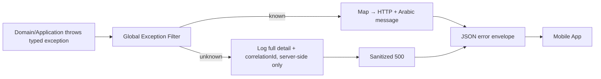

Envelope: `{ statusCode, error, message (Arabic), correlationId }` — never raw Postgres error text, constraint name, stack trace, or file path.

External Service Error is a hard rule, not a fallback: neither Mailgun nor FCM failure ever surfaces on the request that triggered it — password reset always returns 202 unconditionally (anti-enumeration); notifications are post-commit events that can't roll back or error their triggering use case.

## 25. Security Architecture

| Threat                             | Mitigation                                                         |
| ---------------------------------- | ------------------------------------------------------------------ |
| Credential stuffing                | argon2id + `ThrottlerModule`                                       |
| Refresh-token theft                | Rotation + reuse detection                                         |
| SQL injection                      | TypeORM parameterized queries exclusively                          |
| IDOR                               | `ScopeGuard` + repository filter, doubled                          |
| Push payload leakage               | `PushPayload` type, structurally 2 fields                          |
| Join-request flooding              | Rate limit on `POST /join-requests` (ISS-19)                       |
| Seeded Admin credentials           | Forced password change, first login (ISS-07)                       |
| Server compromise (no managed WAF) | fail2ban, unattended upgrades, Traefik as the only exposed surface |
| Backup store over-exposure         | MinIO reachable only from VPS #1 (ADR-034)                         |
| MITM                               | TLS everywhere, automatic Let's Encrypt                            |
| Personal-data over-exposure        | Field-level restriction, API-layer enforced (NFR-10)               |

Administrative access: SSH key-only auth on both VPS instances, 2FA on the Coolify dashboard account — Coolify centralizes deploy access, secrets, and DB credentials, making it the highest-value target in the system. Encryption at rest: disk-level LUKS on both VPS instances, since there's no hyperscaler-default equivalent here.

**ADR-014 — Hosting.** Self-managed Tunisian VPS. Reason: Tunisia's data protection framework (Organic Law n°2004-63, INPDP oversight) requires authorization before personal data crosses the border; foreign PaaS/serverless hosting was ruled out on this basis. **Flagged, not resolved by this document:** FCM and Mailgun still carry limited data (device tokens, recipient email addresses) across the border — worth a direct legal confirmation, not an architectural blocker. Status: Decided; residency scope for third-party transport flagged open.

**ADR-034 — Backup store network posture.** MinIO on VPS #2 reachable only from VPS #1's address. Status: Decided.

## 26. Observability

| Concern   | Approach                                                                                                                                            |
| --------- | --------------------------------------------------------------------------------------------------------------------------------------------------- |
| Logging   | Structured JSON via Pino, file + logrotate, every line carries `correlationId`                                                                      |
| Redaction | Pino `redact` on password, password_hash, Authorization header, both token values                                                                   |
| Metrics   | Scheduler run outcome per job; notification dispatch outcome (`notification_log`); daily submission rate vs. 80% target; authz-failure-rate counter |
| Tracing   | **Not built** — no service boundary in a modular monolith to trace across; `correlationId` gives equivalent visibility at far lower cost            |
| Audit     | SAS §21, exactly 3 actions — unchanged                                                                                                              |
| Alerting  | Healthchecks.io dead-man's-switch for scheduler-failure detection                                                                                   |

**ADR-033 — Observability stack.** Structured logs + correlationId + Healthchecks.io, no Prometheus/Grafana/Jaeger. Status: Decided; revisit only on a demonstrated blind spot.

## 27. Deployment Architecture

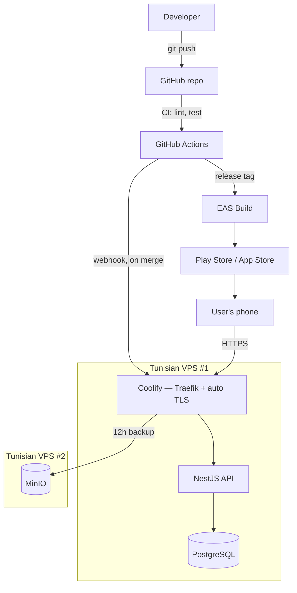

Backend deploy: push → CI lint/test → webhook → Coolify builds, health-checks, rolls traffic over. No manual SSH deploy step. Mobile deploy is a separate pipeline (EAS Build + Submit) — Google Play ($25 one-time) and Apple Developer Program ($99/yr) accounts are a practical prerequisite, not an architecture decision.

**ADR-014 (hosting), ADR-015 (Coolify), ADR-035 (two-VPS topology)** — two Tunisian VPS instances: one running Coolify+API+Postgres, one running only MinIO, so a full VM loss on VPS #1 doesn't destroy the database and its backups in the same event. Status: Decided.

## 28. Environment Strategy

|            | Development                | PR Preview                                         | Production                         |
| ---------- | -------------------------- | -------------------------------------------------- | ---------------------------------- |
| Database   | Local Docker Compose       | **Isolated, disposable, fixture-seeded** (ADR-036) | Coolify-managed Postgres           |
| Secrets    | `.env`, dummy values       | Coolify preview-scoped vars                        | Coolify production vars, encrypted |
| Email      | Mailhog                    | Mailgun sandbox domain                             | Mailgun production                 |
| Push       | Expo test device           | Sandbox posture                                    | FCM production                     |
| Deployment | Manual `docker compose up` | Auto per PR, torn down on close/merge              | Auto on merge to `main`            |

**ADR-036 — Preview environment data isolation.** Every PR preview gets a disposable, fixture-seeded database — never a copy of or connection to production. Reason: a preview environment is a wider, less-monitored surface than production; putting real personal data there would undermine the entire premise of ADR-014. Status: Decided.

Mobile previews are deliberately not wired to per-PR backend URLs — named scope limit for a small team, not an oversight.

## 29. Configuration & Secrets

| Secret                    | Location                                                              |
| ------------------------- | --------------------------------------------------------------------- |
| `DATABASE_URL`            | Coolify env vars, encrypted at rest                                   |
| JWT signing secret        | Coolify env vars — rotatable independently of refresh tokens          |
| Refresh-token pepper      | Coolify env vars, separate from JWT secret                            |
| `MAILGUN_API_KEY`         | Coolify env vars, per-environment (sandbox/production)                |
| Expo/FCM push credentials | Coolify env vars                                                      |
| Mobile API base URL       | `app.config.ts`, `EXPO_PUBLIC_*` — public by definition, not a secret |

**ADR-037 — Secrets management.** Coolify's built-in encrypted env-var store; no separate vault (HashiCorp Vault, AWS Secrets Manager). Reason: a dedicated vault solves a many-service, many-team access-policy problem this single-monolith deployment doesn't have. Status: Decided; revisit only if team/service count genuinely grows.

## 30. Backup & Recovery

|                 | Target                                                                                                              |
| --------------- | ------------------------------------------------------------------------------------------------------------------- |
| Mechanism       | Coolify scheduled `pg_dump` → MinIO                                                                                 |
| Frequency       | **Every 12 hours** — not nightly, given BR-21's irreversibility (a lost report can't be resubmitted)                |
| RPO             | ≤12 hours                                                                                                           |
| Retention       | 30 days rolling                                                                                                     |
| RTO             | ⚠️ No hard target — manual restore via fresh Postgres container + latest dump, honestly stated rather than invented |
| Restore testing | Quarterly manual drill                                                                                              |

Not recommended for MVP: continuous WAL-based PITR — disproportionate operational overhead for a first version with no evidence it's needed (Rule 3).

**ADR-038 — Backup frequency.** 12-hour snapshots, 30-day retention, quarterly restore drill. Status: Decided; NFR-27 remains formally undefined by the stakeholder, this is the recommended default.

**ADR-039 — Coolify instance-state backup.** Coolify's own configuration (repo connections, env vars, deployment state) included in the same backup schedule — restoring the app's data without the ability to redeploy it isn't a complete recovery. Mechanism to confirm against Coolify's current docs at implementation time. Status: Decided in principle.

**Residual, accepted gap:** no backup-of-the-backup — VPS #2 (MinIO) is itself a single point of failure. Not solved with a third VPS, per Rule 3; named honestly rather than silently omitted.

## 31. Scalability Strategy

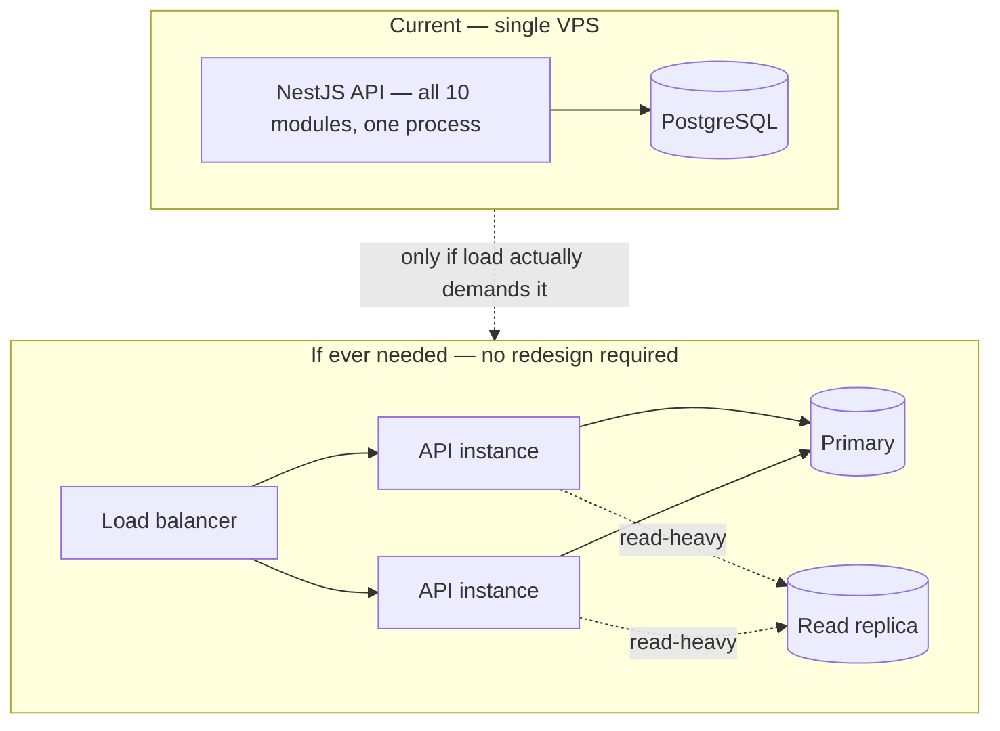

Starting point: vertical scaling alone (larger VPS) likely suffices for this MVP's lifetime, given DEC-C11 and the single-center scope. Evolution path, cheapest first: (1) vertical, (2) read replica — AR-19, only once measured as needed, (3) horizontal API scaling — made possible by stateless JWT auth and idempotent scheduling, though Coolify v4's multi-instance support runs on Docker Swarm with real ceilings versus Kubernetes, worth naming honestly, (4) module extraction along the §11 seams if any single module ever needs independent scaling.

## 32. Failure Handling

| Failure                                 | Detection                                               | Behavior                              | Recovery                                                             |
| --------------------------------------- | ------------------------------------------------------- | ------------------------------------- | -------------------------------------------------------------------- |
| Postgres unreachable                    | Health check / pool errors                              | 503                                   | Container auto-restart, or restore from MinIO (≤12h RPO)             |
| Network interruption mid-write          | Client timeout                                          | No offline queue (NFR-02)             | Retry returns 409 for constraint-guarded writes — success-equivalent |
| Duplicate request                       | Partial unique index                                    | 409                                   | None needed — this is the mechanism                                  |
| Concurrent join approval / archive race | `WHERE status='Pending'` guard, SERIALIZABLE on archive | Second attempt safe no-op             | None needed                                                          |
| Expired access token                    | `AuthGuard`                                             | 401                                   | Silent refresh                                                       |
| IDOR attempt                            | `ScopeGuard`                                            | 403 uniform                           | None needed — working as intended                                    |
| Scheduled job silently fails            | Healthchecks.io                                         | No visible symptom                    | Alert → manual restart; idempotent, safe to catch up                 |
| Mailgun unreachable                     | Adapter catch                                           | 202 still returned (anti-enumeration) | User retries reset request                                           |
| FCM unreachable/invalid token           | Transport error                                         | One retry, then mark invalidated      | None needed — best-effort by design                                  |
| VPS #1 total failure                    | Uptime monitoring                                       | Full outage, no auto-failover         | Provision replacement, restore from MinIO, redeploy via Coolify      |
| VPS #2 (MinIO) failure                  | Backup/drill failure                                    | No live impact                        | Accepted residual risk (§30)                                         |

## 33. Architecture Diagrams — Index

| #   | Diagram                               | Section |
| --- | ------------------------------------- | ------- |
| 1   | System Context                        | §7      |
| 2   | Container Architecture                | §8      |
| 3   | Mobile Architecture                   | §9      |
| 4   | Backend Component / Layering          | §10     |
| 5   | Module Dependency Graph               | §11     |
| 6   | Authentication Flow                   | §13     |
| 7   | Authorization Flow                    | §14     |
| 8   | Notification Dispatch Flow            | §21     |
| 9   | Deployment Topology                   | §27     |
| 10  | Scalability Evolution                 | §31     |
| 11  | Daily Report Flow (UC-05)             | §34     |
| 12  | Join Request Approval Flow (UC-04)    | §34     |
| 13  | Weekly Performance Flow (UC-06/07/08) | §34     |
| 14  | Remove a Student Flow (UC-12)         | §34     |
| 15  | Archive Group Flow (UC-13)            | §34     |

## 34. End-to-End Use Case Flows

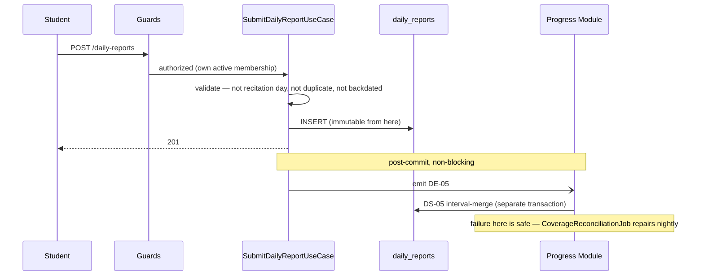

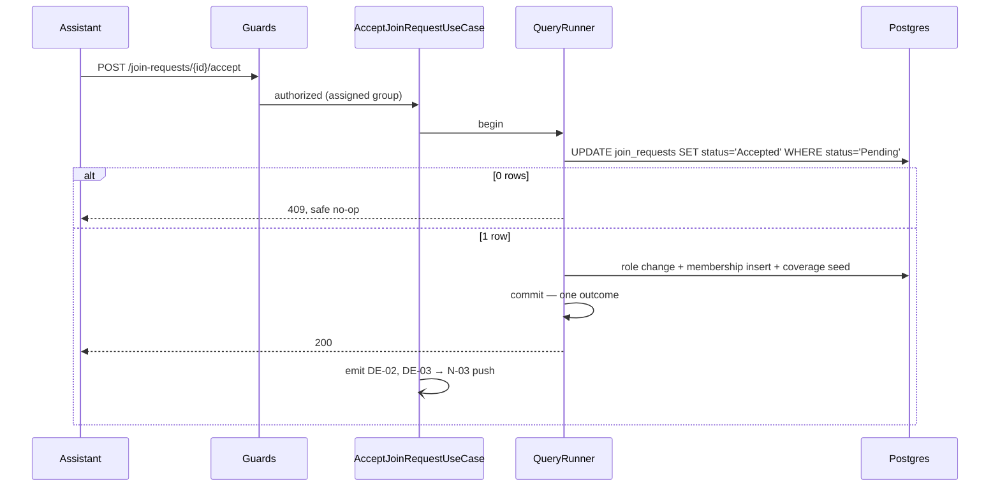

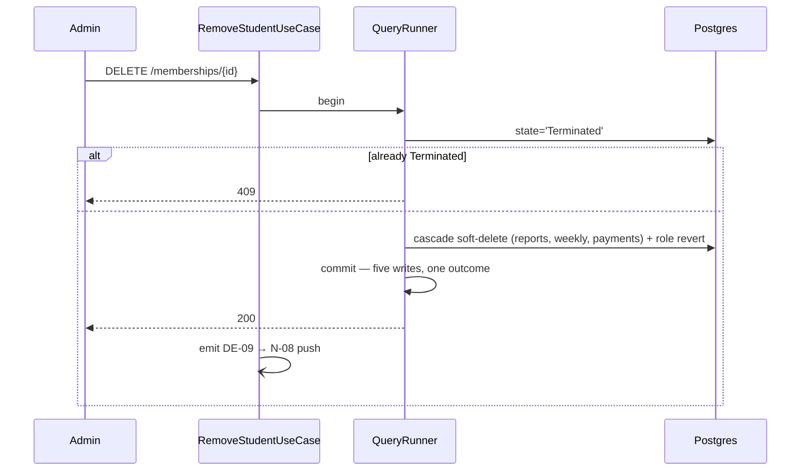

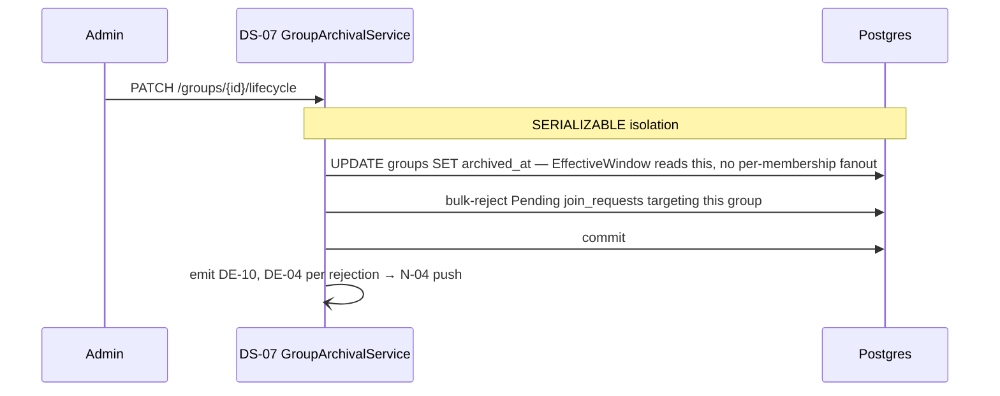

**Remaining UCs**, same chain pattern:

| UC    | Endpoint                       | Use Case (Module)                  | DB                                    |
| ----- | ------------------------------ | ---------------------------------- | ------------------------------------- |
| UC-01 | `/auth/register\|login`        | Register/Login (Identity)          | `users`, `auth_tokens`                |
| UC-03 | `POST /join-requests`          | SubmitJoinRequest (Enrollment)     | `join_requests`, `join_request_ahzab` |
| UC-09 | `/payments`                    | RecordPayment/GetLedger (Payments) | `payment_records`                     |
| UC-10 | `/groups`                      | CreateGroup (Groups)               | `groups`                              |
| UC-11 | `/groups/{id}/staff`           | ReassignStaff (Groups, DS-08)      | `groups`                              |
| UC-14 | `/groups/{id}/enrollment`      | ToggleEnrollment (Groups)          | `groups`                              |
| UC-16 | `/memberships/{id}/recovery`   | RecoveryView (Memberships)         | read-only                             |
| UC-17 | `/users/{id}/role`             | PromoteUser (Identity)             | `users`                               |
| UC-18 | `/me/notification-preferences` | UpdatePreferences (Notifications)  | `notification_preferences`            |

## 35. Requirement Traceability

| Requirement group | Use Case(s)           | Database                                                         | Architecture Component            |
| ----------------- | --------------------- | ---------------------------------------------------------------- | --------------------------------- |
| FR-AUTH           | UC-01                 | `users`, `auth_tokens`                                           | Identity                          |
| FR-JOIN           | UC-03                 | `join_requests`, `join_request_ahzab`                            | Enrollment                        |
| FR-REQ            | UC-04                 | `join_requests`, `memberships`, `users`, `memorization_coverage` | Enrollment → Memberships          |
| FR-GRP            | UC-10, 11, 13, 14     | `groups`                                                         | Groups                            |
| FR-DR             | UC-05                 | `daily_reports`                                                  | Reports                           |
| FR-WR             | UC-06                 | `weekly_reports`                                                 | Reports                           |
| FR-PERF           | UC-02, 07, 08         | reads across reports/memberships                                 | Performance (incl. Progress read) |
| FR-PROG           | UC-05 (async), API-09 | `memorization_coverage`, `coverage_intervals`                    | Progress                          |
| FR-PAY            | UC-09                 | `payment_records`                                                | Payments                          |
| FR-NOTIF          | UC-15, 18             | `device_tokens`, `notification_preferences`, `notification_log`  | Notifications                     |
| FR-AUDIT          | _(implicit)_          | `audit_entries`                                                  | Administration                    |
| FR-ADMIN          | UC-12, 16, 17         | `memberships` + cascade, `users`                                 | Memberships / Identity            |

SAS §27 remains authoritative for full FR→UC→rule→entity→test traceability; this table adds only the architecture-component column that didn't exist before this document.

## 36. Architectural Decisions

ADR-001…012 inherited unchanged from SAS §30 (Membership modeling, day-boundary authority, weekly-report computation, commitment-score computation, Quran reference data, payment modeling, deletion strategy, progress model, notification delivery, report immutability — identity and API-style are closed below).

| ADR | Decision                                                         |
| --- | ---------------------------------------------------------------- |
| 013 | Backend: NestJS + TypeScript                                     |
| 014 | Hosting: self-managed Tunisian VPS                               |
| 015 | Deployment platform: Coolify, self-hosted                        |
| 016 | Backup target: self-hosted MinIO, second local VPS               |
| 017 | Mobile: React Native + Expo, TypeScript                          |
| 018 | Identity: in-house credential storage                            |
| 019 | Email: Mailgun                                                   |
| 020 | Push: FCM via Expo                                               |
| 021 | API protocol: REST/JSON                                          |
| 022 | Environments: Dev + Production + PR previews via Coolify         |
| 023 | Architectural style: Modular monolith                            |
| 024 | Scheduler: in-process cron, no broker                            |
| 025 | Mobile state: TanStack Query + Zustand                           |
| 026 | Domain events: in-process `EventEmitter2`, post-commit           |
| 027 | Enrollment/Memberships: two modules                              |
| 028 | Data access: TypeORM; transactions: use-case-owned `QueryRunner` |
| 029 | Coverage reconciliation: promoted Required                       |
| 030 | Scheduling: single tick, filtered by computed local time         |
| 031 | Caching: none, except HTTP headers on reference data             |
| 032 | Event dispatch: fire-and-forget, never awaited                   |
| 033 | Observability: structured logs + correlationId + Healthchecks.io |
| 034 | Backup store: network-restricted to VPS #1                       |
| 035 | Deployment topology: two Tunisian VPS instances                  |
| 036 | Preview environments: isolated, fixture-seeded DB                |
| 037 | Secrets: Coolify's built-in store, no separate vault             |
| 038 | Backup frequency: 12h, 30-day retention                          |
| 039 | Coolify instance-state included in backup scope                  |

## 37. Open Architecture Questions

| Item                                                                                | Status                                                                        |
| ----------------------------------------------------------------------------------- | ----------------------------------------------------------------------------- |
| Final VPS provider confirmation (TT Cloud vs. HexaByte/Orange quotes)               | Open — stakeholder to confirm, not a design blocker                           |
| FCM/Mailgun cross-border data flow vs. the data-residency constraint                | Open — recommend legal confirmation, not architecturally blocking             |
| RTO                                                                                 | No hard target — manual recovery only, honestly stated                        |
| Backup-of-the-backup (VPS #2 single point of failure)                               | Accepted gap for MVP                                                          |
| Coolify's exact current instance-backup mechanism                                   | To confirm against current Coolify docs at implementation time                |
| App store accounts (Apple, Google Play)                                             | Practical prerequisite, not an architecture decision                          |
| All inherited SAS/DBD open issues (ISS-02, ISS-04, ISS-08, RISK-08, DB-UQ-11, etc.) | Unaffected by architecture, carried forward unchanged — see SAS §29 / DBD §34 |

## 38. Architecture Quality Review

| Criterion              | Assessment                                                                                                                                                                 |
| ---------------------- | -------------------------------------------------------------------------------------------------------------------------------------------------------------------------- |
| Requirement Coverage   | Every AR-01…AR-21 (SAS §26) has a concrete home; every FR group traces to a module (§35)                                                                                   |
| Separation of Concerns | §12's boundary matrix — Domain touches no I/O row, demonstrated not asserted                                                                                               |
| Domain Protection      | Domain services import nothing framework- or database-specific (§10, §16)                                                                                                  |
| Security               | Threat-mapped for this specific deployment (§25), including risks the VPS pivot itself introduced                                                                          |
| Data Integrity         | Every DBD concurrency hazard resolves to a DB constraint, never app-layer alone                                                                                            |
| Scalability            | Vertical-first, correct-by-construction; horizontal path exists but isn't pre-built (§31)                                                                                  |
| Simplicity             | Checked against Rule 3's forbidden list explicitly — nothing on it appears anywhere in this document; two near-misses (job queue, Redis) considered and rejected on record |
| Testability            | Domain layer is I/O-free by construction, not by convention                                                                                                                |
| Maintainability        | NestJS modules = §11 module boundaries, 1:1                                                                                                                                |

**Overall assessment:** this architecture is a direct, traceable implementation of SAS/DMS/DBD's already-substantial analysis work, extended only where architecture genuinely required new decisions (identity provider, hosting, API style, and the operational mechanics — scheduling, transactions, caching, backups — those documents deliberately left open). No business rule was invented or altered; every open item was already open upstream or is logged here as new, not silently resolved.

---

_End of document._
