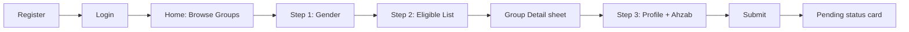
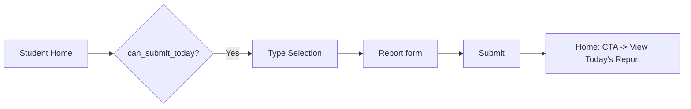
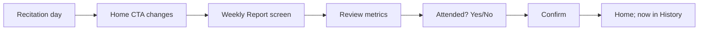
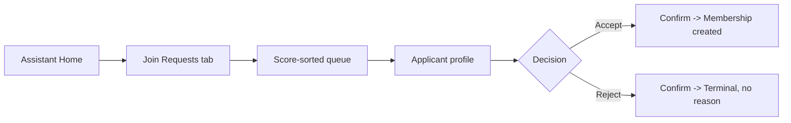
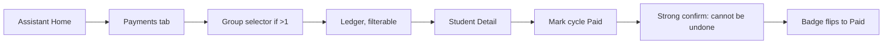
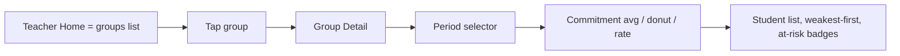
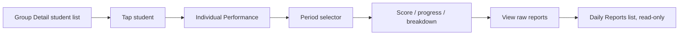

# Irtaki — UX/UI & User Flow Specification

---

## 1. Document Information

| Field                     | Value                                                                                                                  |
| ------------------------- | ---------------------------------------------------------------------------------------------------------------------- |
| Document                  | Irtaki — UX/UI & User Flow Specification (UXS)                                                                         |
| Version                   | 1.0 — Baseline                                                                                                         |
| Product                   | Irtaki — Quran Memorization Mobile Application                                                                         |
| Status                    | Baselined — sole source of truth for design and frontend implementation of the UX/UI layer                             |
| Author role               | Senior UX Architect, Product Designer, Mobile UX Specialist                                                            |
| Product Owner             | Naim Benjedou                                                                                                          |
| Authoritative inputs      | SRS v1.0, SAS v1.0, DMS v1.0, DDS v1.0, System Architecture Specification v1.0, API Specification v1.0 — all Baselined |
| Position in pipeline      | Sits between the API Specification and the Technical Specification / Development Plan                                  |
| Scope                     | MVP, mobile application only                                                                                           |
| Question batches resolved | Batch 1 — UXQ-01…UXQ-10, plus 2 flagged items (all confirmed)                                                          |

---

## 2. UX Objectives

1. Turn every confirmed business rule, state model, and API contract from the five upstream documents into a concrete, buildable interface — without redefining any of them.
2. Protect the primary success metric (SRS §13.1 — 80% weekly submission rate) by keeping the single highest-frequency action, Daily Report submission, as low-friction as the domain allows.
3. Make role boundaries (DEC-B09's Assistant exclusion, the Teacher's single write permission, DEC-C09's applicant opacity) visible through _absence_, not through disabled-but-visible controls — so authorization reads as intentional design, not as a bug.
4. Design a fully Arabic, fully RTL mobile experience as a first-class starting point, not a mirrored afterthought.
5. Never invent functionality, fields, or endpoints beyond what the authoritative documents establish — every open ambiguity is either resolved by an explicit, confirmed decision (§43) or left as a flagged, non-blocking gap.

---

## 3. UX Principles

| Principle                                     | Applied as                                                                                                                                                                                 |
| --------------------------------------------- | ------------------------------------------------------------------------------------------------------------------------------------------------------------------------------------------ |
| Server-authoritative state, thin client logic | No client-side date pickers, no local drafting, no timezone controls — the domain's temporal and business logic lives entirely server-side (§9, §15)                                       |
| Absence over disablement                      | Out-of-scope actions and data don't appear as greyed-out controls; they simply don't render (§8, §17)                                                                                      |
| One question, one screen                      | Progressive disclosure gates every conditional form section behind a single yes/no question rather than showing all fields at once (§15)                                                   |
| Friction proportional to consequence          | Daily habit-loop actions get zero confirmation; genuinely irreversible actions (payment recording, group deletion) get the strongest confirmation copy in the app (§25)                    |
| Minimal footprint over invented richness      | Where the data model has nothing to show (a Group's discoverable content, a Student's own group screen), the UI shows nothing extra rather than inventing content to fill space (§12, §14) |
| Consistency over novelty                      | One Quran range-picker component, one time-picker pattern, one status-badge construction, reused everywhere they're needed (§29)                                                           |

---

## 4. UX Architectural Drivers

| Requirement / finding                                                                                                                                                             | Source                    | UX impact                                                                                                                    |
| --------------------------------------------------------------------------------------------------------------------------------------------------------------------------------- | ------------------------- | ---------------------------------------------------------------------------------------------------------------------------- |
| MVP is materially larger than the SRS alone describes — push notifications, soft-delete/recovery, and a memorization-coverage engine were all added during analysis               | SAS §31.3                 | Screen inventory covers all of it, not just the SRS's original 8 use cases                                                   |
| Arabic-only, no language switcher, full RTL                                                                                                                                       | NFR-03/04                 | No locale toggle anywhere in the IA                                                                                          |
| No offline mode, no drafting, no local queueing                                                                                                                                   | NFR-02, RISK-05 accepted  | §37 is a fixed answer, not an open design space                                                                              |
| No in-app notification centre; push payload carries only `{eventType, resourceId}`                                                                                                | BR-46, SAS §22.6          | Every push event needs an explicit tap→screen mapping designed up front (§26)                                                |
| API error messages are already Arabic, user-facing strings                                                                                                                        | APIS §9.5                 | Error-state UX is largely "display what the server sends" (§24)                                                              |
| Access token 1h (memory), refresh 30d sliding (SecureStore)                                                                                                                       | SA §13                    | Session-expiry UX is a silent background refresh in the normal case, not a hard logout (§9)                                  |
| `groups` table has no description, capacity, or photo field                                                                                                                       | DBD DBT-02                | Group discovery/detail content is inherently minimal — name + recitation day is the entire discoverable footprint (§11, §12) |
| Admin authenticates through the same endpoint as every other role and has a real action set (create/archive groups, reassign staff, promote users, remove students, recover data) | SAS §4.1, FR-GRP/FR-ADMIN | Admin is included as a 5th role area in this spec (UXQ-01), at lower fidelity than the metrics-driven roles                  |
| `absence_reason` is an enum only — no free-text column exists anywhere in the schema                                                                                              | DBD DBT-06                | The Absence flow collects no reason text, for any option including "Other"                                                   |
| Every performance rate is nullable and must never render as `0%`                                                                                                                  | DEC-B04                   | A single "not enough data" treatment applies everywhere a rate could be undefined                                            |

---

## 5. Role Profiles

Functional profiles only — no fictional demographic personas, per project convention.

### User (prospective applicant)

- **Goals** — get accepted into a suitable group.
- **Main actions** — register; declare gender; browse eligible groups; complete a multi-step join application (profile + ahzab selection); check pending status.
- **Information needed** — own account; filtered group list (name + recitation day only); own request status only — never group detail, never their own score, never a rejection reason.
- **Restrictions** — at most one `Pending` request (BR-01); no cancel action (FR-JOIN-12); can reapply immediately if rejected, no cooldown (BR-06).

### Student

- **Goals** — fulfil daily reporting, track own commitment/progress, know payment status.
- **Main actions** — submit one Daily Report per memorization day (Normal / Absent / Revision); confirm the Weekly Report once, on the recitation day; view own performance dashboard with period filter; view own payment/arrears; view own report history.
- **Information needed** — today's submission status/block reason; commitment score + components; memorization progress (ahzab completed, activity-pointer position); payment status + next due + arrears; own group's `{name, recitation_day, enrollment_status}` only — not their own Teacher/Assistant's identity (§14.2 SAS).
- **Restrictions** — nothing submitted is ever editable or deletable (BR-22); can't apply elsewhere while enrolled (BR-03); can't submit on the recitation day or backdate (FR-DR-06, BR-21); one report per date (FR-DR-01).

### Assistant

- **Goals** — gatekeep membership, track fee collection, for assigned groups only.
- **Main actions** — review the pending-request queue (score-sorted); open a full applicant profile; accept/reject; record a payment against any unpaid cycle, any order (BR-56).
- **Information needed** — applicant profiles including restricted personal fields (phone, age, occupation, city — not email, APIQ-04) for assigned groups; payment ledgers for assigned groups.
- **Restrictions** — zero access to report content, weekly reports, coverage, or any performance figure, enforced as a blanket exclusion regardless of group assignment (DEC-B09); can't toggle enrollment; can't remove a student; can't create a group; no payment correction/reversal exists (ISS-02).

### Teacher

- **Goals** — monitor commitment, intervene early, control intake timing, for assigned groups only.
- **Main actions** — view group dashboard(s); view individual student dashboards; open a student's raw report list; toggle enrollment Open/Closed — their only write permission in the entire system.
- **Information needed** — commitment scores, day breakdowns, at-risk lists, submission rates, raw reports for assigned groups; historical (terminated) memberships remain visible for past periods but drop out of the current week (FR-PERF-09/10); sees a student's `full_name` + `gender` only, never phone/age/occupation/city (NFR-10).
- **Restrictions** — zero payment access; no grading, comments, or corrections (DEC-009); can't touch unassigned groups.

### Admin

- **Goals** — keep the center's structural configuration correct: groups, staff, membership integrity.
- **Main actions** — create/archive/un-archive groups; assign or reassign Teacher + Assistant; promote a User to Teacher or Assistant; remove a Student; view (read-only) a removed student's recovered records; view the 3-action audit log.
- **Information needed** — full read across everything, including report content and performance for every group (DEC-C07); a user list for the staff-assignment picker.
- **Restrictions** — can never edit or delete a report; can't create another Admin; can't remove or demote themself (FR-ADMIN-02); no demote-to-User action exists in this MVP UI (UXQ-09).

---

## 6. Role Capability Matrix

Legend: ✅ own · ✅ assigned · ✅ all · — no access

| Capability                                   | User   | Student | Assistant   | Teacher     | Admin       |
| -------------------------------------------- | ------ | ------- | ----------- | ----------- | ----------- |
| Register / log in                            | ✅     | ✅      | ✅          | ✅          | ✅ (seeded) |
| View own role-appropriate dashboard          | ✅     | ✅      | ✅          | ✅          | ✅          |
| Browse joinable groups                       | ✅     | —       | —           | —           | —           |
| Submit join application                      | ✅     | —       | —           | —           | —           |
| View own application status                  | ✅     | —       | —           | —           | —           |
| Review pending join requests                 | —      | —       | ✅ assigned | —           | ✅ all      |
| Accept / reject a join request               | —      | —       | ✅ assigned | —           | —           |
| Create / archive a group                     | —      | —       | —           | —           | ✅          |
| Reassign Teacher / Assistant                 | —      | —       | —           | —           | ✅          |
| Toggle group enrollment                      | —      | —       | —           | ✅ assigned | —           |
| Promote User → Teacher/Assistant             | —      | —       | —           | —           | ✅          |
| Remove a Student                             | —      | —       | —           | —           | ✅          |
| Recover a removed student's data (read-only) | —      | —       | —           | —           | ✅          |
| Submit a Daily Report                        | —      | ✅ own  | —           | —           | —           |
| View Daily Reports                           | —      | ✅ own  | —           | ✅ assigned | ✅ all      |
| Confirm the Weekly Report                    | —      | ✅ own  | —           | —           | —           |
| View Weekly Reports                          | —      | ✅ own  | —           | ✅ assigned | ✅ all      |
| View own performance dashboard               | —      | ✅ own  | —           | —           | —           |
| View group performance dashboard             | —      | —       | —           | ✅ assigned | ✅ all      |
| View an individual student's performance     | —      | ✅ own  | —           | ✅ assigned | ✅ all      |
| View the at-risk list                        | —      | —       | —           | ✅ assigned | ✅ all      |
| View own payment status                      | —      | ✅ own  | —           | —           | —           |
| View a group's payment ledger                | —      | —       | ✅ assigned | —           | ✅ all      |
| Record a payment                             | —      | —       | ✅ assigned | —           | —           |
| Manage notification preferences              | ✅ own | ✅ own  | ✅ own      | ✅ own      | ✅ own      |
| View audit log                               | —      | —       | —           | —           | ✅          |

The empty cells for Assistant on reports/performance/at-risk, and Teacher on payments, are the two hardest boundaries in the permission model (DEC-B09, SRS §10) — the interface is designed so their absence is structural (§8), not a disabled tab.

---

## 7. Information Architecture

Navigation model chosen per actual use frequency, not applied uniformly:

| Role      | Model                                            | Reasoning                                                                |
| --------- | ------------------------------------------------ | ------------------------------------------------------------------------ |
| User      | Single stack, no tabs                            | One linear journey at a time (BR-01)                                     |
| Student   | Bottom tabs: **Home · Progress · Payment**       | Three genuinely parallel, frequently-revisited areas                     |
| Assistant | Bottom tabs: **Home · Join Requests · Payments** | Matches its two real workflows                                           |
| Teacher   | Single stack, no tabs                            | Dashboard _is_ the groups list; everything else is a drill-down          |
| Admin     | Single stack, menu-style Home                    | Infrequent, administrative — a settings-style menu fits better than tabs |

```
App
├── Auth Stack (unauthenticated)
│   ├── Login
│   ├── Register
│   └── Forgot Password (Request → Confirm)
│
└── Role Shell (resolved at login / cold-start from role)
    │
    ├── User Area
    │   Home → Join Stepper (Step 1 → Step 2 + Group Detail sheet → Step 3) → Pending
    │
    ├── Student Area  [tabs: Home · Progress · Payment]
    │   Home → Report Type Selection → Daily Report Form → Quran Range Picker
    │        → Weekly Report (recitation day)
    │   Progress tab → Performance dashboard → Report History → Report Detail
    │   Payment tab → Cycle list
    │
    ├── Assistant Area  [tabs: Home · Join Requests · Payments]
    │   Join Requests tab → Queue → Applicant Detail (accept/reject)
    │   Payments tab → [group selector if >1] → Ledger → Payment Detail
    │
    ├── Teacher Area
    │   Home (= groups list) → Group Detail (performance, roster, enrollment toggle)
    │                        → Individual Performance → Raw Reports
    │
    └── Admin Area
        Home (menu) → Groups (list → detail → create → reassign/archive/delete)
                             → Roster → terminated member → Recovery
                    → Staff/Users → Promote
                    → Audit Log

Shared, from every role's Profile entry point:
    Profile/Account · Notification Preferences
```

## 8. Navigation Architecture

Two structural rules govern every role area, applied to enforce authorization boundaries through the navigation layer itself, not through disabled controls (NFR-08's "UI hiding is never the sole control" — this is the UI-layer half of that pairing, always backed by server-side authorization):

1. **A screen only exists in a role's navigation graph if that role's RBAC scope (§13 SAS) includes it.** An Assistant's app literally contains no route to any report, weekly report, coverage, or performance screen — not a guarded one, an absent one.
2. **A resource only appears in a list if it's in scope.** Teacher's group list contains only assigned groups; Student's own-group card is the only group-shaped content in their entire app.

Deep-link routing (from push notifications) overlays this same graph rather than opening parallel screens:

| Push event                   | Opens                                          |
| ---------------------------- | ---------------------------------------------- |
| N-01 Daily report reminder   | Student Home → Daily Report                    |
| N-02 Weekly report available | Student Home → Weekly Report                   |
| N-03 Join accepted           | Student Home (role already flipped by arrival) |
| N-04 Join rejected           | User Home                                      |
| N-05 New join request        | Assistant → Join Requests tab                  |
| N-06 Payment due soon        | Student → Payment tab                          |
| N-07 Student at risk         | Teacher → that Group's Detail                  |
| N-08 Removed from group      | User Home                                      |

---

## 9. Authentication UX

**Registration captures only email + password** (FR-AUTH-01). `full_name`/`gender` stay `null` until the join application; timezone is captured silently from the device (FR-AUTH-07), never as a form field.

### Register

|               |                                                                                                                                        |
| ------------- | -------------------------------------------------------------------------------------------------------------------------------------- |
| Inputs        | Email · Password                                                                                                                       |
| Validation    | Email: RFC-5322 shape (VR-01). Password: ≥ 8 characters (VR-02), shown as a live helper hint                                           |
| Server errors | `409 EMAIL_TAKEN` → inline under email field · `422` format/strength → inline, field-specific                                          |
| Loading       | Button-level spinner, form disabled                                                                                                    |
| Success       | `201` returns tokens directly — no separate login step; role is always `User` → routes to User Home → triggers push-permission priming |

### Login

|               |                                                                                                                                                                                        |
| ------------- | -------------------------------------------------------------------------------------------------------------------------------------------------------------------------------------- |
| Inputs        | Email · Password                                                                                                                                                                       |
| Validation    | Presence only                                                                                                                                                                          |
| Server errors | `401 INVALID_CREDENTIALS` — one generic message, deliberately uniform for wrong password and unknown email (anti-enumeration); banner above form, password field cleared and refocused |
| Success       | `200` returns `role` + `dashboard_route` → routes directly to the matching Role Shell                                                                                                  |

### Forgot Password

1. **Request** — email only → always shows the same neutral confirmation regardless of whether the account exists (`202` always, EC-05). No visible error state by design.
2. **Confirm** — reached via a deep link from the emailed reset link (token embedded in URL, not manually typed). `400 INVALID_OR_EXPIRED_TOKEN` → dead-end state with a "request a new one" CTA back to Request. Success: no tokens returned (every session is revoked) → routes to Login with a success banner.

### Logout

Single tap, no confirmation — low-cost, fully reversible. Fire-and-forget `POST /auth/logout`; route to Login immediately.

### Session expiry

Any `401` mid-session → silent `POST /auth/refresh` + automatic retry, invisible to the user. Only a failed refresh bounces to Login, with the same neutral "please log in again" message — token-reuse detection is never surfaced.

### Cold-start entry flow

```
Launch → Splash
    │
    ▼
Refresh token in SecureStore?
    │
    ├─ No ────────────────────────▶ Auth Stack → Login
    │
    └─ Yes → POST /auth/refresh
              ├─ Network failure ──▶ "Can't connect — retry" (not auto-logout)
              ├─ 401 ──────────────▶ clear token → Login, neutral message
              └─ Success → GET /me → role → Role Shell → GET /me/dashboard
```

---

## 10. Dashboard UX

Every dashboard is one `GET /me/dashboard` call, except Student's Home which layers in `GET /weekly-reports/current` for the live weekly card.

### User

| Element                                                                     | Source                                              |
| --------------------------------------------------------------------------- | --------------------------------------------------- |
| No pending request → "Browse Groups" CTA                                    | `has_pending_request: false`                        |
| Pending → status card only                                                  | `has_pending_request: true, pending_request_status` |
| Rejected → status card ("Not accepted this time") + immediate "Apply again" | Terminal status, no reason ever shown (DEC-C09)     |

### Student — Home

| Element             | Source                                       | Behaviour                                |
| ------------------- | -------------------------------------------- | ---------------------------------------- |
| Daily Report CTA    | `can_submit_today`, `block_reason`           | See state table below                    |
| Commitment Score    | `commitment_score`                           | Large number; `null` → "not enough data" |
| Payment chip        | `payment.status/next_due_date/arrears_count` | Tap → Payment tab                        |
| This-week live card | `weekly-reports/current`                     | Read-only 6-day progress strip           |

**Daily Report CTA state machine:**

| `block_reason`        | CTA                      | Tap behaviour                                          |
| --------------------- | ------------------------ | ------------------------------------------------------ |
| _(none)_              | "Submit Today's Report"  | Opens Report Type Selection                            |
| `already_submitted`   | "View Today's Report"    | Opens today's report, read-only                        |
| `recitation_day`      | "Complete Weekly Report" | Redirects into Weekly Report; Daily path never offered |
| `group_archived`      | No CTA — banner          | "Your group is no longer active"                       |
| `membership_inactive` | No CTA — banner          | Rare-race fallback, not a designed path                |

### Assistant

| Element                                                           | Source                                                |
| ----------------------------------------------------------------- | ----------------------------------------------------- |
| Pending request count → Join Requests tab                         | `pending_request_count`                               |
| Per-group `payment_followup_count` → filtered Payments view       | `groups[]`                                            |
| No commitment/at-risk/submission-rate figure, ever, even disabled | DEC-B09's exclusion is invisible, not a visible tease |

### Teacher

Home _is_ the groups list, no separate summary layer:

| Element                                                                  | Source                                                           |
| ------------------------------------------------------------------------ | ---------------------------------------------------------------- |
| Card per group: `commitment_average`, `at_risk_count`, `submission_rate` | `groups[]`                                                       |
| Zero groups                                                              | "No groups assigned yet" — no CTA (assignment is Admin's action) |

### Admin

| Tile                   | Source                   | Tap target                                                                                    |
| ---------------------- | ------------------------ | --------------------------------------------------------------------------------------------- |
| Group count            | `group_count`            | Groups list                                                                                   |
| Staff count            | `staff_count`            | Users list, filtered to staff roles                                                           |
| Student count          | `student_count`          | Non-tappable — no global student list endpoint                                                |
| Pending recovery count | `pending_recovery_count` | Informational only — no global recovery-list endpoint; recovery is reached via Group → Roster |

---

## 11. Group Discovery UX

Discovery lives entirely inside the join stepper (FR-JOIN-01's single 3-step stepper), not as a separate browsing area:

```
User Dashboard (has_pending_request = false)
  │
  ▼
"Browse Groups" CTA → Step 1 — Gender (single choice, captured here for the first time)
                              │
                              ▼
                          Step 2 — Eligible Groups (GET /groups/available?gender=)
              ┌───────────────┼───────────────────┐
        results > 0                          results = 0
              │                                    │
              ▼                                    ▼
     List of rows (name +                 "No groups available
     recitation day only)                  for [gender] right now"
              │
              ▼
     Tap → Group Detail bottom sheet (§12)
              │
              ▼
     "Apply to this group" → Step 3 — Profile (§13)
```

| State                                                | Trigger                              | Behaviour                                                                                        |
| ---------------------------------------------------- | ------------------------------------ | ------------------------------------------------------------------------------------------------ |
| Eligible group shown                                 | Server-filtered already              | Renders plainly — no "ineligible" visual state exists, since nothing ineligible is ever returned |
| No groups available                                  | Zero results for the declared gender | Empty state, no retry CTA — resolves only when the center opens a group                          |
| Already requested                                    | `has_pending_request = true`         | Unreachable — the CTA doesn't exist on Home in this state                                        |
| Already member                                       | Stale cached session                 | Defensive only — `409` (VR-09) → toast + force-refresh                                           |
| Group closes/archives between listing and detail tap | Stale item                           | "This group is no longer available" on the sheet, list refreshes                                 |
| Group closes/archives at final submit                | EC-09, VR-34                         | `409 GROUP_UNAVAILABLE` → back to Step 2 (list re-fetched), not back to Step 1                   |
| Network failure                                      | —                                    | Inline retry banner in place of the list                                                         |

## 12. Group Details UX (bottom sheet)

| Field          | Source              | Notes                                                                    |
| -------------- | ------------------- | ------------------------------------------------------------------------ |
| Group name     | `name`              | —                                                                        |
| Recitation day | `recitation_day`    | Rendered as an Arabic weekday name                                       |
| Status badge   | `enrollment_status` | Will only ever read "Open" here — reassurance, not a live-changing value |
| Primary action | —                   | "Apply to this group"                                                    |

**Deliberately absent, because the fields don't exist in the data model:** teacher/assistant name, description, capacity, member count, photo. No placeholder treatment — an absent field is simply absent. A bottom sheet, not a pushed screen, since two lines of content don't warrant a new navigation level.

## 13. Join Request UX

### Step 3 — Profile form

| Field                  | Input type                                    | Required | Validation                                                                                      |
| ---------------------- | --------------------------------------------- | -------- | ----------------------------------------------------------------------------------------------- |
| Full name              | Text                                          | Yes      | 3–80 chars (VR-03)                                                                              |
| Age                    | Numeric                                       | Yes      | Integer > 0, no upper bound (DEC-D06)                                                           |
| Phone number           | Text, numeric keyboard                        | Yes      | Tunisian format (VR-05)                                                                         |
| Occupation             | Free text                                     | Yes      | No predefined list exists                                                                       |
| City                   | Free text                                     | Yes      | No predefined list exists                                                                       |
| Memorized ahzab        | 60-chip grid                                  | Yes      | 5–60 distinct (VR-04a, BR-57), live counter                                                     |
| Tajweed level          | Single-select: Beginner/Intermediate/Advanced | Yes      | —                                                                                               |
| Studied tajweed theory | Yes/No                                        | Yes      | —                                                                                               |
| Studied Qalun          | Yes/No                                        | Yes      | —                                                                                               |
| Program goal           | Single-select: Memorization/Revision-only     | Yes      | Selecting Revision-only blocks progression client-side (BR-36) rather than round-tripping a 422 |
| Fee agreement          | Checkbox                                      | Yes      | Must be checked (VR-06)                                                                         |

Applicant Score is computed and returned at submission but **never shown to the applicant** — used solely to sort the Assistant's queue (§9.3 SAS), never re-exposed via `GET /join-requests/mine`. No pre-fill exists on reapplication — every field is filled from scratch each time, since no endpoint returns a User's own prior application data.

### Submission states

| State                                   | Trigger         | Behaviour                                                                     |
| --------------------------------------- | --------------- | ----------------------------------------------------------------------------- |
| Initial                                 | Form opened     | Submit disabled until all required fields + ahzab minimum + fee checkbox pass |
| Editing                                 | Field change    | Inline format validation as-you-go; business rules gate the button            |
| Submitting                              | Tap submit      | Button spinner, double-tap guard                                              |
| Validation error (`422`)                | Field failure   | Inline, per-field, Arabic message as-is                                       |
| Group unavailable (`409`)               | EC-09           | Back to Step 2, list re-fetched, gender retained                              |
| Already pending/enrolled (`409`, VR-09) | Stale session   | Toast + force-refresh (normally unreachable)                                  |
| Network error                           | —               | Retry banner, entered data preserved                                          |
| Server error (`500`)                    | —               | Generic retry message                                                         |
| Duplicate submit (`409`)                | Double-tap race | Silent success — treated like `201`                                           |
| Success (`201`)                         | —               | Routes to User Home, now showing the Pending status card                      |

## 14. Membership UX

A Student's own group exposes exactly `{name, recitation_day, enrollment_status}` — Teacher and Assistant identity are never visible to the Student (§14.2 SAS). Given that minimalism, there's no dedicated "My Group" screen: the three fields live as a header card on Student Home.

| Template item                   | Resolution                                                                       |
| ------------------------------- | -------------------------------------------------------------------------------- |
| Group overview                  | Header card on Home                                                              |
| Teacher information             | Does not exist for this role — omitted                                           |
| Assistant information           | Does not exist for this role — omitted                                           |
| Schedule                        | Reduces to the single recitation-day fact — no per-group timetable object exists |
| Reporting period / availability | Fully specified by the Daily Report CTA state machine (§10)                      |

**Membership state, by viewer:**

| Viewer               | Active                        | Terminated                                                          |
| -------------------- | ----------------------------- | ------------------------------------------------------------------- |
| The Student themself | Full Student shell            | Invisible — next login shows a clean User shell, no trace (EC-69)   |
| Their Teacher        | Current roster + at-risk list | Drops from current-week views; appears in historical-period queries |
| Admin                | Group roster                  | Marked "removed," tappable into Recovery                            |

---

## 15. Daily Report UX

### Weekly schedule context

```
Today is a memorization day  /  Today is your recitation day
[7-segment weekly strip: reported (filled) · excused (muted grey) ·
 missed (red) · today (outlined) · future (empty)]
```

No calendar screen — the pattern never varies week to week; the strip lives inline on Home.

### Type selection

```
"Submit Today's Report" → Report Type Selection
  ┌───────────┬───────────┬───────────┐
  │  Normal   │  Revision │  Absent   │
  └───────────┴───────────┴───────────┘
```

Three equal-weight cards, no default pre-selected — labeling one as "default" would quietly discourage honest Absent/Revision reporting. Only reachable when `can_submit_today = true`.

### Normal report form

Two independent progressive-disclosure sections, plus one standalone toggle.

**Section A — Memorization**
| Field | Shown | Required when |
|---|---|---|
| "Did you memorize new verses today?" (Yes/No, no default) | Always | Gates everything below |
| Memorization range (From/To) — Quran Range Picker | If Yes | Yes selected |
| Memorization time (From/To) | If Yes | Range entered |
| "Completed the 50 repetitions?" | If Yes | Range entered |
| "In a single session?" | **Only if 50-reps = Yes** | 50-reps = Yes |

**Section B — Revision**
| Field | Shown | Required when |
|---|---|---|
| "Did you revise today?" (Yes/No, no default) | Always | Gates everything below |
| Revision range (From/To) | If Yes | Yes selected |
| Revision time (From/To) | If Yes | Range entered |

**Standalone:** "Did you read tafsir today?" — Yes/No, no expansion, feeds no metric (ISS-12), kept visually lightweight.

**Validation**
| Rule | Behaviour |
|---|---|
| Reverse-order range within report (VR-14a) | Client-side block on "To" selection, inline guidance |
| Both sections "No" (BR-48) | Accepted, no confirmation dialog — counts as a miss on both |
| `repetitions_in_single_session=true` while 50-reps=false (VR-18) | Structurally impossible — field doesn't render unless 50-reps is Yes |
| Ayah exceeds surah's count (VR-13) | Cannot occur — picker scoped to real `ayah_count` |

### Absence report form

```
[Absent] → Reason (single-select, required)
  Sick / Studying  ("Excused" group — visually grouped)
  Other            (shown separately, inline note: "This will count as a missed day")
```

No text field under any option — confirmed absent from the schema. No confirmation dialog.

### Revision-type report form

No gate question — the type itself signals revision (BR-28a). All four fields required directly:
| Field | Required |
|---|---|
| Revision range (From/To) | Yes |
| Revision time (From/To) | Yes |

No memorization fields, no 50-repetition fields, no tafsir toggle. No streak counter or "days in revision" messaging — BR-49/DEC-D08 leave this deliberately unbounded.

### Submission states (canonical, all three types)

| State                                      | Trigger                    | Behaviour                                                                            |
| ------------------------------------------ | -------------------------- | ------------------------------------------------------------------------------------ |
| Initial                                    | Form opened                | Submit disabled until minimum fields satisfied                                       |
| Editing                                    | Field change               | Client-checkable validation only                                                     |
| Submitting                                 | Tap submit                 | Button spinner, form disabled, double-tap guard                                      |
| Success (`201`)                            | —                          | Returns to Home, CTA → "View Today's Report"; `ahzab_completed` updates Progress tab |
| Validation error (`422` field)             | —                          | Inline, per-field, Arabic message                                                    |
| `422 RECITATION_DAY`                       | Midnight crossed mid-entry | Routes to Weekly Report, form discarded                                              |
| `422 BACKDATED`                            | Midnight crossed, no grace | "Today has ended" → Home re-evaluates fresh                                          |
| `403` group archived / membership inactive | Rare race                  | Informational message, returns to Home                                               |
| `409 DUPLICATE_REPORT`                     | Double-tap / retry         | Silent success — existing report returned, treated as `201`                          |
| Network error                              | —                          | Retry banner, data preserved                                                         |
| Server error (`500`)                       | —                          | Generic retry message                                                                |

No `Draft` state exists — closing mid-entry discards, with a "discard this report?" prompt only if fields were touched.

### Report History

```
Progress tab → History → [Daily Reports] · [Weekly Reports] (two sub-tabs)
  → Chronological list (report_date DESC / week_start DESC)
  → Tap → read-only detail (same layout as the submission form, fields disabled)
```

Cursor-paginated infinite scroll (`limit=20`), no date-range filter control despite API support — a deliberate omission, easy to add later. Skeleton rows on first load, inline spinner on scroll. This exact component is reused verbatim for the Teacher's raw-report view (§17).

## 16. Weekly Report UX

The live "this week" card (from §10/§15) is visible all week, read-only; this full screen is what it unlocks into on the recitation day.

```
Recitation day → Home CTA changes to "Complete Weekly Report"
  → Weekly Report screen
      Header: week range
      6 read-only metric counts (missed_daily_reports, missed_daily_memorization,
        missed_daily_revision, missed_50_repetitions, missed_single_session — plus
        expected_days context line)
      "Did you attend the recitation call?" — Yes/No, no default
      Confirm button (disabled until answered)
```

A zero-activity week renders fully, honestly, with every metric near its max — not softened as an empty state.

| State                          | Trigger                        | Behaviour                                                                                               |
| ------------------------------ | ------------------------------ | ------------------------------------------------------------------------------------------------------- |
| Not yet recitation day         | `can_confirm=false`            | Screen unreachable — only the live card exists                                                          |
| Recitation day, open           | `state=Open, can_confirm=true` | Full screen as above                                                                                    |
| Submitting                     | Tap Confirm                    | Button spinner, checkbox locked                                                                         |
| Success (`200`)                | —                              | Routes to Home, metrics now snapshotted/immutable, appears in History                                   |
| `409 ALREADY_FINALISED`        | Scheduler beat the student     | Shows the finalized result read-only, quiet note, no error tone                                         |
| `422 NOT_RECITATION_DAY`       | Defensive only                 | Generic error, returns to Home                                                                          |
| Scheduler finalizes unattended | Student never opened the app   | No in-app moment — found already finalized (`attended: No`) next visit, never retroactively confirmable |

---

## 17. Performance UX

⚠️ **API GAP** — SRS §9.4.1 specifies "Commitment Score + weekly trend line," but no performance endpoint returns a time series, only a single snapshot per requested period. **Resolved default: the trend line is omitted for MVP.** Worth revisiting if a lightweight history endpoint is ever added.

### Student — Progress tab

```
Period selector: Week · Month · 3 Months · Custom
Commitment Score — large number, or "Not enough data" if null (no trend line)
Memorization Progress
  Ahzab completed — "23 / 60" completion ring (a real count)
  "Last worked on: [Surah] [Ayah]" — plain text, NEVER a progress bar
    (API sends is_activity_pointer_only:true specifically to prevent this misread, DEC-D02)
Day breakdown — 5-segment donut: Normal · Revision · Excused · Unexcused · Missed
  (not labeled "Memorized" — a Normal day can legally contain neither, BR-48)
Repetition Quality % — shown standalone, not folded into Commitment Score (§18.3 SAS)
Recitation Attendance % — shown standalone, mirroring the SRS's own dual listing
Days since last report — number, red at ≥3 (same counting as the at-risk predicate)
```

Every rate renders `null` as "Not enough data," never `0%` (DEC-B04).

### Group Performance (Teacher content, navigation frame in §22)

| Element                                   | Display                                                                                          |
| ----------------------------------------- | ------------------------------------------------------------------------------------------------ |
| Group Commitment average                  | Large number, same null handling                                                                 |
| Student list                              | Ascending by commitment score (weakest first)                                                    |
| At-risk indicator                         | Separate badge, cross-referenced from the at-risk endpoint — never inferred from low score alone |
| Absence reasons                           | Group-level donut                                                                                |
| Submission rate                           | %                                                                                                |
| Historical periods incl. removed students | Rendered as returned — server already applies FR-PERF-09/10                                      |

## 18. Payment UX

| Template question       | Answer                                                                                                          |
| ----------------------- | --------------------------------------------------------------------------------------------------------------- |
| What the Assistant sees | Group-scoped ledger, filterable by status, per-student cycle detail, "Mark as Paid" on unpaid cycles, any order |
| What the Student sees   | Status chip on Home; full cycle history on the Payment tab                                                      |
| What statuses exist     | `Paid` / `Due Soon` / `Unpaid`, plus a derived `arrears_count` — no fourth enum value                           |
| Is editing allowed      | No — nowhere, for anyone. No correction/reversal endpoint exists (ISS-02)                                       |
| Is history visible      | Yes, full cycle-by-cycle, both roles                                                                            |

### Student — Payment tab

```
Status badge (current cycle) — Next due date
Arrears banner (only if arrears_count > 0): "3 cycles unpaid — 90 TND total"
  (90 = arrears_count × 30, client-side arithmetic on a fixed public constant, BR-31)
Full cycle list, chronological: date range · status badge · paid_at if Paid
```

No empty state — cycle 0 exists from membership creation. No dispute/flag action — no endpoint exists to route it to.

### Assistant — Payments tab

```
[Group selector, only if >1 assigned group]
Status filter chips: All · Paid · Due Soon · Unpaid
Student ledger list: name · current-cycle badge · arrears badge if >0
  → Payment Detail: full cycle list, "Mark as Paid" on unpaid cycles
      → Confirm dialog: "Record this payment as received? This cannot be
         undone — there is no correction option." (ISS-02/APIQ-02)
```

| State                    | Trigger              | Behaviour                                                             |
| ------------------------ | -------------------- | --------------------------------------------------------------------- |
| Submitting               | Confirmed            | Spinner on that row                                                   |
| Success (`201`)          | —                    | Badge flips to Paid, arrears recalculates in place                    |
| `409 CYCLE_ALREADY_PAID` | Concurrent recording | Toast, row refreshes, no error tone                                   |
| `422 FUTURE_CYCLE`       | Defensive only       | Unreachable by construction — future cycles never rendered as payable |
| Network/server error     | —                    | Dialog stays open, retry                                              |

Empty states: "No students in this group" / "No students with this status."

## 19. Quran Interaction UX

One range-picker sheet per range (memorization, revision) — two invocations per Normal report, not four separate From/To pickers.

```
Tap "Memorization range" → Range Picker Sheet
  Step 1 — FROM: Surah list (mushaf order, searchable, Arabic names)
                → Ayah wheel (1..ayah_count of that surah)
  Step 2 — TO:   Surah list (pre-selected = FROM's surah, changeable)
                → Ayah wheel (options before FROM's ordinal disabled — VR-14a)
  → Range confirmed → sheet closes → summary chip on form
```

| Decision                                              | Reasoning                                                                                                                                  |
| ----------------------------------------------------- | ------------------------------------------------------------------------------------------------------------------------------------------ |
| Surah step: flat list, mushaf order, not alphabetical | Matches how students actually think about the mushaf                                                                                       |
| Ayah step: wheel picker, not a button grid            | A 286-option grid (Al-Baqara) is unusable; a wheel is idiomatic and RTL-agnostic                                                           |
| Reference data cached 7 days                          | `GET /quran/surahs`, `/quran/hizb-boundaries`, fetched once                                                                                |
| Cross-surah ranges supported                          | Coverage is modeled as ordinals across the whole mushaf (§17.6 SAS), not per-surah                                                         |
| Mushaf-order enforcement                              | TO's ayah wheel disables anything resolving before FROM, computed client-side from cached ordinals                                         |
| Pre-fill FROM with `last_memorized_position + 1`      | Recommended polish — fully editable, not locked; not applied to revision (no "next" logic exists) or to a brand-new student's first report |

**Flagged assumption, not specified anywhere upstream:** Western Arabic numerals (0,1,2…) throughout, matching everyday Tunisian convention — not Eastern Arabic-Indic numerals.

### Ahzab multi-select (join application)

A single scrollable grid of 60 numbered toggle-chips, RTL-ordered, with a live "X selected — minimum 5" counter; submit disabled below the minimum. No grouping or search needed at 60 items. Reused read-only (filled/unfilled, non-interactive) on the Assistant's Applicant Detail screen.

---

## 20. Form Design Rules

| Component                               | Label                                                | Required indicator                                        | Error display                                | Disabled state                                                     |
| --------------------------------------- | ---------------------------------------------------- | --------------------------------------------------------- | -------------------------------------------- | ------------------------------------------------------------------ |
| Text (name, occupation, city, password) | Above field, right-aligned                           | Trailing "\*" after label                                 | Below field, red, RTL                        | Grey background, no border change                                  |
| Number (age)                            | Same                                                 | Same                                                      | Same                                         | Same                                                               |
| Phone                                   | Same                                                 | Same                                                      | Same                                         | Same                                                               |
| Date                                    | N/A                                                  | N/A                                                       | N/A                                          | **Never an input in this app** — only read-only display text (§26) |
| Time                                    | Above wheel trigger                                  | Trailing "\*"                                             | Below trigger                                | Grey pattern                                                       |
| Single-select                           | Above option group                                   | Trailing "\*" on group label                              | Below group                                  | Non-interactive unselected options                                 |
| Yes/No gate question                    | The question is the label                            | None — always answerable                                  | N/A                                          | N/A                                                                |
| Checkbox (fee agreement)                | Statement itself, checkbox leading (RTL: right side) | Trailing "\*"                                             | Below, on unchecked attempt                  | N/A                                                                |
| Ahzab chip grid                         | Section label above                                  | Trailing "\*" + live counter                              | Counter turns red below minimum              | Chips never disabled, only submit button                           |
| Search (Surah list)                     | Placeholder only                                     | N/A                                                       | No-results state within sheet                | N/A                                                                |
| Quran range selector                    | Above summary-chip trigger                           | Trailing "\*" (Revision type; Normal's opted-in sections) | Field stays empty if sheet closed incomplete | Grey pattern                                                       |

**Cross-cutting rules:** server `422` messages render verbatim (already Arabic); client-only nudges (time-order, mushaf-order) match the server's tone so a user can't tell which layer caught the issue; required-asterisk color is neutral, not red, until touched; one consistent grey treatment for disabled state across every component; every directional icon mirrors for RTL, numerals do not, checkboxes/toggles lead from the right.

## 21. Validation UX

| Layer                                                          | Example                                                     | Treatment                                                           | Timing      |
| -------------------------------------------------------------- | ----------------------------------------------------------- | ------------------------------------------------------------------- | ----------- |
| Immediate UI validation                                        | Empty required field, ahzab below 5, mushaf-order violation | Inline under field, on blur/attempt — never mid-typing              | Client-side |
| Server field validation (`422`)                                | Phone format, password strength                             | Inline under field, verbatim Arabic                                 | On submit   |
| Server business-rule / state conflict (`409`, non-field `422`) | Group closed, already-decided request, duplicate report     | Never inline under a field — banner/toast, or a routing consequence | On submit   |

Immediate validation never blocks typing, only submitting.

## 22. Loading States

One rule, applied everywhere: **skeletons for first-load of list/dashboard content, button/row-scoped spinners for actions, never a full-screen blocking spinner.**

| Context                        | Pattern                                                         |
| ------------------------------ | --------------------------------------------------------------- |
| App startup/refresh            | Branded splash, silent if fast                                  |
| Any dashboard                  | Skeleton matching eventual layout                               |
| Group discovery list           | Skeleton rows                                                   |
| Group detail sheet             | Skeleton line (lightweight single call)                         |
| Any form submission            | Button-level spinner, form disabled                             |
| Report history (first page)    | Skeleton rows                                                   |
| Report history (pagination)    | Small inline spinner, list bottom                               |
| Performance/Progress           | Skeleton matching layout                                        |
| Join Requests / Payments lists | Skeleton rows                                                   |
| Payment "Mark as Paid"         | Spinner scoped to that row only                                 |
| Quran picker                   | Cached after first open — brief skeleton only on first-ever use |

## 23. Empty States

| Screen                             | Message                                      | Reachable?                                       |
| ---------------------------------- | -------------------------------------------- | ------------------------------------------------ |
| Eligible groups                    | "No groups available for [gender] right now" | Yes                                              |
| Daily Reports history              | "No reports yet"                             | Yes (first partial week)                         |
| Weekly Reports history             | "No weekly reports yet"                      | Yes                                              |
| Teacher's groups                   | "No groups assigned yet"                     | Yes                                              |
| Group roster                       | "No students in this group yet"              | Yes (no capacity minimum)                        |
| Join Requests queue                | "No pending requests"                        | Yes                                              |
| Payments ledger, filtered          | "No students with this status"               | Yes                                              |
| Student's Payment tab              | —                                            | **Not reachable** — cycle 0 exists from creation |
| Group performance, all-null scores | "Not enough data"                            | Yes                                              |
| Assistant with no groups           | "No groups assigned yet" (both tabs)         | Yes                                              |

Every empty state is a factual statement, no forced CTA where none exists in the domain.

## 24. Error States

| Error                    | HTTP        | Treatment                                                                                   |
| ------------------------ | ----------- | ------------------------------------------------------------------------------------------- |
| Network unavailable      | —           | Inline retry banner, form data always preserved                                             |
| Server error             | `500`       | Generic retry message, no internal detail ever shown                                        |
| Unauthorized (session)   | `401`       | Silent refresh + retry; neutral re-login prompt only if refresh fails                       |
| Forbidden/not found      | `403`/`404` | Deliberately unreachable in almost every case — navigation never offers out-of-scope routes |
| Conflict (state changed) | `409`       | Never a generic banner — routes to a specific, pre-designed consequence per endpoint        |
| Validation error         | `422`       | Inline, field-level, verbatim Arabic                                                        |
| Rate limited             | `429`       | Generic "too many attempts, try again shortly" — only on `/auth/*` and join submission      |

## 25. Confirmation Patterns

| Action                         | Confirmation?        | Reasoning                                                |
| ------------------------------ | -------------------- | -------------------------------------------------------- |
| Submit Daily Report (any type) | No                   | Daily habit-loop — friction works against the 80% metric |
| Confirm Weekly Report          | No                   | Low frequency, low ambiguity                             |
| Toggle group enrollment        | No                   | Fully reversible, one tap either way                     |
| Logout                         | No                   | Zero cost, instantly reversible                          |
| Accept a join request          | Yes                  | Infrequent, creates a Membership, starts a payment clock |
| Reject a join request          | Yes                  | Terminal, no reason captured                             |
| Record a payment               | Yes — strongest copy | No correction path exists anywhere                       |
| Remove a student (Admin)       | Yes — strongest copy | Ejects an active member instantly                        |
| Archive a group (Admin)        | Yes                  | Cascading effects across reporting/payments/requests     |
| Delete a group (Admin)         | Yes — strongest copy | Genuine hard delete, no soft-delete column               |
| Reassign staff (Admin)         | Yes, lighter copy    | Immediate, complete access-scope change                  |
| Promote a User (Admin)         | Yes, lighter copy    | One-directional in this MVP                              |
| Discard report mid-entry       | Yes, only if touched | Prevents accidental loss on an unrecoverable form        |

**Genuinely destructive, no undo anywhere:** Record a payment; Delete a group.
**Consequential but soft-reversible, same confirmation weight:** Remove a student; Archive a group; Reassign staff; Promote a User.

---

## 26. Navigation Map

```
Auth Stack
├── Login
├── Register
└── Forgot Password (Request → Confirm, deep-linked)

Role Shell (routed post-auth)
│
├── User Area (single stack)
│   Home → Join Stepper
│            Step 1 (Gender) → Step 2 (List → Detail sheet) → Step 3 (Profile) → Pending
│
├── Student Area [tabs: Home · Progress · Payment]
│   Home → Daily Report (Type select → Normal/Absent/Revision form → Quran Picker)
│        → Weekly Report (recitation day only)
│   Progress tab → Performance dashboard
│                → History (Daily sub-tab / Weekly sub-tab) → Detail (read-only)
│   Payment tab → Cycle list
│
├── Assistant Area [tabs: Home · Join Requests · Payments]
│   Join Requests tab → Queue → Applicant Detail → Accept/Reject (confirm)
│   Payments tab → [Group selector if >1] → Ledger → Student Detail → Mark Paid (confirm)
│
├── Teacher Area (single stack)
│   Home (= groups list) → Group Detail
│                              ├── Enrollment toggle (inline, no nav)
│                              ├── Group Performance (incl. student list)
│                              └── Student row → Individual Performance → Raw Reports
│
├── Admin Area (single stack, menu-style Home)
│   Home → Groups
│              → Group list → Create Group
│                           → Group Detail
│                                ├── Archive/Un-archive (confirm)
│                                ├── Delete (confirm, only if no history)
│                                ├── Reassign Staff (confirm)
│                                └── Roster → terminated member → Recovery (read-only)
│         → Staff/Users → Promote (confirm)
│         → Audit Log
│
└── Shared, from every role's Profile entry point
    Profile/Account → Notification Preferences
```

Deep-link overlay from push notifications — see §8 for the full event→screen table.

## 27. Screen Inventory

| ID     | Screen                                | Actor                  | Purpose                                               | Entry Point                          |
| ------ | ------------------------------------- | ---------------------- | ----------------------------------------------------- | ------------------------------------ |
| SCR-01 | Login                                 | Any (unauthenticated)  | Authenticate                                          | App launch, no valid session         |
| SCR-02 | Register                              | User (unauthenticated) | Create account                                        | Login → "Register"                   |
| SCR-03 | Forgot Password: Request              | Any (unauthenticated)  | Request reset link                                    | Login → "Forgot password"            |
| SCR-04 | Forgot Password: Confirm              | Any (unauthenticated)  | Set new password                                      | Deep link from email                 |
| SCR-05 | User Home                             | User                   | View status, entry to join flow                       | Post-login routing                   |
| SCR-06 | Join Stepper                          | User                   | 3-step group application                              | Home → "Browse Groups"               |
| SCR-07 | Group Detail Sheet                    | User                   | View a group before applying                          | Step 2 row tap                       |
| SCR-08 | Student Home                          | Student                | Daily hub — report status, week strip, score, payment | Post-login routing                   |
| SCR-09 | Report Type Selection                 | Student                | Choose Normal/Absent/Revision                         | Home → "Submit Today's Report"       |
| SCR-10 | Daily Report Form                     | Student                | Submit today's report (type-conditional)              | Type Selection                       |
| SCR-11 | Quran Range Picker                    | Student                | Select a Surah/Ayah range                             | Range field tap (sub-screen, shared) |
| SCR-12 | Weekly Report                         | Student                | Review + confirm the week                             | Home CTA, recitation day only        |
| SCR-13 | Performance / Progress Tab            | Student                | Own dashboard                                         | Bottom tab                           |
| SCR-14 | Report History                        | Student                | Browse own Daily/Weekly reports                       | Progress tab                         |
| SCR-15 | Report Detail (read-only)             | Student                | View a past report                                    | History row tap                      |
| SCR-16 | Payment Tab                           | Student                | Own cycle ledger                                      | Bottom tab                           |
| SCR-17 | Assistant Home                        | Assistant              | Entry hub                                             | Post-login routing                   |
| SCR-18 | Join Requests Queue                   | Assistant              | Review pending applicants                             | Bottom tab                           |
| SCR-19 | Applicant Detail                      | Assistant              | Full profile, accept/reject                           | Queue row tap                        |
| SCR-20 | Payments Ledger                       | Assistant              | Group-scoped student ledger                           | Bottom tab                           |
| SCR-21 | Payment Detail                        | Assistant              | Cycle list, mark paid                                 | Ledger row tap                       |
| SCR-22 | Teacher Home                          | Teacher                | Groups list with metrics                              | Post-login routing                   |
| SCR-23 | Group Detail (Teacher)                | Teacher                | Performance, roster, enrollment toggle                | Home card tap                        |
| SCR-24 | Individual Performance (Teacher view) | Teacher                | A student's dashboard                                 | Group Detail row tap                 |
| SCR-25 | Raw Daily Reports (Teacher view)      | Teacher                | Read-only report list                                 | Individual Performance               |
| SCR-26 | Admin Home                            | Admin                  | Menu hub                                              | Post-login routing                   |
| SCR-27 | Groups List (Admin)                   | Admin                  | All groups                                            | Home → "Groups"                      |
| SCR-28 | Create Group                          | Admin                  | New group form                                        | Groups List CTA                      |
| SCR-29 | Group Detail (Admin)                  | Admin                  | Archive, staff, delete, roster                        | Groups List row tap                  |
| SCR-30 | Roster (Admin)                        | Admin                  | Current + terminated members                          | Group Detail                         |
| SCR-31 | Recovery (read-only)                  | Admin                  | Soft-deleted record viewer                            | Roster → terminated member           |
| SCR-32 | Staff/Users List                      | Admin                  | All users, promote                                    | Home → "Staff"                       |
| SCR-33 | Audit Log                             | Admin                  | The 3-action log                                      | Home → "Audit Log"                   |
| SCR-34 | Profile/Account                       | All roles              | Own account, timezone                                 | Shared entry point                   |
| SCR-35 | Notification Preferences              | All roles              | Mute toggles per category                             | Profile                              |

## 28. Screen Specifications

Every field required by the phase brief (Entry Conditions, Layout, Components, Data, API, Actions, Validation, Loading/Empty/Error/Success, Navigation, Authorization, Accessibility) has already been fully specified per-screen across §9–§19 and the cross-cutting §20–§25. Repeating all thirteen fields for all 35 screens verbatim would duplicate several thousand words of content already stated once. This section is therefore the **assembly index** — one row per screen, cross-referenced to where its full behavioral spec lives, plus the two attributes not yet captured anywhere else: layout structure and authorization boundary.

| ID                              | Layout structure                                                                  | Key components (§29)                                                            | Full behavioral spec | Authorization                              |
| ------------------------------- | --------------------------------------------------------------------------------- | ------------------------------------------------------------------------------- | -------------------- | ------------------------------------------ |
| SCR-01 Login                    | Centered form, single column                                                      | Text input ×2, primary button                                                   | §9                   | Unauthenticated only                       |
| SCR-02 Register                 | Centered form, single column                                                      | Text input ×2, primary button                                                   | §9                   | Unauthenticated only                       |
| SCR-03 Forgot Pw: Request       | Centered form, single column                                                      | Text input ×1, primary button                                                   | §9                   | Unauthenticated only                       |
| SCR-04 Forgot Pw: Confirm       | Centered form, single column                                                      | Text input ×1, primary button                                                   | §9                   | Deep-link token only                       |
| SCR-05 User Home                | Single status card + CTA                                                          | Status badge, primary button                                                    | §10                  | role=User                                  |
| SCR-06 Join Stepper             | 3-step wizard, progress indicator                                                 | Step indicator, form field wrapper ×multiple, ahzab chip grid, checkbox         | §11, §13             | role=User                                  |
| SCR-07 Group Detail Sheet       | Bottom sheet, 3 lines + CTA                                                       | Status badge, primary button                                                    | §12                  | role=User, within Step 2                   |
| SCR-08 Student Home             | Vertical stack: CTA card, weekly strip, score, payment chip                       | Metric row, status badge, weekly strip                                          | §10, §15             | role=Student                               |
| SCR-09 Report Type Selection    | 3 equal-weight cards                                                              | Report type card ×3                                                             | §15                  | role=Student, `can_submit_today=true`      |
| SCR-10 Daily Report Form        | Progressive-disclosure sections                                                   | Segmented control, Quran range trigger, time wheel trigger                      | §15                  | role=Student, own membership               |
| SCR-11 Quran Range Picker       | Full-screen sheet, 2-step                                                         | Surah search list, Ayah wheel                                                   | §19                  | role=Student (invoked from SCR-10)         |
| SCR-12 Weekly Report            | Vertical stack: header, metrics, checkbox, CTA                                    | Metric row ×6, segmented control                                                | §16                  | role=Student, recitation day only          |
| SCR-13 Progress Tab             | Vertical stack: selector, score, progress, donut, quality, attendance, days-since | Segmented control (period), metric row, donut, completion ring                  | §17                  | role=Student, own data                     |
| SCR-14 Report History           | Two sub-tabs, chronological list                                                  | List row, skeleton loader                                                       | §15                  | role=Student, own data                     |
| SCR-15 Report Detail            | Same layout as submission form, all fields disabled                               | Form field wrapper (disabled)                                                   | §15                  | role=Student / Teacher / Admin, scoped     |
| SCR-16 Payment Tab              | Vertical stack: badge, banner (conditional), list                                 | Status badge, cycle/payment row                                                 | §18                  | role=Student, own data                     |
| SCR-17 Assistant Home           | Two summary tiles                                                                 | Metric row                                                                      | §10                  | role=Assistant                             |
| SCR-18 Join Requests Queue      | Score-sorted list, fixed order                                                    | Applicant/student detail card (list variant)                                    | §13, §23             | role=Assistant, assigned groups            |
| SCR-19 Applicant Detail         | Full profile card + 2 action buttons                                              | Applicant/student detail card, ahzab chip grid (read-only), confirmation dialog | §13, §25             | role=Assistant, assigned groups            |
| SCR-20 Payments Ledger          | Group selector (conditional) + filter chips + list                                | Cycle/payment row, status badge                                                 | §18                  | role=Assistant, assigned groups            |
| SCR-21 Payment Detail           | Full cycle list + action per unpaid row                                           | Cycle/payment row, confirmation dialog (strong)                                 | §18, §25             | role=Assistant, assigned groups            |
| SCR-22 Teacher Home             | Card list, one per group                                                          | Metric row (card variant)                                                       | §10                  | role=Teacher                               |
| SCR-23 Group Detail (Teacher)   | Header + toggle + period selector + Performance content + student list            | Status badge, segmented control, at-risk badge, group/roster row                | §17, §22             | role=Teacher, assigned group               |
| SCR-24 Individual Performance   | Same layout as Progress Tab                                                       | Metric row, donut, completion ring                                              | §17                  | role=Teacher, assigned group / Student own |
| SCR-25 Raw Daily Reports        | Same as Report History                                                            | List row                                                                        | §15                  | role=Teacher, assigned group               |
| SCR-26 Admin Home               | Menu list                                                                         | Metric row (tile variant)                                                       | §10                  | role=Admin                                 |
| SCR-27 Groups List              | Flat list                                                                         | Group/roster row                                                                | §22                  | role=Admin                                 |
| SCR-28 Create Group             | Single-column form                                                                | Form field wrapper ×4                                                           | §22                  | role=Admin                                 |
| SCR-29 Group Detail (Admin)     | Header + action menu + roster                                                     | Status badge, confirmation dialog (3 tiers)                                     | §22, §25             | role=Admin                                 |
| SCR-30 Roster (Admin)           | Flat list, current + terminated                                                   | Group/roster row (with terminated marker)                                       | §22                  | role=Admin                                 |
| SCR-31 Recovery                 | Read-only dump: reports, weekly reports, payments                                 | List row (read-only)                                                            | §22                  | role=Admin                                 |
| SCR-32 Staff/Users List         | Flat list, role filter                                                            | Group/roster row (user variant), confirmation dialog                            | §22, §25             | role=Admin                                 |
| SCR-33 Audit Log                | Flat chronological list                                                           | List row                                                                        | §22                  | role=Admin                                 |
| SCR-34 Profile/Account          | Single-column, minimal fields                                                     | Form field wrapper (timezone display)                                           | — (all roles)        | Own account only                           |
| SCR-35 Notification Preferences | Flat list, toggle per row                                                         | Notification preference row                                                     | §8                   | Own preferences only                       |

---

## 29. Component Inventory

| Component                     | Used in                                                                           | Variants                                                                   |
| ----------------------------- | --------------------------------------------------------------------------------- | -------------------------------------------------------------------------- |
| Status badge                  | Payment status, group enrollment/lifecycle, join request status, membership state | Color + text label always paired                                           |
| At-risk badge                 | Group Performance student list                                                    | Distinct from status badge — separate predicate, never inferred from score |
| Segmented control             | Yes/No gate questions, period selector, tajweed level                             | Full-width (period selector), inline (gate questions)                      |
| Skeleton loader               | Every dashboard, every first-page list load                                       | Row variant, layout-matched dashboard variant                              |
| Empty state block             | 10 distinct screens (§23)                                                         | Icon + one-line message, optional CTA (rare)                               |
| Error/retry banner            | Every network-dependent screen                                                    | Inline (replaces content), appended (list-bottom)                          |
| Confirmation dialog           | 4 Assistant/Admin actions + discard-on-close                                      | Standard, strong ("cannot be undone"), lightweight                         |
| Toast                         | Every mutating action's success path                                              | Single-line, auto-dismiss                                                  |
| Group/roster row              | Discovery list, Teacher's student list, Admin's roster/users list                 | Same base row, different trailing content per context                      |
| Metric row                    | Weekly Report, Performance dashboards, tile-style dashboard cards                 | Label + value, null-safe                                                   |
| Report type card              | Type Selection screen                                                             | Equal-weight, no default                                                   |
| Range-picker trigger + sheet  | Memorization/revision entry                                                       | Surah step, Ayah wheel step                                                |
| Time wheel picker             | Memo/revision time fields                                                         | Reused verbatim from the Ayah wheel's interaction pattern                  |
| Ahzab chip grid               | Join form (interactive), Applicant Detail (read-only)                             | Two modes, same visual language                                            |
| Applicant/student detail card | Join Requests, Group roster drill-down                                            | List variant, detail variant                                               |
| Form field wrapper            | Every form in the spec                                                            | Label, asterisk, help text, error text slots                               |
| Notification preference row   | Preferences screen                                                                | Category label + mute toggle                                               |
| Cycle/payment row             | Student Payment tab, Assistant ledger                                             | Action button only on the Assistant's variant                              |
| Weekly strip                  | Student Home, Weekly Schedule context                                             | 7-segment, RTL-ordered                                                     |
| Completion ring               | Progress tab (ahzab completed)                                                    | —                                                                          |
| Donut chart                   | Progress tab (day breakdown), Group Performance (absence reasons)                 | 5-segment (individual), group-level variant                                |

## 30. Design System Foundations

**Typography.** Arabic script needs more vertical breathing room than Latin at equivalent point sizes — generous line-height, not tight Latin-first defaults. A type scale with fewer, more distinct steps, since Arabic lacks a Latin-style all-caps hierarchy device — size and weight carry more of the hierarchical load.

**Spacing.** A single base unit, multiples throughout, no arbitrary one-off values. Generous vertical spacing between metric rows on dense screens (Applicant Detail, Weekly Report) prioritized over horizontal compactness.

**Color — semantic roles only:**

| Role    | Used for                                                             |
| ------- | -------------------------------------------------------------------- |
| Success | Paid status, submitted/completed states, accept actions              |
| Warning | Due Soon, arrears banner, "will count as a missed day" notices       |
| Error   | Unpaid/overdue, validation errors, destructive confirmations         |
| Info    | Neutral notices (immutability reminder, activity-pointer disclaimer) |
| Neutral | Default text, disabled states, unselected options                    |

**Component consistency rule:** every status badge across the app shares one construction — colored dot/fill + text label, never color alone.

## 31. RTL Guidelines

| Element                 | Treatment                                                                                                                                                                  |
| ----------------------- | -------------------------------------------------------------------------------------------------------------------------------------------------------------------------- |
| Text alignment          | Right-aligned throughout                                                                                                                                                   |
| Icon direction          | Directional icons mirror (back/forward chevrons); non-directional icons (checkmarks, status dots) don't                                                                    |
| Navigation direction    | Back control top-right; stack "advances" leftward, "returns" rightward                                                                                                     |
| Horizontal lists        | Read right-to-left, first item rightmost                                                                                                                                   |
| Weekly strip            | Renders right-to-left — day 1 rightmost, most recent day leftmost, matching reading direction                                                                              |
| Numerals                | Do not mirror — Western Arabic numerals read left-to-right even inside RTL text (standard bidi)                                                                            |
| Mixed Arabic/Latin      | Phone numbers render LTR-embedded within RTL layout via standard bidi isolation                                                                                            |
| Wheel pickers           | Direction-agnostic by construction — vertical scroll sidesteps RTL entirely                                                                                                |
| Quran text presentation | Not applicable — no verse text ever renders anywhere (no reader feature); only surah names and ayah numbers appear, following the same right-aligned/Western-numeral rules |

## 32. Accessibility

Targeting a WCAG 2.1 AA-_inspired_ baseline for mobile — not a certified compliance claim.

| Area                  | Requirement                                                                                        |
| --------------------- | -------------------------------------------------------------------------------------------------- |
| Touch targets         | Minimum 44×44pt (iOS) / 48×48dp (Android) on every tappable element                                |
| Contrast              | Body text and badge text meet 4.5:1 against their background                                       |
| Screen reader labels  | Every icon-only control gets a text label; Yes/No gates labeled beyond "Yes"/"No" alone            |
| Non-color-only status | Dot + text on every status indicator, always                                                       |
| Focus order           | Right-to-left, top-to-bottom, matching RTL visual order                                            |
| Dynamic text sizing   | Layouts tolerate OS text-scale increases without clipping — especially metric rows and chip labels |
| Error identification  | Never color-only — every inline error pairs an icon with the Arabic message text                   |

## 33. UX Writing Principles

This spec defines writing **principles**, not the canonical Arabic copy strings — no upstream document (including DMS's Ubiquitous Language glossary) defines Arabic domain terminology, and inventing it here risks shipping vocabulary the center doesn't actually use. Actual string authoring is a follow-on localization task.

| Category     | Principle                                                | Illustrative (English stand-in)                          |
| ------------ | -------------------------------------------------------- | -------------------------------------------------------- |
| Success      | Brief, confirmatory, no exclamation overuse              | "Report submitted"                                       |
| Error        | States what happened + what to do, never blames the user | "Couldn't connect — check your connection and try again" |
| Validation   | Specific to the field and the actual constraint          | "Select at least 5"                                      |
| Empty        | Factual, no forced action where none exists              | "No pending requests"                                    |
| Confirmation | Names the actual consequence, not a generic prompt       | "This cannot be undone — there is no correction option"  |
| Information  | Neutral, present tense, non-alarming                     | "Reports can't be edited after submitting"               |

**Consistency requirement:** one canonical Arabic term per domain concept, used identically everywhere — SAS §17.2 itself flags "Daily Revision vs. Revision Period" as the single most misreadable part of the domain; inconsistent copy would resurrect exactly that confusion.

---

## 34. Resource State Models

**Join Request** (User's own perspective — Assistant's view lives in §13/§18's queue design)

```
No Request ──▶ Pending ──┬──▶ Accepted ──▶ (dissolves: role flips, User shell
                          │                  replaced by Student shell next load)
                          └──▶ Rejected ──▶ status card + "Apply again" CTA
```

| UI state   | What's shown                                                           |
| ---------- | ---------------------------------------------------------------------- |
| No Request | "Browse Groups" CTA on Home                                            |
| Pending    | Status card, no group info, no cancel action                           |
| Accepted   | Never rendered as a distinct screen — session already reflects Student |
| Rejected   | Status card, no reason, immediate "Apply again"                        |

**Membership** — see §14's per-viewer table.

**Daily Report**

```
(none) ──submit──▶ Submitted (immutable, no edit/delete affordance)
                       │
                       └── membership terminated ──▶ Archived (Admin-Recovery-only)
```

**Weekly Report**

```
(none, pre-recitation-day) ──▶ live "this week" card only, not the full screen
                                     │
                           recitation day arrives
                                     ▼
                                  Open ──┬── Student confirms ──▶ Finalised
                                          └── Scheduler at midnight ──▶ Finalised (attended=No)
                                                                            │
                                                                            ▼
                                                                  Read-only in History forever
```

**Payment Cycle** (derived — the badge is the entire UI representation)
| Status | Badge treatment |
|---|---|
| Unpaid (future, not yet imminent) | Neutral |
| Due Soon (current, final 10 days) | Warning |
| Unpaid (arrears, past due) | Error + counted in `arrears_count` |
| Paid | Success, terminal |

**Group** (two independent dimensions)
| Lifecycle × Enrollment | Discoverable? | Students function normally? | Staff-facing badge |
|---|---|---|---|
| Active + Open | Yes | Yes | None |
| Active + Closed | No | Yes | "Closed" |
| Archived (either) | No | Frozen — reporting/payments stop, membership persists | "Archived" |

## 35. User Journeys



_Journey 1 — New User to Join Request._



_Journey 2 — Daily Report._



_Journey 3 — Weekly Report._



_Journey 4 — Join Request Decision._



_Journey 5 — Payment Recording._



_Journey 6 — Group Performance._



_Journey 7 — Individual Student Performance._

## 36. Edge Case UX

| Case                               | UI behaviour                                                                          |
| ---------------------------------- | ------------------------------------------------------------------------------------- |
| User has no group                  | Default User shell state                                                              |
| User has pending request           | "Browse Groups" CTA doesn't exist in this state                                       |
| User is rejected                   | Status card + immediate "Apply again"                                                 |
| Group becomes unavailable mid-flow | Routes back to Step 2, not an error dead-end                                          |
| Student submits twice              | Silent success (`409` treated as `201`)                                               |
| Report window closed               | `BACKDATED` → form discarded, Home re-evaluates fresh                                 |
| Student misses a report            | No dedicated notice — day renders missed (red) in the strip, no retroactive messaging |
| No performance data                | "Not enough data," never `0%`                                                         |
| Teacher has no groups              | "No groups assigned yet," no CTA                                                      |
| Assistant has no groups            | Same pattern — both tabs show the same empty state                                    |
| Group has no students              | "No students in this group yet"                                                       |
| Payment record "missing"           | Not reachable — cycle 0 exists from membership creation                               |
| Network interruption               | Inline retry, form data preserved                                                     |
| Session expiration                 | Silent refresh-and-retry; visible bounce only if refresh itself fails                 |

## 37. Offline Strategy

**MVP assumes network connectivity throughout** — an explicit, confirmed upstream decision (NFR-02, RISK-05 accepted), not a gap being quietly accepted here.

| Sub-question                  | Answer                                                                              |
| ----------------------------- | ----------------------------------------------------------------------------------- |
| Read-only cached data         | Only the Quran reference dataset — 7-day HTTP cache, not an app-level offline store |
| Draft reports                 | Not supported — no `Draft` state exists; closing a form discards it                 |
| Offline submission / queueing | Not supported — every mutating action requires a live connection                    |
| Retry                         | Manual, user-initiated                                                              |
| Conflict resolution           | N/A — no offline writes means no local/server divergence to reconcile               |

---

## 38. API → UX Traceability

| Screen                       | API dependencies                                                                                                            |
| ---------------------------- | --------------------------------------------------------------------------------------------------------------------------- |
| Login                        | `POST /auth/login`                                                                                                          |
| Register                     | `POST /auth/register`                                                                                                       |
| Forgot Password              | `POST /auth/password-reset/request`, `POST /auth/password-reset/confirm`                                                    |
| Cold-start / session refresh | `POST /auth/refresh`, `GET /me`                                                                                             |
| User Home                    | `GET /me/dashboard`                                                                                                         |
| Group Discovery (Step 2)     | `GET /groups/available`                                                                                                     |
| Group Detail sheet           | `GET /groups/{id}`                                                                                                          |
| Join Application (Step 3)    | `POST /join-requests`                                                                                                       |
| Student Home                 | `GET /me/dashboard`, `GET /weekly-reports/current`                                                                          |
| Daily Report form            | `GET /daily-reports/today`, `POST /daily-reports`                                                                           |
| Report History (Daily)       | `GET /daily-reports`                                                                                                        |
| Weekly Report screen         | `GET /weekly-reports/current`, `POST /weekly-reports/{id}/confirm`                                                          |
| Report History (Weekly)      | `GET /weekly-reports`                                                                                                       |
| Performance / Progress tab   | `GET /me/performance`, `GET /me/progress`                                                                                   |
| Payment tab (Student)        | `GET /me/payments`                                                                                                          |
| Assistant Home               | `GET /me/dashboard`                                                                                                         |
| Join Requests queue          | `GET /join-requests?status=pending`                                                                                         |
| Applicant Detail             | `GET /join-requests/{id}`, `POST /join-requests/{id}/accept`, `POST /join-requests/{id}/reject`                             |
| Payments ledger (Assistant)  | `GET /groups/{id}/payments`                                                                                                 |
| Payment Detail / Mark Paid   | `POST /memberships/{id}/payments`                                                                                           |
| Teacher Home                 | `GET /me/dashboard`                                                                                                         |
| Group Detail (Teacher)       | `GET /groups/{id}/performance`, `GET /groups/{id}/at-risk`, `GET /groups/{id}/memberships`, `PATCH /groups/{id}/enrollment` |
| Individual Performance       | `GET /memberships/{id}/performance`, `GET /memberships/{id}/progress`                                                       |
| Raw Reports (Teacher)        | `GET /memberships/{id}/daily-reports`                                                                                       |
| Admin Home                   | `GET /me/dashboard`                                                                                                         |
| Groups list / Create         | `GET /groups`, `POST /groups`                                                                                               |
| Group Detail (Admin)         | `GET /groups/{id}`, `PATCH /groups/{id}/lifecycle`, `PATCH /groups/{id}/staff`, `DELETE /groups/{id}`                       |
| Roster / Recovery            | `GET /groups/{id}/memberships`, `GET /memberships/{id}/recovery`, `DELETE /memberships/{id}`                                |
| Staff/Users list             | `GET /users`                                                                                                                |
| Promote User                 | `PATCH /users/{id}/role`                                                                                                    |
| Audit Log                    | `GET /audit`                                                                                                                |
| Quran range picker           | `GET /quran/surahs`, `GET /quran/hizb-boundaries`                                                                           |
| Notification Preferences     | `GET /me/notification-preferences`, `PATCH /me/notification-preferences`                                                    |
| Push registration (silent)   | `POST /devices`, `DELETE /devices/{id}`                                                                                     |

No screen in this spec requires an endpoint that doesn't exist. The one shortfall (§17's performance trend line) was designed around, not silently worked past.

## 39. Use Case → Screen Traceability

| Use Case                              | Screen(s)                         | Action        | API         |
| ------------------------------------- | --------------------------------- | ------------- | ----------- |
| UC-01 Register/Log In                 | Register, Login                   | Authenticate  | API-001/002 |
| UC-02 See Dashboard                   | Home (all 5 roles)                | View          | API-009     |
| UC-03 Apply to Join                   | Join Stepper (3 steps)            | Submit        | API-019     |
| UC-04 Manage Join Requests            | Queue, Applicant Detail           | Accept/Reject | API-023/024 |
| UC-05 Submit Daily Report             | Type Selection, Report forms      | Submit        | API-030     |
| UC-06 Submit Weekly Report            | Weekly Report screen              | Confirm       | API-034     |
| UC-07 Track Group Performance         | Group Detail (Teacher)            | View          | API-038/040 |
| UC-08 Track Student Performance       | Individual Performance            | View          | API-039/042 |
| UC-09 Manage Payments                 | Payments ledger, Payment Detail   | Record        | API-047     |
| UC-10 Manage Groups and Staff         | Groups list, Group Detail (Admin) | Create/Update | API-013/016 |
| UC-11 Reassign Group Staff            | Group Detail (Admin)              | Update        | API-016     |
| UC-12 Remove a Student                | Roster → Remove flow              | Terminate     | API-027     |
| UC-13 Archive/Un-archive a Group      | Group Detail (Admin)              | Update        | API-017     |
| UC-14 Toggle Group Enrollment         | Group Detail (Teacher)            | Update        | API-015     |
| UC-16 Recover Removed Student Data    | Recovery screen                   | View          | API-028     |
| UC-17 Promote a User to Staff         | Staff/Users list                  | Update        | API-052     |
| UC-18 Manage Notification Preferences | Notification Preferences          | Update        | API-050/051 |

UC-15 (scheduler-dispatched reminders) has no screen — system-initiated, represented only via the deep-link overlay (§8) that handles the result of N-01 firing.

## 40. Requirement → UX Traceability

| Requirement group            | Use Case       | Screen                            | UX behaviour                                 |
| ---------------------------- | -------------- | --------------------------------- | -------------------------------------------- |
| FR-AUTH                      | UC-01          | Login/Register/Forgot Password    | §9's full state table                        |
| FR-JOIN                      | UC-03          | Join Stepper                      | §11/§13's 3-step flow, ahzab grid            |
| FR-REQ                       | UC-04          | Queue, Applicant Detail           | §13/§18's score-sorted list, dual confirm    |
| FR-GRP                       | UC-10/11/13/14 | Group Detail (Admin & Teacher)    | §22 (enrollment) + §25 (archive/reassign)    |
| FR-DR                        | UC-05          | Report forms                      | §15's per-type field logic                   |
| FR-WR                        | UC-06          | Weekly Report                     | §16's confirm flow, live card                |
| FR-PERF                      | UC-07/08       | Performance dashboards            | §17's full metric layout, null-safety rule   |
| FR-PROG                      | (embedded)     | Progress tab, range picker        | §17's activity-pointer framing, §19's picker |
| FR-PAY                       | UC-09          | Payment screens (both roles)      | §18's consolidation                          |
| FR-NOTIF                     | UC-18          | Notification Preferences          | §8's deep-link map + Preferences screen      |
| FR-AUDIT/ADMIN               | UC-12/16/17    | Admin Area                        | §25's destructive-action treatment           |
| NFR-03/04 (Arabic/RTL)       | —              | Every screen                      | §31                                          |
| NFR-08/19/20 (Authorization) | —              | Every screen's absent affordances | §8's "absence, not disablement" principle    |

## 41. UX Acceptance Criteria

**Authentication**

> Given a User with valid credentials, when they submit the Login form, then they are routed directly to the dashboard matching their role, with no intermediate screen.

> Given an expired access token mid-session, when any request is made, then the app silently refreshes and retries without any visible interruption, unless the refresh itself fails.

**Group joining**

> Given a User with no pending request, when they open Home, then a "Browse Groups" CTA is visible; given a pending request, then that CTA is absent and a status card is shown instead.

> Given a group closes between Step 2's list load and Step 3's submission, when the User submits, then they are returned to Step 2 with the list refreshed, not shown a dead-end error.

**Daily reporting**

> Given a Student on a memorization day who has not yet submitted, when they open Home, then "Submit Today's Report" is shown; given they have already submitted, then the CTA reads "View Today's Report" and opens a read-only view.

> Given a Student on their group's recitation day, when they open Home, then no Daily Report path is offered — only "Complete Weekly Report."

> Given a Normal report with neither memorization nor revision answered "Yes," when submitted, then it succeeds without any confirmation dialog beyond the standing inline immutability notice.

**Weekly reporting**

> Given it is not the group's recitation day, when a Student attempts to reach the Weekly Report screen, then it is unreachable — only the live "this week" card is visible.

> Given a Student does not confirm by local midnight on the recitation day, when they next open the app, then the Weekly Report is already finalised with `attended = No`, and no confirmation action is offered.

**Join request management**

> Given an Assistant taps Accept or Reject, when the confirmation dialog appears, then it names the specific one-way consequence before the action is committed.

> Given two Assistants act on the same request concurrently, when the second one submits, then they see a non-alarming "already handled" toast, not an error.

**Payments**

> Given an Assistant taps "Mark as Paid," when the confirmation dialog appears, then its copy states explicitly that no correction option exists.

> Given a Student has 3 unpaid cycles, when they view their Payment tab, then `next_due_date` reflects the oldest unpaid cycle and `arrears_count` reads 3.

**Performance**

> Given a Student's Commitment Score denominator is 0 for the selected period, when the dashboard renders, then it shows "Not enough data" — never "0%."

> Given a Teacher views a historical period spanning a student's removal, when the group dashboard renders, then that student appears for their active portion; given the same Teacher views the current week, then that student is absent entirely.

---

## 42. Open UX Questions

None of the following block implementation — all have a stated working default. Carried forward for future confirmation, in the same spirit as SAS §29's Open Issues register.

| ID          | Issue                                                                                                                                               | Recommended default in use                                                           | Severity                               |
| ----------- | --------------------------------------------------------------------------------------------------------------------------------------------------- | ------------------------------------------------------------------------------------ | -------------------------------------- |
| UXQ-OPEN-01 | Performance trend line (SRS §9.4.1) has no supporting API — no history/time-series endpoint exists                                                  | Omitted from MVP; revisit if `/me/performance/history` is ever added                 | Low                                    |
| UXQ-OPEN-02 | Numeral system (Western vs. Eastern Arabic-Indic) is unspecified upstream                                                                           | Western Arabic numerals throughout                                                   | Low                                    |
| UXQ-OPEN-03 | Time-of-day format (12h vs. 24h) is unspecified upstream                                                                                            | 24-hour digital format                                                               | Low                                    |
| UXQ-OPEN-04 | "Time to ≥ time from" within a session is not a stated business rule                                                                                | Light client-side nudge, not a hard block                                            | Low                                    |
| UXQ-OPEN-05 | Program Goal field's UI treatment (both options shown vs. locked to Memorization) is an interpretive call — BR-36 only states the rejection outcome | Both options shown; Revision-only blocks progression client-side with an explanation | Low                                    |
| UXQ-OPEN-06 | Applicant Score's non-disclosure to the applicant is a judgment call, not an explicit rule                                                          | Never shown, even though the create-response includes it                             | Low                                    |
| UXQ-OPEN-07 | `GET /groups/available`'s exact response shape isn't documented the way `GET /groups/{id}` is                                                       | Assumed `{id, name, recitation_day}`                                                 | Low — API-layer gap, not a UX decision |
| UXQ-OPEN-08 | Password reset delivery mechanism (deep link vs. manual code entry) isn't specified                                                                 | Deep link from the emailed reset URL                                                 | Low                                    |
| UXQ-OPEN-09 | Admin's "pending recovery count" dashboard tile has no supporting list endpoint                                                                     | Informational only, non-tappable                                                     | Low                                    |

## 43. UX Decisions

Resolutions from Batch 1, recorded ADR-style — every decision governing this specification traces to one of these.

| ID        | Decision                                                                                                                                                                                          | Status                                 |
| --------- | ------------------------------------------------------------------------------------------------------------------------------------------------------------------------------------------------- | -------------------------------------- |
| UXQ-01    | Admin included as a 5th role area, at lower fidelity (list-and-form utility screens, not a metrics dashboard)                                                                                     | Confirmed                              |
| UXQ-02    | 8 push events mapped to specific screens (§8); a Notification Preferences screen added to the inventory                                                                                           | Confirmed                              |
| UXQ-03    | Push permission requested once, immediately after first login, with a priming message                                                                                                             | Confirmed                              |
| UXQ-04    | Quran range entry via a two-step bottom sheet (Surah search → Ayah wheel), reused across all 4 range fields                                                                                       | Confirmed                              |
| UXQ-05    | Ahzab selection via a 60-chip toggle grid with a live minimum-5 counter                                                                                                                           | Confirmed                              |
| UXQ-06    | A live, read-only "this week" card shown throughout the week; full Weekly Report + confirm action unlock only on the recitation day                                                               | Confirmed                              |
| UXQ-07    | No extra confirmation step on Daily Report submission; a persistent inline immutability notice instead. Confirmation reserved for the Weekly confirm and Assistant/Admin high-consequence actions | Confirmed                              |
| UXQ-08    | Group Discovery/Details content is intentionally minimal — name + recitation day only, no richer fields exist in the data model                                                                   | Confirmed                              |
| UXQ-09    | No demote-to-User action exists in this MVP admin UI — staff promotion is one-directional                                                                                                         | Confirmed                              |
| UXQ-10    | Student's Payment tab shows the full cycle-by-cycle history, not a compact summary                                                                                                                | Confirmed                              |
| ⚠️ Flag-A | `daily_reports.absence_reason` has no free-text column — the Absence flow collects no reason text under any option                                                                                | Confirmed, verified against DBD DBT-06 |
| ⚠️ Flag-B | `GET /groups/available`'s response shape assumed as `{id, name, recitation_day}` pending confirmation                                                                                             | Assumed, carried to §42 as UXQ-OPEN-07 |

## 44. Final UX Quality Review

| Criterion               | Assessment                                                                                                                                                                                                                                                |
| ----------------------- | --------------------------------------------------------------------------------------------------------------------------------------------------------------------------------------------------------------------------------------------------------- |
| Requirement coverage    | Every FR group (AUTH, JOIN, REQ, GRP, DR, WR, PERF, PROG, PAY, NOTIF, AUDIT/ADMIN) has at least one screen; every UC-01…18 is represented except UC-15 (system-initiated, no UI by nature)                                                                |
| Role separation         | Assistant's report/performance exclusion and Teacher's payment exclusion are enforced by absent affordances (§8), not visible-but-disabled controls — pairs correctly with NFR-08's "UI hiding is never the sole control" rather than substituting for it |
| Business rule alignment | Every conditional field, validation, and state transition traces to a specific BR/FR/DEC; the two genuine interpretive calls (Program Goal's client-side gate, Applicant Score's non-disclosure) are flagged in §42, not silently decided                 |
| API alignment           | §38 confirms no screen requires a nonexistent endpoint; the one shortfall (performance trend line) is flagged with a stated default, not silently dropped                                                                                                 |
| Mobile usability        | Every dashboard is one round trip (§10); every list is cursor-paginated with skeleton loading (§14, §22); no full-screen blocking spinners anywhere (§22)                                                                                                 |
| Arabic/RTL              | Full RTL treatment specified for layout, navigation, icons, the weekly strip's reading direction, and bidi-safe mixed content (§31); numeral and time-format choices flagged as assumptions, not asserted as confirmed                                    |
| Accessibility           | WCAG 2.1 AA-inspired baseline stated without a compliance claim (§32)                                                                                                                                                                                     |
| Error handling          | Every mutating action across every screen has a specified `409`/`422`/network/server path (§24) — none left as a generic catch-all                                                                                                                        |
| Empty states            | Every list-bearing screen has a defined empty state (§23); two screens were explicitly confirmed as unreachable-empty rather than left ambiguous                                                                                                          |
| Loading states          | One consistent rule (skeleton for first-load, spinner scoped to action) applied uniformly (§22)                                                                                                                                                           |
| Consistency             | Component Inventory (§29) shows every UI pattern reused ≥2 times                                                                                                                                                                                          |
| Simplicity              | Three deliberate non-additions: no in-app notification centre, no offline mode (§37), no engineered workaround for the trend-line gap — left as a documented gap instead                                                                                  |

**Two items carried forward as known, accepted gaps — not blockers:**

1. Performance trend line (SRS §9.4.1 vs. actual API shape) — omitted for MVP, flagged for a future history endpoint.
2. `dashboard_route`'s eventual fate (APIQ-NEW-02, open at the API layer) — this spec doesn't depend on it either way; role-based routing works from `role` alone.

**Overall assessment.** This specification is a direct, traceable completion of the API Specification's already-substantial endpoint contract, extended only where the UX layer genuinely required a decision the upstream documents left open — each resolved through the UXQ-01…10 confirmation batch and recorded in §43. No business rule, field, or endpoint was invented; every flagged gap in §42 is logged with a working default, not silently decided.

---

_End of document._
